## Introduction

We've made lots of progress integrating the DynamoDB database service into the Deep Thoughts application!

In the previous lesson, we created the API endpoints that will supply the front end with the database operations, as the following image shows:

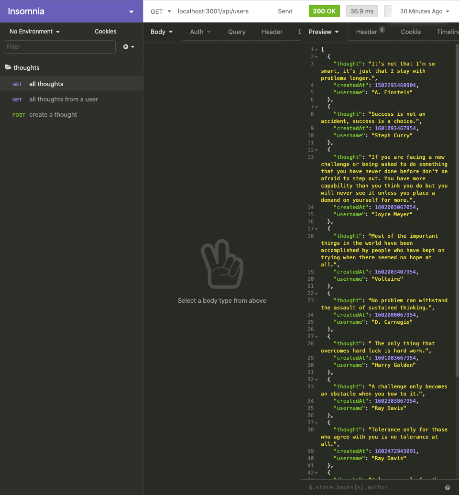

In this lesson, we'll integrate the routes that we built into the front end of the application. This is so that we can render the images and connect the form to the database.

Once we've accomplished this, we'll have an application that can share text. But, wouldn't it be nice to also share images? So, we'll add a bonus feature that will allow users to post images along with their thoughts. This will expand the usefulness of the application and demonstrate more capabilities of cloud computing.

The following image shows the first GitHub issue that we'll work on in this lesson:

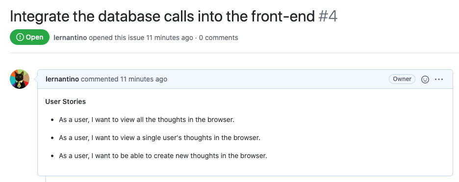

In the preceding image, notice that GitHub Issue 4 is named "Integrate the database calls into the front-end." And, it lists the following three user stories:

* As a user, I want to view all the thoughts in the browser.

* As a user, I want to view a single user's thoughts in the browser.

* As a user, I want to be able to create new thoughts in the browser.

> **Note**
>
> We'll review the second issue when we start that task.

In this lesson, we'll integrate database calls into the UI, create an image upload route for uploading an image to the S3 bucket, add an input element to capture the image file from the user, and integrate the image upload route into the UI component.

Once we successfully integrate the API endpoints into the front end of the application, we'll have an extra feature. This feature will allow users to save images to the cloud and share them in the application.

## Preview

The goals of this lesson are twofold. First, we'll complete the integration of DynamoDB into the Deep Thoughts application. Second, we'll add a bonus feature that expands the capabilities of the application.

The following image shows an example of what we'll build by the end of the lesson:

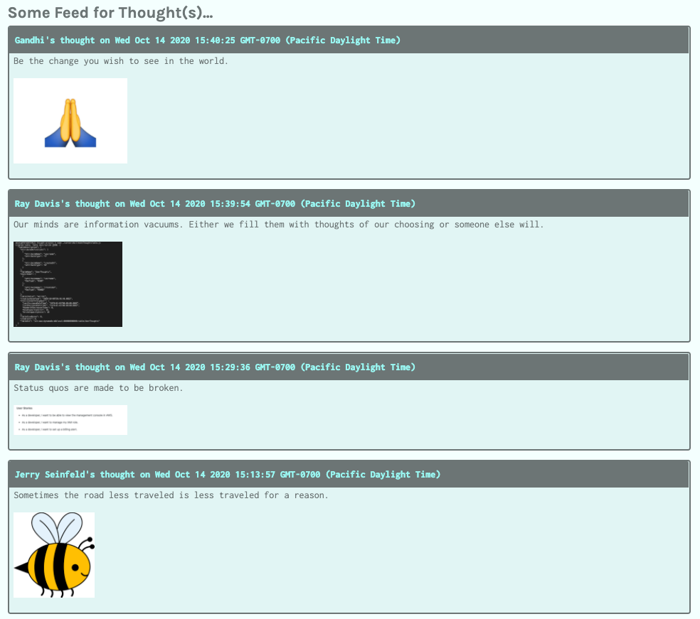

To get there, we’ll follow this game plan:

1. Integrate the API endpoints into the front end of the application.

2. Deploy DynamoDB to AWS.

3. Set up the image upload route.

4. Integrate the image upload feature into the UI.

> **Note**
>
> Before you start, spend a few minutes reviewing the starter code that you previously downloaded. Familiarize yourself with the React application and its components. In this lesson, we'll work mostly with the `Home`, `ThoughtList`, `ThoughtForm`, and `Profile` components.

Let's get started!

## Integrate the API Endpoints into the Front End of the application

We built three API endpoints in the previous lesson. Let's integrate these endpoints into the front end of the application so that users can render the data and create new data.

To get started, follow these steps if your client and server are not running:

1. Ensure that all the packages are installed by navigating to the root folder and running the `npm install` command at the command line.

2. Next, navigate to the `package.json` file within the `server` folder and add a new "watch" script under the "test" and "start" scripts so it looks like the following:

   ```json
   "scripts": {
       "test": "echo \"Error: no test specified\" && exit 1",
       "start": "node server.js",
       "watch": "nodemon server.js --ignore client"
     },
   ```

3. Start the React application by navigating back up to the root of the project and running the `npm run start:dev` command. This will run the `watch` script in the server. Notice a few warnings in the console for variables that haven't been assigned yet. We'll take care of those in this lesson. We'll also make breaking changes to the server, but once we have entered the missing variables, the `nodemon` process will restart the server successfully.

4. Create the development feature branch by checking out from the `develop` branch and creating the `feature/integrate-api`.

### Read All Thoughts from All Users

The first route that we'll incorporate is the `/api/users` GET route, which retrieves all the thoughts in the application. We need this data on the homepage so that users can see what everyone has posted.

To accomplish this, follow these steps:

1. Go to the `Home` component in the `pages` directory, inside the `src`.

2. Open the `Home` component in the IDE.

3. Inside the `Home` function expression and under the `useState` constant declarations, add the following `useEffect` call, before the return statement:

   ```js
   useEffect(() => {
     const fetchData = async () => {
       try {
         const res = await fetch('/api/users');
         const jsonData = await res.json();
         const _data = jsonData.sort((a, b) =>
           a.createdAt < b.createdAt ? 1 : -1,
         );
         setThoughts([..._data]);
         setIsLoaded(true);
       } catch (error) {
         console.log(error);
       }
     };
     fetchData();
   }, []);
   ```

In the preceding statement, we used the `useEffect` hook to request all the users' thoughts to render on the component mount event. Notice that we used the default GET method to `fetch` the data from the database and store as a JSON into the data constant. Because the database call uses the `scan` method, we must sort the data ourselves, which we accomplish by using the `sort` method. We could also apply the sort operation in the server to offload processing to the cloud instead of the client.

Once the data is sorted, we store the data using the `useState` setter method, `setThoughts`. Notice that the dependency array is empty, so this fetch will only be invoked once when the component mounts.

It's a good idea to use a `try...catch` block in case the web service call doesn't work.

#### Test the All-Thoughts-All-Users Database Call

Test the work by starting the Express server by running `npm run start` from the `client` directory in your command line, and navigating to the homepage, `https://localhost:3000` in your browser. If the component works as expected, you should see something like the following image:

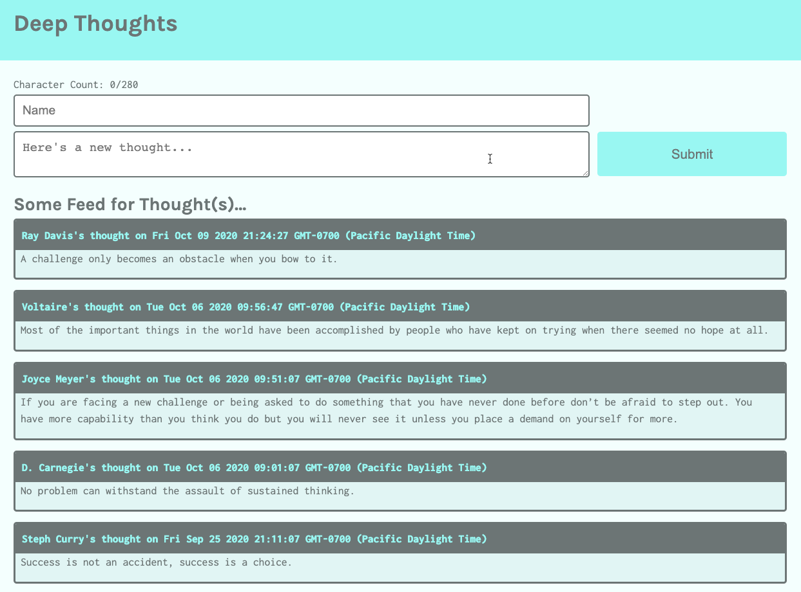

If the application isn't rendering properly, make sure that both the Express.js server and the React server are running at ports 3000 and 3001. If you aren't receiving the test results you expect, restart the servers before troubleshooting to ensure that the latest changes are recognized by both servers.

Nice work! Next, we'll incorporate the route that will display the thoughts of a specific user in the `Profile` component.

### Get All Thoughts from a Specific User

Open the `Profile` component in the IDE. Use the `useEffect` hook again to fetch the data from the database.

Insert the following hook in the `Profile` function expression, under the `useState` constant declarations:

```js
useEffect(() => {
  const fetchData = async () => {
    try {
      const res = await fetch(`/api/users/${userParam}`);
      const data = await res.json();
      console.log(data);
      setThoughts([...data]);
      setIsLoaded(true);
    } catch (error) {
      console.log(error);
    }
  };
  fetchData();
}, [userParam]);
```

Adding this statement will reduce the warnings we observed earlier, since we're now using the variable we declared in the `useState` expressions. Notice a similar pattern here compared to the `useEffect` hook in the `Home` component. Namely, we do the following things:

* Use the `userParam` sourced from the React Router to retain the username from the `ThoughtList` component.

* Pass the `userParam` to the database in the URL.

* Set the state with the database response.

* Set the dependency array in the hook to reflect the dependency for the username with `userParam`.

#### Test the All-Thoughts-Specific-User Database Call

Now let's test this database call by selecting a user on the homepage. The table row with the black background is actually a link. When you click that link, you should be directed to the profile page, as shown in the following image:

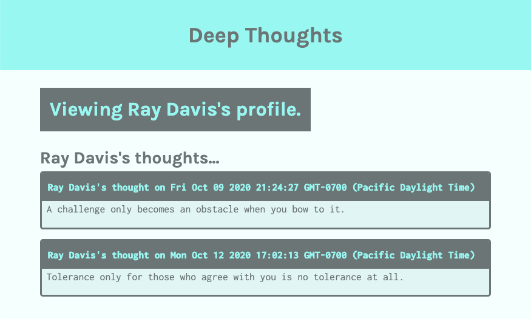

The preceding image displays the profile page for Ray Davis and his thoughts.

Next let's finish integrating the third route and let the user create a thought.

### Create a Thought

Next, we need a route that creates a new thought to connect with the form submission. Open the `index.js` file in the `ThoughtForm` folder from the IDE. We'll need to send the client request in `handleFormSubmit`.

Now we need to send the request to the API endpoint to create a new thought. In the `handleFormSubmit` function, under the `event.preventDefault`, add the following function:

```js
const postData = async () => {
  const res = await fetch('/api/users', {
    method: 'POST',
    headers: {
      Accept: 'application/json',
      'Content-Type': 'application/json',
    },
    body: JSON.stringify(formState),
  });
  const data = await res.json();
  console.log(data);
};
postData();
```

In the preceding function, we used the `fetch` function to send the form data to the endpoint in the body of the request.

#### Test the Create-a-Thought Function

Test the code by creating a new thought. Because we set the list to render in chronological order, the newest thoughts are rendered first! The profile page should resemble the following image:

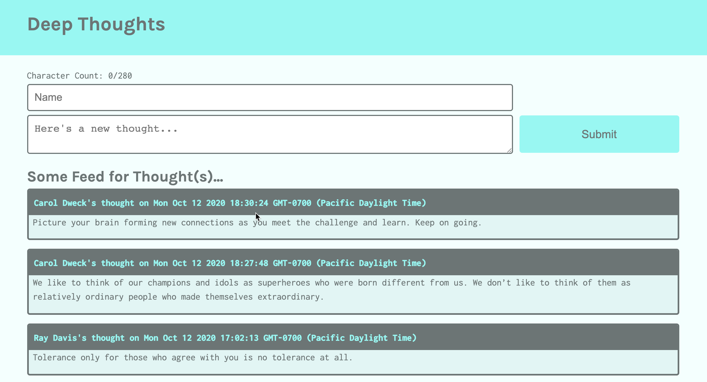

> **Note**
>
> If the page does not display as expected, you may need to refresh the browser.

Nice work. Now that the API endpoints have successfully integrated into the front end of the Deep Thoughts application, let's deploy the DynamoDB web service to AWS, making this capability available to all users.

## Deploy Amazon DynamoDB to AWS

In this step, we'll deploy DynamoDB to AWS.

We used a local DynamoDB instance for the development phase of creating the database operations. Now that we've fully integrated DynamoDB into the application, let's use the web service and create a new `Thoughts` table in the cloud.

Now the `dynamodb` service object will point to the web service and not the local instance, because we previously configured the AWS CLI to connect to the S3 web service. Because we already assigned the access key and secret key, the service object can verify account authentication.

From the root directory, execute the following commands:

```bash
node ./server/db/CreateThoughtsTable.js && node ./server/db/LoadThoughts.js
```

You should see messages that indicate the success of the `PutItem` operation, as shown in the following image:

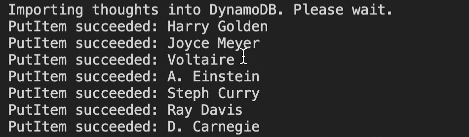

We can also perform a table scan in the AWS CLI to check whether the data is from the old table or the new table, using the following command:

```bash
aws dynamodb scan --table-name Thoughts
```

The response in the CLI displays the original data and doesn't contain any of the new thoughts we created previously, as shown in the following image:

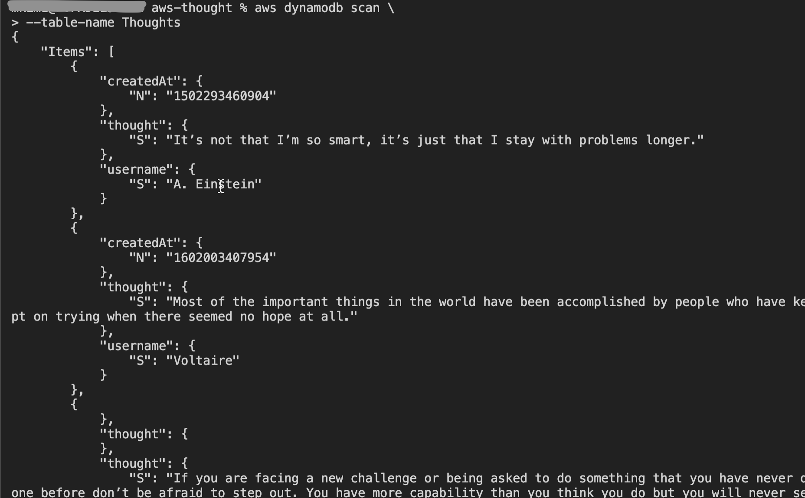

If this is too hard to read, there's another way to verify that you created a table in AWS. Open the browser and log into your AWS account. Select the DynamoDB service under the Services option in the menu bar.

Select the Tables option in the left side menu. Select the `Thoughts` table, then select "Explore table items" next to the Actions menu item. We'll see the data in the `Thoughts` table, as shown in the following image:

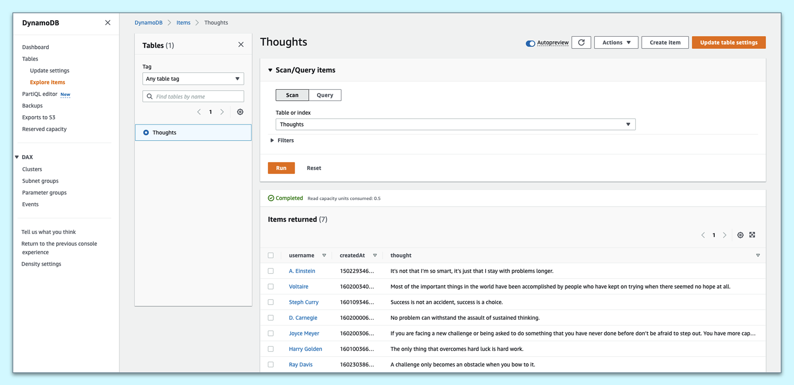

Based on the preceding image, we can verify that the `Thoughts` table has been seeded successfully in the AWS cloud.

Now go to the browser and refresh the homepage to render the original data, without the new thoughts that we added.

Create a few thoughts of your own to make sure the web service is functioning properly. Visit the table in the DynamoDB console to verify that the database calls are working.

Now that we've finished integrating the routes into the client and deployed the database service to AWS, let's add and commit this work and then close the GitHub issue.

## Set Up the Image Upload Route

In the previous step, we deployed DynamoDB to AWS. In this step, we'll set up the image upload route.

Conceptually, we're starting the work on the new feature that allows users to share images along with their thoughts. So, review the second GitHub issue for this lesson, which the following image shows:

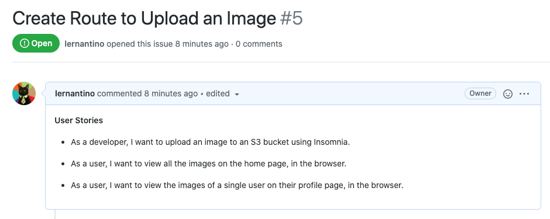

In the preceding image, notice that GitHub Issue 5 is named "Create Route to Upload an Image." And, it lists the following three user stories:

* As a developer, I want to upload an image to an S2 bucket using Insomnia.

* As a user, I want to view all the images on the home page, in the browser.

* As a user, I want to view the images of a single user on their profile page, in the browser.

So, we'll capture a user image and then programmatically upload it to an S3 bucket. To do this, we'll create an API endpoint that can receive the image and then save it to the cloud.

But why use S3? Didn't we just set up a database in the last lesson? This is because there's a tradeoff for DynamoDB's superior high performance and speed: storage capacity. Allowing large files to be stored would greatly alter DynamoDB's read and write performance. DynamoDB limits each item or **record** at 400 kB&mdash;not very much, considering that images with average resolution can be half a megabyte, or 500 kB. High resolution images can easily top 3&ndash;4 megabytes each.

We'll use S3 to store the image files and store a reference to the file in DynamoDB. The reason why AWS has so many services is because each is responsible for a specific purpose. Having a high performance single-purpose service allows developers customize solutions to their applications by combining services.

In this case, we'll use the S3 bucket we created previously to store the image assets. The location URL of the image will then be saved in DynamoDB with the `username` and `thought`. This will allow the image to be retrieved with the accompanying thought and the username.

### Set Up the Route Dependencies

Much like we did previously, we'll first create the route that can upload the image to the S3 bucket. Navigate to the project in the IDE and go to the `server/server.js`

Let's create another route path by adding a route reference to the Express object, `app`.

Add the following route reference to the `server.js` file, under the current reference to the `userRoutes`:

```js
// app.use(require('./routes'));
app.use('/api/', userRoutes);
app.use('/api/', imageRoutes); // add this route for image upload
```

> **Note**
>
> This addition will cause the server running on the back end to fail temporarily until we fix the error by adding the `imageRoutes` function, which we'll do in the following steps.

Next we'll need to include the preceding route file at the top of the `server.js` file, as follows:

```js
const userRoutes = require('./routes/user-routes');
const imageRoutes = require('./routes/image-upload'); // add this file import to the top of the file
```

Now let's create the route file, `image-upload.js`, in the `routes` folder.

To begin we'll need to create a route, process the image file, and upload to the S3 bucket. We'll include `express`, `multer`, and `aws-sdk` at the top of the `image-upload.js` file, as follows:

```js
const express = require('express');
const router = express.Router();
const multer = require('multer');
const AWS = require('aws-sdk');
```

We'll use the package `multer` to provide the middleware for handling `multipart/form-data`, primarily used for uploading files. The `multer` package will add a `file` property on the `req` object that contains the image file uploaded by the form, as we shall soon see.

To install `multer` from the terminal, navigate to the `server` folder and run the following command:

```js
npm install multer
```

> **Deep Dive**
>
> To learn more, review the [npm documentation on multer](https://www.npmjs.com/package/multer).

With `multer` we'll create a temporary storage container that will hold the image files until it is ready to be uploaded to the S3 bucket. Under the imported constants that we just created, add the following statement:

```js
const storage = multer.memoryStorage({
  destination: function (req, file, callback) {
    callback(null, '');
  },
});
```

Next we'll declare the `upload` object, which contains the storage destination and the key, `image`, using the following expression:

```js
// image is the key!
const upload = multer({ storage }).single('image');
```

We'll use the preceding function, `upload`, to store the image data from the form data received by the `POST` route. We'll use the `single` method to define that this upload function will receive only one image. We'll also define the `key` of the image object as `image`.

Next, we'll instantiate the service object, `s3`, to communicate with the S3 web service, which will allow us to upload the image to the S3 bucket. As a best practice, we normally keep the object declaration near the top of the file, with the other object declarations. See the following code for an example:

```js
const s3 = new AWS.S3({
  apiVersion: '2006-03-01',
});
```

We locked the version number as a precautionary measure in case the default S3 version changes. This way the code we write has a lower chance of breaking due to default version changes to the API.

### Create the Image Upload Route

With all the necessary dependencies set up now, create the route in the following statement:

```js
router.post('/image-upload', upload, (req, res) => {
  // set up params config
  // set up S3 service call
});
```

Note that the preceding endpoint will be located at `localhost:3000/api/image-upload`. We'll use a POST method to securely transfer the request body. We include the `upload` function as the second argument to define the key and storage destination. In the route's function block we need to configure `params`, so that the S3 will know the bucket name as well as the image's file name.

> **Pause**
>
> **Question:** How does S3 get the access keys to provide web service permission?
>
> **Answer:** The `aws-sdk` package retrieves this information from the local folder, `~/.aws/credentials`, where we stored the access id key and private key information with the AWS CLI.

We'll need to do two things to complete this endpoint. We need to configure the `params` object, then make the web service call to S3 to upload the image.

Let's create a function that will return the `params` object in a separate file. This way we can keep the route uncluttered and more legible. We'll create this function in a file called `params-config.js`, which will be located in the `utils` folder in the `server` directory. So from the root directory, the relative path for the file will look like this:
`./server/utils/params-config.js`.

Let's create the `utils` folder, then create the `params-config.js` file nested in that folder and open the file in the IDE.

This file has a singular purpose: to return a configured `params` object. We'll use a package called `uuid` that will generate a unique 36-character alphanumeric string, which we'll use as the image file names.

> **Important**
>
> If a file name was duplicated, the original file would be overwritten by the new content.

Add the following expression to the top of the `params-config.js` file:

```js
const { v4: uuidv4 } = require('uuid');
```

Note how we specify version 4 in the preceding statement.

In order to use this package, navigate to the `server` in the terminal and execute the command `npm install uuid`.

> **Deep Dive**
>
> To learn more, look at the [npm documentation on uuid](https://www.npmjs.com/package/uuid).

Next we'll declare the `params` function, replacing the `<My_Bucket_Name>` with your own bucket name, that will configure the file as shown in the following statement:

```js
const params = (fileName) => {
  const myFile = fileName.originalname.split('.');
  const fileType = myFile[myFile.length - 1];

  const imageParams = {
    // Replace the <My_Bucket_Name> with the name of your own S3 bucket
    Bucket: '<My_Bucket_Name>',
    Key: `${uuidv4()}.${fileType}`,
    Body: fileName.buffer,
  };

  return imageParams;
};
```

In the preceding function expression, the `params` function receives a parameter called `fileName`, which this function will receive as an argument from the Express route.

Once we store the reference to the `fileType`, we'll declare `imageParams`.

We must define three properties of `imageParams`: the `Bucket`, `Key`, and `Body` properties to connect to S3.

We'll assign the `Bucket` with the name of the S3 bucket we created previously by replacing the `<My_Bucket_Name>` placeholder with the actual name of the S3 Bucket you created earlier in this lesson.

Next, assign the `Key` property, which is the name of this file. Use `uuidv4()` to ensure a unique file name. We'll also add the file extension from `fileType`. Then, assign the `buffer` property of the image to the `Body` property. This is the temporary storage container of the image file. `multer` removes this temporary storage space once this buffer has been used.

> **Pause**
>
> **Question:** How will we find the images if we assign them random string values as names?
>
> **Answer:** Reference to the images will be stored in DynamoDB with a reference to their URL.

All that's left is to add the `module.exports` expression to expose the `imageParams`. Add the following statement at the bottom of the `params-config.js` file:

```js
module.exports = params;
```

Now that this function has been completed, let's navigate back to the `image-upload.js` file that contains the image upload route. We've finished the first part of the route, so let's ensure that the file we just created is available. Add the following import statement near the top of `image-upload.js`:

```js
const paramsConfig = require('../utils/params-config');
```

Now that the config object is imported, let's use it to make the web service call to upload the image to the S3 bucket. Go to the function block of the image upload route and declare a new constant named `params`, as follows:

```js
router.post('/image-upload', upload, (req, res) => {
  const params = paramsConfig(req.file);
  // set up S3 service call
});
```

In the preceding expression, we retrieved the image file object, `req.file`, from the route using `multer`. We assigned the returned object from the `paramsConfig` function to the `params` object.

Next, use the `s3` service interface object we instantiated previously with the `aws-sdk` package to call the `upload()` method&mdash;as shown in the following S3 service call:

```js
s3.upload(params, (err, data) => {
  if (err) {
    console.log(err);
    res.status(500).send(err);
  }
  res.json(data);
});
```

Similar to the pattern we used previously for the DynamoDB calls, we'll use the callback function to catch any internal errors with the web service and log error and success messages accordingly. In the last statement of this route, we send the `data` retrieved from S3 back to the client. The `data` will contain the image file's metadata, including the URL, bucket name, file name, and more. Now that the route is complete, it should look like the following statement:

```js
router.post('/image-upload', upload, (req, res) => {
  console.log("post('/api/image-upload'", req.file);
  const params = paramsConfig(req.file);
  s3.upload(params, (err, data) => {
    if (err) {
      console.log(err);
      res.status(500).send(err);
    }
    res.json(data);
  });
});

module.exports = router;
```

In the preceding statement, we configured the `params` object, then uploaded the image to S3. At the bottom of the file, include the `module.exports` statement so that this can be exposed. Let's test this route in Insomnia to see if it works.

Open Insomnia and create a POST route named `image upload` in the `thoughts` folder. Select the POST method in the address bar and use the following URL: `localhost:3001/api/image-upload`.

Now to test the route, we need to simulate the file upload process of the user, so a file is inserted into the form data. We can do this in Insomnia by changing the Body option in the menu bar. Select Multipart Form. In the name field, we must include the name of the key, `image`, that we designated previously when we configured the `upload` function. See the following code for an example:

```js
// image is the key!
const upload = multer({ storage }).single('image');
```

Use `image` as name of the file object. In the next field, select File from the drop-down. Then choose an image from your computer to upload to the S3 bucket. You should see something like the following image:

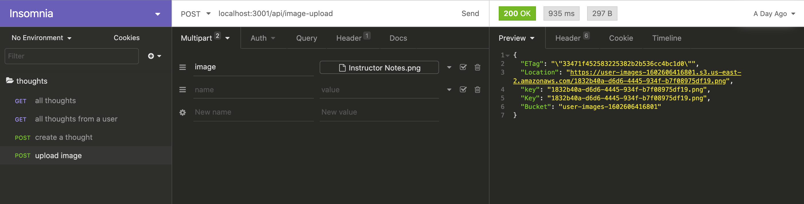

As we can see in the preceding image from Insomnia, the request was successful and the image was uploaded to the S3 bucket. The data response from S3 includes the bucket name and the URL of the image, which is assigned to the `Location` key. This is the value we'll store in the DynamoDB as a reference to this image.

Not only can S3 store images in the cloud, but it also offers a URL that enables access to the image. This is an incredibly useful feature, making the image widely available and accessible once it is stored in the cloud. We'll soon see how we can incorporate this URL into the application to render the images.

Now that the image upload endpoint is functional, let's move on to the front end of the application, to incorporate the image into the UI.

## Integrate the Image Upload Feature into the UI

In the previous step, we set up the image upload route. In this step, we'll integrate the image upload feature into the UI.

More specifically, we'll extend the UI in the following way: First, we'll allow a user to add an image to their thought. Second, we'll then render the image on both the homepage and the user's profile page.

### Add the Image Upload Option for the Users

To begin, we'll add the image upload input element in the `ThoughtForm`. This will allow users to add an image to each thought.

In the return statement of the `ThoughtForm` component, add the following HTML elements to the current `<form>` element:

```html
<label className="form-input col-12  p-1">
  Add an image to your thought:
  <input type="file" ref="{fileInput}" className="form-input p-2" />
  <button className="btn" onClick="{handleImageUpload}" type="submit">
    Upload
  </button>
</label>
```

We'll add the preceding elements after the `<textarea>` element, but before the `<button type="submit">` element within the `<form>` of the `ThoughtForm` component. Notice in the preceding statement that we've added the `<input>` and `<button>` wrapped in the `<label>`. A few key highlights of the preceding code include the following:

* The `<input>` type is `file`. With this designation, HTML can browse and add files from your computer.

* The `ref` attribute is assigned to the `fileInput`. We'll define this function using a React Hook name, `useRef`.

* We'll also need to define the `handleImageUpload` function. This function will send the image to the image upload endpoint we created.

With the `<input>` element in place, let's build the logic that will make this functionality work.

At the top of the `ThoughtForm`, we need to import the React Hook `useRef`. There is already a React import at the top of the file for `useState`. Replace that existing import statement with this single import statement that will combine the import for `useState` and `useRef` in one import statement:

```js
import React, { useState, useRef } from 'react';
```

The `useRef` Hook is useful, especially if there's a need to reference the DOM. We'll use the `useRef` Hook to retrieve the image file uploaded by the user, by accessing the `<input type="file">` element.

> **Deep Dive**
>
> To learn more, refer to the [React documentation on useRef](https://reactjs.org/docs/hooks-reference.html#useref).

Beneath the `useState` constant declarations in the `ThoughtForm` component, we'll declare another constant called `fileInput`, as shown in the following expression:

```js
const fileInput = useRef(null);
```

In the preceding statement, we set the initial value of `fileInput`&mdash;the reference to the DOM element, `<input type="file">`&mdash;to null. This ensures that the reference to the DOM element is current.

### Declare the Function and the Interface Object

In the next step, we declare the `handleImageLoad` function. We assigned this function to invoke when the user selects the `Upload` button for the `<input type="file">` element. We want this function to retrieve the image file uploaded by the user and send this data in a request to the image upload endpoint that we created previously.

Declare the `handleImageLoad` function, as shown in the following expression:

```js
const handleImageUpload = (event) => {
  event.preventDefault();
  const data = new FormData();
  data.append('image', fileInput.current.files[0]);
  // send image file to endpoint with the postImage function
  // ...
};
```

In the preceding expression, we've configured some of the parameters that are necessary to send the image file to the image upload endpoint. Note that without the `event.preventDefault()` statement, the thought will save before the image file is uploaded.

> **Important**
>
> Because the image upload process to S3 is an asynchronous request that will take some time, it's possible to submit the form before the response from the image upload process is returned. This will submit a null as the value of the image URL. To prevent this, we can add a progress bar or disable the form submit button while the image is processing. However, because this is beyond the scope of this lesson, we will not attempt to add this feature.

Next, declare an interface object from `FormData`, called `data`. `FormData` makes it easy to construct a set of key-value pairs, mirroring the format of a form with the type set to `"multipart/form-data"`.

> **Deep Dive**
>
> For more information, refer to the [MDN Web Docs on FormData](https://developer.mozilla.org/en-US/docs/Web/API/FormData).

### Assign a Key-Value Pair

In the next statement, we assign a key-value pair to the `FormData` object with the name of the image file (`image`) and the payload (the image file). We assign the reference to the image file with `fileInput.current.files[0]`. If multiple files were uploaded at once, the `files` array would be sent.

The `postImage` function sends the configured `FormData` object, `data`, to the upload image endpoint. We'll declare the following function in the `handleImageLoad` function block, as indicated by the comment, `// send image file to endpoint with the postImage function`:

```js
const postImage = async () => {
  try {
    const res = await fetch('/api/image-upload', {
      mode: 'cors',
      method: 'POST',
      body: data,
    });
    if (!res.ok) throw new Error(res.statusText);
    const postResponse = await res.json();
    setFormState({ ...formState, image: postResponse.Location });

    return postResponse.Location;
  } catch (error) {
    console.log(error);
  }
};
postImage();
```

We used `async` and `await` to handle the Promises in the `fetch` request to the image upload endpoint, `/api/image-upload`. Notice that we used a POST method to send the image file as `data` in the body of the fetch request.

Once we receive a response from the image upload endpoint, we convert the response into a JSON object, so that we can add this new key-value to `formState`. This new key-value pair is `{ image: postResponse.Location }`, which is the public URL of the image. It was a good idea to place this request in a `try...catch` block to track any unsuccessful S3 calls.

Once the two sections are combined, `handleImageLoad` should look like the following function:

```js
const handleImageUpload = (event) => {
  event.preventDefault();
  const data = new FormData();
  data.append('image', fileInput.current.files[0]);

  const postImage = async () => {
    try {
      const res = await fetch('/api/image-upload', {
        mode: 'cors',
        method: 'POST',
        body: data,
      });
      if (!res.ok) throw new Error(res.statusText);
      const postResponse = await res.json();
      setFormState({ ...formState, image: postResponse.Location });
      console.log('postImage: ', postResponse.Location);
      return postResponse.Location;
    } catch (error) {
      console.log(error);
    }
  };
  postImage();
};
```

Let's check whether this functionality is working properly. The predicted behavior is to upload an image to the S3 bucket once the Upload button has been selected. Keep the console window open in the browser to see the response message.

Double-check that both servers at ports 3000 and 3001 are running properly without errors. Then go to the homepage of the application and upload a local image file. The browser with the new `<input>` element should look like the following image:

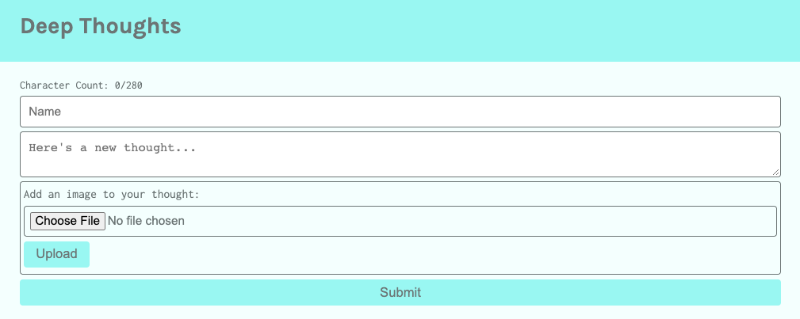

In the preceding image, we used the Upload button to load the image file to S3. In a previous lesson, we set a click event on the Submit button, to handle the database call to create the thought in the table.

Great work! Examine the S3 console in AWS to verify that the image was uploaded correctly, as shown in the following image:

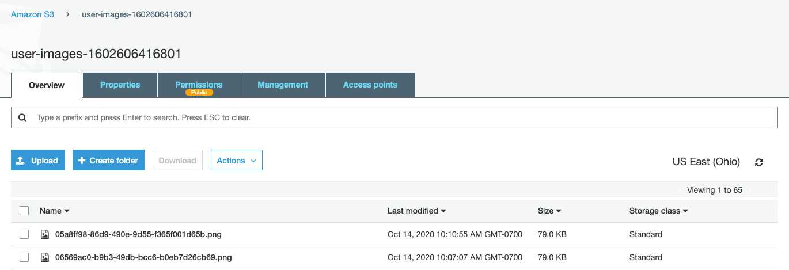

We can select a file from the S3 bucket and download it to verify that the image is the same one that was uploaded.

We've now successfully completed the GitHub issue and uploaded an image as a user to the S3 bucket. We can close this issue and then add, commit, push, and merge the feature branch, `feature/integrate-api`, into `develop`.

Now that we've finished the uploading feature for image files, we need to modify the endpoints to accept the image attribute in the database calls. Then we must receive the new image attribute and render the image to the `ThoughtsList`.

## Reflection

You've now completed another lesson that was full of new skills and concepts! These included integrating database calls and form data requests into the application. You used React Hooks to connect the UI components to database calls for the purpose of retrieving data from the `Thoughts` table. Then, you created the image upload route to upload an image to the S3 bucket.

> **On the Job**
>
> In the AWS ecosystem, working with multiple web services is a typical expectation. The ability to add features that highlight different services contributes to making AWS highly customizable and flexible. And with the pay-as-you-go model, you can use the AWS infrastructure without large up-front cost commitments&mdash;giving you an affordable way to try new services.

In this lesson, you accomplished the following:

* Integrated database calls into the UI.

* Created an image upload route for uploading an image to the S3 bucket.

* Added an input element to capture the image file from the user.

* Integrated the image upload route into the UI component.

In the next and final lesson of this module, we'll put the finishing touches on the Deep Thoughts application. Specifically, we'll modify the existing database calls to store the image attribute. We'll then render the image in the Deep Thoughts application by modifying the `ThoughtList` UI component. Finally, we'll deploy the application to a virtual machine in the cloud.

---

© 2025 edX Boot Camps LLC. Confidential and Proprietary. All Rights Reserved.
