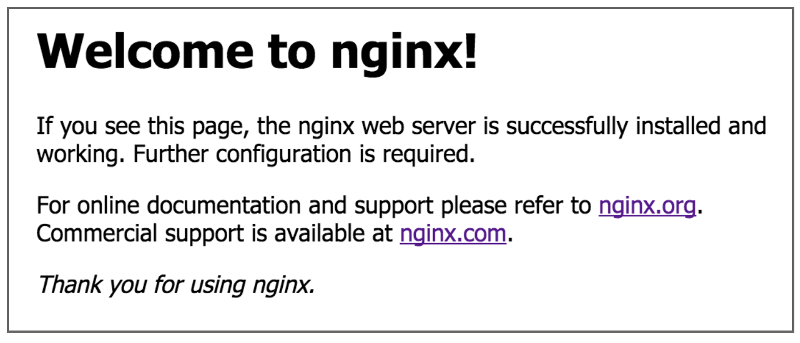

## Introduction

Nice work completing the first part of the image feature&mdash;which allows users to add images to the Deep Thoughts application! Users can now share funny memes and compelling pictures along with their thoughts.

We already completed the image upload route. We then modified the `ThoughtForm` component so that a user could choose an image file to upload to the S3 bucket. And, recall that when an image file successfully uploads to the S3 bucket, it displays in the S3 console, as the following image shows:


In this lesson, we'll complete the integration of the image feature so that users can display the images. We'll then deploy the app to the cloud. To do so, we'll deploy the app in an Amazon EC2 instance to host the app in AWS. This will make the Deep Thoughts application publicly available.

The following image shows the GitHub issue that we'll work on in this lesson:


In the preceding image, notice that GitHub Issue 5 is named "Create Route to Upload an Image." And, it lists the following three user stories:

* As a developer, I want to upload an image to an S3 bucket using Insomnia.

* As a user, I want to view all the images on the home page, in the browser.

* As a user, I want to view the images of a single user on their profile page, in the browser.

We already accomplished the first user story. And, we'll finish the last two user stories at the beginning of this lesson. We'll deploy the application to an EC2 instance.

In this lesson, we'll modify the database queries to include the image attribute, modify the UI components to render images, launch an EC2 instance, set up the EC2 environment, clone the application to the EC2 instance, and deploy the web application to AWS.

## Preview

The goals of this lesson are twofold. First, we'll complete the image feature so that it can render the images from the S3 bucket. Second, we'll make this application publicly available in the AWS cloud.

The following image shows an example of what we'll build by the end of the lesson:


To get there, we’ll follow this game plan:

1. Display the images.

2. Modify the UI components to render the images.

3. Learn about AWS virtual machines. (VMs)

4. Create an EC2 instance.

5. Set up the EC2 environment.

6. Install the application environment dependencies.

7. Configure the NGINX server.

8. Modify the API calls.

9. Build and run a production version of the application.

Let's get started!

## Display the Images

Now that we've successfully integrated the image upload route into the front end, we'll render the images from the S3 bucket. We had to store the images in an S3 bucket because the DynamoDB table has restrictions on storage capacity. Now that the image is stored in the S3 bucket, how do we associate the image to the `Thoughts` table? Based on the following response message in Insomnia, there is information about the image and the S3 bucket:


As shown in the preceding image, the response object contains a property that we need to render the image.

> **Pause**
>
> **Question:** Which property in the preceding database response will help us render this image?
>
> **Answer:** The `Location` property has the URL address that we can assign to the `src` attribute in an `` element.

In the last lesson, we added the image and image location to `formState` in the `handleImageUpload` function in the `ThoughtForm` component. Once the Submit button is selected, the `handleFormSubmit` function will send the form data to the API endpoint for the create thought operation.

In this section, we'll modify the `/api/users` POST route so that the image attribute will be added to the item when created in DynamoDB. Open the `user-routes.js` file in the `server` of the Deep Thoughts application.

Go to the POST route and add the `image` attribute to the `params` object, as shown in the following expression:

```js
// Create new user
router.post('/users', (req, res) => {
  const params = {
    TableName: table,
    Item: {
      username: req.body.username,
      createdAt: Date.now(),
      thought: req.body.thought,
      image: req.body.image  // add new image attribute
    }
  };
  // ... database call
```

> **Rewind**
>
> Note that because we're dealing with a NoSQL database, we don't have to adjust the table schema or perform a migration like we would for a relational database.

With this modification, the DynamoDB table will store the image URL in the `Thoughts` table with the `username` and `thought` text.

Let's confirm that the image URL is correctly stored by querying the `Thoughts` table with the scan operation in the command line. Navigate to the `server` directory and run the following command to run the scan:

```bash
aws dynamodb scan --table-name Thoughts
```

The subsequent response from the web service will appear in the command line:


The preceding image shows that the image attribute holds the URL of the image which we can use to render the image.

In the following step, let's check the rest of the GET routes to ensure that the responses are returning the `image` attribute correctly. Because the route to get all thoughts uses the scan operation, all the items in the `Thoughts` table will be returned as the response. However in the route to get thoughts from a user, or the `/api/users/:username` route, we see that the `ProjectionExpression` property in the `params` object doesn't have the `image` attribute.

> **Rewind**
>
> The `ProjectionExpression` property is like the `SELECT` statement in SQL, which identifies which attributes or columns to return in the database query.

Let's add the `image` attribute to the `ExpressionAttributeNames` property to add the `#img` alias. Then we can add the `image` attribute to the `ProjectionExpression` property, as shown in the following modification to the `params` object:

```js
// get thoughts from a user
router.get('/users/:username', (req, res) => {
  console.log(`Querying for thought(s) from ${req.params.username}.`);
  const params = {
    TableName: table,
    KeyConditionExpression: "#un = :user",
    ExpressionAttributeNames: {
      "#un": "username",
      "#ca": "createdAt",
      "#th": "thought",
      "#img": "image"    // add the image attribute alias
    },
    ExpressionAttributeValues: {
      ":user": req.params.username
    },
    ProjectionExpression: "#un, #th, #ca, #img", // add the image to the database response
    ScanIndexForward: false  // false makes the order descending(true is default)
  };
  // database call ..
```

Now that we've modified the database calls, we need to adjust the UI components to render the images, which will take place in the `ThoughtList` component.

Open this component so that we can add the `` element that will render the image.

## Modify the UI Components to Render the Images

In the previous step, we displayed the images. In this step, we'll modify the UI components to render the images.

Now let's integrate the image feature into the homepage. Look at the `Home` component, where the query to get all the users' thoughts originated.

Once the database response is received, it's assigned to the `thoughts` state and then passed down to the `ThoughtList` component as a prop.

Open the `ThoughtList` component in the IDE. This is the component that renders the user's thoughts, so it is here that we'll render the user's images as well. In the return statement of the component in the `<div>` element, following the `<p>` element, add the following JSX expression to add the user's image:

```js
<div key={thought.createdAt} className="card mb-3">
  <p className="card-header">
    <Link
      to={`/profile/${thought.username}`}
      style={{ fontWeight: 700 }}
      className="text-light"
    >
      {thought.username}'s thought on{' '}
      {new Date(parseInt(thought.createdAt)).toString()}
    </Link>{' '}
  </p>

  {/* add thought text */}
  {thought.thought && <p className="px-2 mt-2">{thought.thought}</p>}
  {/* add thought image */}
  {thought.image && (
    <p className="px-2">
      
    </p>
  )}
</div>
```

Notice that we used a conditional render expression, to only show the thought or image if a user added them.

Let's make sure the application is running so that we can check in the browser to see if the images we added are showing. We should see something like the following image:


Up until now we've had access to the S3 bucket through the access keys located in `.aws/credentials` locally stored on the computer. These credentials were accessed by the `aws-sdk` package and provided authentication to the S3 and DynamoDB services. The access keys recognized us as the S3 bucket owner, which grants us access privileges to write, list, and read items in the S3 bucket.

### Grant Access Permissions

To access the images in the bucket from a public URL, we'll need to grant access privileges to the S3 bucket. AWS can grant privileges in a few different ways in an S3 bucket. We can grant access to each file in the bucket or grant access to the bucket, for all the files or objects stored in the bucket.

To do this programmatically, we can assign an **ACL** (or **access-control list**) permission on each image file. Let's add this permission property to the `imageParams` object, which we configured in the `params-config.js` file in the `server/utils` folder. Open this file in the IDE and make the following adjustment:

```js
const imageParams = {
  Bucket: config.bucket,
  Key: `${uuidv4()}.${fileType}`,
  Body: fileName.buffer,
  ACL: 'public-read', // allow read access to this file
};
```

In this example, we add the `ACL` property to the `imageParams` object to grant read access to this object.

Next, we also need to change the permissions in the bucket in the S3 console. This type of permission can be granted programmatically as well, when the bucket is first created.

> **Deep Dive**
>
> To learn more, see the [AWS documentation on access control lists](https://docs.aws.amazon.com/AmazonS3/latest/dev/acl-overview.html#CannedACL).

To enable anyone with the URL address to view the images files, we must allow public read access. First navigate in the browser to the S3 console, then select the bucket name.

Select the Permissions tab, then scroll down to Bucket Policy. Select Edit.

We'll add a bucket policy that will grant read access for anonymous users so that anyone can see the images in their browsers.

Enter the following JSON code with your own `user-images` Amazon Resource Names (ARNs) into the text editor and select Save. You can find your ARN under the Properties tab within your bucket.

```json
{
  "Version": "2012-10-17",
  "Statement": [
    {
      "Sid": "PublicReadGetObject",
      "Effect": "Allow",
      "Principal": "*",
      "Action": "s3:GetObject",
      "Resource": [
        // Replace <arn:aws:s3:::user-images-16026064168/*> and <arn:aws:s3:::user-images-16026064168> with your own ARNs. Do not include the angled brackets. You will be posting the same ARN twice here but one will have a `/*` after it.
        "<arn:aws:s3:::user-images-16026064168/*>",
        "<arn:aws:s3:::user-images-16026064168>"
      ]
    }
  ]
}
```

Make sure to add `/*` to the end of one of the ARNs. To understand most security policies, you should consider who gets access and what type of access will they receive. In the preceding bucket policy the "who" is the `Principal`, which is set to everyone. The type of `Action` or what this policy allows, is `GetObject`, which also means the read object, which is the image file in this case. In the `Resource` property, you designate the S3 bucket name and all its contents.

> **Important**
>
> As a general rule, it's also best to grant the least amount of permission possible to constrain accessibility. This will increase security and decrease vulnerabilities of your applications.

Due to the change in permission, we can see the Public flag under Permissions and Bucket Policy.

Now let's go back to the application in the browser to see if we can view any of the images in the application. If the bucket policy was granted successfully, we should be able to see something like the following image in the browser:


Nice work! As shown in the preceding image, the application can now retrieve the URL from the DynamoDB table and render the results in the browser. Let's also check the profile page to confirm that the application is functioning properly. Because we modified the route previously, the profile page is also working correctly.

Now that we've verified that the images are persisting in the S3 bucket and rendering to the browser, we've fulfilled the requirements for the GitHub issue. Close this issue and add, commit, push, and merge the work into the `develop` branch. Because we're finished with this feature's development, merge the work into the `main` branch for deployment.

Now all that's left is to deploy the application to AWS to allow public access to the application.

## Learn About AWS VMs

In the previous step, we modified the UI components to render the images. In this step, we'll learn about AWS VMs.

In this final part of the module, we'll deploy our application to a VM in the cloud. This means that we'll provision a server in AWS to host the website on a public URL. Before we proceed, let's learn a bit about the VM that we'll use to host the website.

We'll use an EC2 instance to host the application. Amazon **EC2**, or **Elastic Cloud Compute**, is a cornerstone of AWS's IaaS model. An EC2 instance provides powerful computing services that can be located in any region around the globe. An EC2 is a great example of leveraging AWS's cloud infrastructure. As the need for capacity changes with the demands of a website, EC2 instances can be quickly added or dropped depending on the need.

With AWS's free tier, we can use a free EC2 instance for up to 750 hours per month&mdash;running the EC2 instance roughly 24/7 for the entire month. With the EC2 instance available on the free tier, the website can handle approximately 45 concurrent users. If we reach this capacity, we can easily add another EC2 instance&mdash;however, we'll exceed the free tier because this will add about 744 hours of computing time each month. Because EC2 costs about five cents per hour, this will equate to an additional $37 per month, or $444 per year.

This cost analysis shows that an EC2 instance is much more expensive compared to a Heroku deployment as a comparison. Normally an EC2 instance is used by a company that needs to handle a steady amount of requests or concurrent users. EC2 instances are also great for supporting roles as an emergency backup system in case the main servers go down.

## Create an Amazon EC2 Instance

In the previous step, we learned about AWS VMs. In this step, we'll create an EC2 instance.

To create our EC2 instance, navigate to the [EC2 console](https://console.aws.amazon.com/ec2) and select "Launch instance".

> **Important**
>
> The AWS Management Console UI changes frequently. Some of these steps may be slightly different from what you see on the screen. In future modules, we use the AWS CLI, which allows us to avoid navigating an interface that might change every time you begin a new project. This module serves as an introduction to AWS, so it's important to begin working in the console. Note that some of these instructions may have some slight variations from what you see in the console.

### Choose an Amazon Machine Image (AMI)

An Amazon Machine Image (AMI) is a preconfigured template of software. This step is to select the operating system and application server so that the EC2 instance has the correct software configuration needed by your application.

From the list of available AMIs, select the "Ubuntu Server 20.04 LTS (HVM), SSD Volume Type, 64-bit (x86)", which is on the free tier. If this is not available, you can choose a different AMI on the free tier.

> **Deep Dive**
>
> Scrolling down the list of options will reveal many different types of AMI for many operating systems and application servers. There are even a few preconfigured application templates used for computation for machine learning. In short, we're renting a VM or a computer in an AWS data center that's capable of handling heavy computational processes.
>
> For more information, read the [AWS Docs on Amazon Machine Images](https://docs.aws.amazon.com/AWSEC2/latest/UserGuide/AMIs.html).

### Choose an Instance Type

EC2 provides a wide selection of instance types optimized to fit different use cases. An instance type will have different configurations of CPU, memory, storage, and networking capacity.

Select `t2.micro` from the list of instance types&mdash;it's free-tier eligible and capable of fulfilling the requirements of the Deep Thoughts application. Select "Next: Configure Instance Details" to continue.

### Configure the Instance Details

In this step, we will configure our instance to use a new IAM role with a new set of permissions. We don't want to use our current IAM role since it has admin privileges. Ideally, limiting the IAM permissions on an EC2 instance is preferred to limit vulnerability to the AWS account.

> **Deep Dive**
>
> Because we're placing IAM user credentials in the cloud, we should make sure that this user has the smallest possible amount of permissions. To learn more, see the [AWS documentation on IAM users](https://docs.aws.amazon.com/IAM/latest/UserGuide/id_users.html).

Select "Create new IAM role" next to the "IAM role" dropdown menu to be taken to the IAM console in another browser tab. Select "Create role" and follow these steps:

1. Select "AWS service" as the type of trusted entity.

2. Under "Choose a use case", select EC2.

3. Select "Next: Permissions".

4. Select "Create policy"; it will open a new browser tab.

5. Select the JSON tab and replace its content with the following policy:

   ```json
   {
     "Version": "2012-10-17",
     "Statement": [
       {
         "Sid": "DescribeQueryScanBooksTable",
         "Effect": "Allow",
         "Action": "dynamodb:*",
         "Resource": "*"
       },
       {
         "Effect": "Allow",
         "Action": "s3:*",
         "Resource": "*"
       }
     ]
   }
   ```

   * With this policy, we'll be able to access S3 and DynamoDB from the EC2 instance.

6. Select "Next: Tags".

7. We will not add any tags, so select "Next: Review".

8. Enter `S3-DynamoDB` as the name of this policy so that we can remember which services this policy is giving access to.

9. Select "Create policy". We should see confirmation that the `S3-DynamoDB` policy has been created. We can close this browser tab.

10. Back in the "Create role" page, refresh the list of policies to view our `S3-DynamoDB` policy. Select our policy and then the "Next: Tags" button.

11. We will not add any tags, so select "Next: Review".

12. Enter `S3-DynamoDB` as the Role name and select "Create role". We should see our new `S3-DynamoDB` IAM role listed in the list of IAM roles. We can close this browser tab.

13. Back in the "Configure Instance Details" page, refresh the IAM roles dropdown menu and select `S3-DynamoDB` as our IAM role.

> **Rewind**
>
> IAM roles assign permissions to a service or entity. For example, we'll assign the EC2 instance access to S3 and DynamoDB with an IAM role. An IAM user assigns permission to a person to access AWS services or maintain the amount of access to a service.

Select "Next: Add Storage" to continue to the next step.

### Add Storage

Here we can expand the application's storage needs if applicable. We can attach an Amazon EBS as a primary storage device for data that requires frequent updates. This is often used for storage when running a database on an instance.

We'll accept the default configuration and select "Next: Add Tags" because the default storage capacity is sufficient for this application's storage needs.

> **Deep Dive**
>
> To learn more, review the [AWS documentation on EC2 storage](https://docs.aws.amazon.com/AWSEC2/latest/UserGuide/Storage.html).

### Add Tags

This step allows you to add more information to your EC2 instance for instance organization purposes. Because we only have one instance we'll skip this step. Select "Next: Configure Security Group".

### Configure a Security Group

A **security group** is a set of firewall rules that control the traffic on your EC2 instance. On this page, you can add rules to allow specific traffic to reach your instance with inbound rules as well as manage the outbound traffic.

Select "Create a new security group" and follow these steps:

1. Keep the Security group name as `launch-wizard-1` and leave the Description with the default value.

2. Keep the default SSH values.

3. Select "Add Rule" to create a new rule.

4. Select "HTTPS" from the dropdown menu for Type.

5. Keep the default values for "Port Range" and "Source".

   * `0.0.0.0/0, ::/0` allows any IP address to connect to the EC2 instance using HTTPS.

6. Select "Add Rule" to create another rule.

7. Select "HTTP" this time and keep the default values for "Port Range" and "Source".

That's it! Select "Review and Launch" to review the details of our instance.

### Review and Launch the Instance

Review the AMI details, Instance Type, and Security Group. We can change the Security Group, Tags, and Instance Details, but the AMI template can't be changed.

Select "Launch" to start the EC2 instance and provision the server.

We're directed to either select an existing key pair or create a new key pair. We can use this key for multiple EC2 instances. For now, choose "Create a new key pair" from the first dropdown menu, select RSA under Key pair type, and name the key pair `aws-thought`, as shown in the following image:


Once downloaded, save this file in the `~/.ssh/` folder. If this folder doesn't exist, we can create the `.ssh` folder at `~/` by running the following command:

```bash
mkdir ~/.ssh
```

This is how we'll receive authentication for the EC2 instance when we try to connect to the instance with `ssh`.

Select "Launch Instances" to see a launch status message in the browser. AWS will need a few minutes to generate the AMI, then provision the EC2 instance. If more EC2 instances are needed to scale up, this configuration can be copied as an AMI image that can be replicated quickly on up to 20 different instances at once.

> **Important**
>
> If the instance is running, then AWS is counting this time towards the free time given in the free tier. Even though the EC2 instance is currently idle and not actively processing anything, because this VM is provisioned, the rental time begins when the state of the instance is running.
>
> To turn the instance state off, select the checkbox for the instance and select the Actions button. This will display a dropdown menu of options, including the instance state. By choosing that option, we can stop the instance, as shown in the following image:
>
> 
>
> As we can see in the preceding image, we can have several EC2 instances in different states, but remember, only a running instance will accrue time against the free tier time allotment. As a general rule, if only one instance is running at any given time, then the free tier will not be exceeded.

## Set Up the Amazon EC2 Environment

In the previous step, we created an EC2 instance. In this step, we'll set up the EC2 environment. By setting up the EC2 environment, we'll enable the Deep Thoughts application to run on the EC2 instance.

To do this, we must first connect to the EC2 instance from the command line. In the security group configuration, we left a default setting for inbound traffic to allow an SSH IP connection on port 22.

In the command line, navigate to the `.ssh` folder. Then in our browser, navigate to the [EC2 console](https://console.aws.amazon.com/ec2) and select Instances to see which EC2 instances are running or stopped.

Now select the Instance ID to expand the details of the EC2 instance we just launched. We see a summary of our EC2 instance that includes information like the instance ID, instance type, VPC ID, and Public IPv4 address. We also see tabs below the instance summary that includes details on security, networking, storage, status checks, monitoring, and tags.

Let's make sure that the instance is still running and select the Connect button. Select the "SSH client" tab to view the details of the SSH client. We'll use the SSH client to connect to the EC2 instance from the command line.

Following the directions on this page, run the following commands in the `~/.ssh` directory if you're using Mac OS:

```bash
chmod 400 aws-thought.pem
```

If you're using Windows OS, run the following commands:

```bash
icacls.exe aws-thought.pem /reset
icacls.exe aws-thought.pem /grant:r "$($env:username):(r)"
icacls.exe aws-thought.pem /inheritance:r
```

> **Important**
>
> If later you decide you want to delete this `.pem` file, you'll need to first reset the permissions on the file by using the following:
>
> ```bash
> icacls.exe aws-thought.pem /reset
> ```
>
> This command ensures that the key isn't publicly viewable.

Next, run the following command to connect to the instance, using the public DNS of your instance:

```bash
ssh -i "aws-thought.pem" ubuntu@<public DNS of your instance>
```

Note that this command will only work in the `~/.ssh` directory because the path to the key is relative.

With the key file, we also have the username, `ubuntu`, and its Public DNS address, similar to `ec2-3-140-217-171.us-east-2.compute.amazonaws.com`.

If successful, we'll be prompted to confirm connection. Affirm with yes, to see the following message in the command line:


Great! We're now in a VM in a data center located in the Midwest. We need to set up the environment of this machine to run the Deep Thoughts application. We'll talk through this process from start to finish.

> **Important**
>
> Previously Heroku handled this part of the deployment process for us. As a PaaS, Heroku makes the process of deployment very simple, making all the decisions on the types of resources and security. However, if any special ports or storage resources are needed, modifications to meet the application's needs can't be served. The ability to allocate security and resources offers a lot of flexibility in choosing the right fit for the application.

## Install the Application Environment Dependencies

In the previous step, we set up the EC2 environment and connected to our instance running Ubuntu. In this step, we'll install the application environment dependencies on our instance.

We'll need to install the following to begin:

* The AWS CLI

* Node.js and npm

* Git

* NGINX

> **Important**
>
> We must be connected to our instance when running the following commands to install the application environment dependencies. If you are not connected to the instance, run the following command from your terminal, using the public DNS of your instance: `ssh -i "aws-thought.pem" ubuntu@<public DNS of your instance>`. If you are connected successfully, the terminal prompt name should be similar to the following: `ubuntu@ip-123-45-67-890`.

First, we'll add the runtime environment that will execute the application. Run the following command in the Ubuntu CLI to receive root access control:

```bash
sudo su -
```

We can see the command prompt changed to `root`. Without assigned root user status, we'd need to prefix the installation commands with `sudo` to run these commands with root user permission. Because the EC2 instance has open access to the internet, we need tightened security around file permissions, especially for code installations.

Update the environment with the following Ubuntu command using the `APT` package:

```bash
apt update
```

> **Rewind**
>
> The `apt` command might seem similar to the `npm` command in the Node.js.

### Install the AWS CLI

Next we'll install the AWS CLI on our instance, which is a useful command-line tool that we used previously to connect to the DynamoDB service. We'll use it to store the access keys that the application will use to authenticate access for the S3 and DynamoDB services.

Run the following command in the Ubuntu CLI:

```bash
apt install awscli
```

Now we'll set up our AWS CLI profile. To do this, we'll need our access key ID, secret access key, and AWS region we're working in.

> **Rewind**
>
> When we created the admin IAM user in Lesson 1, we should've safely stored the access key ID and secret access key.

Run the following command to configure our AWS CLI:

```bash
aws configure
```

When prompted, enter your `AWS Access Key ID` and `AWS Secret Access Key`. Set the default region name as `us-east-2` and assign the default output format as JSON.

> **Deep Dive**
>
> For more information on setting up the AWS CLI, check out the [AWS Command Line Interface User Guide](https://docs.aws.amazon.com/cli/latest/userguide/cli-configure-quickstart.html).

### Install Node.js, NPM, and Git

Now we'll install Node.js and npm on our instance by running the following commands in the Ubuntu CLI:

```bash
curl -sL https://deb.nodesource.com/setup_10.x | bash -

apt install -y nodejs
```

Run `node --version` to check if the installation was successful.

Next we'll install Git on our instance by running the following command in the Ubuntu CLI:

```bash
apt install git-all
```

Run `git --version` to verify that installation was successful.

In the browser, navigate to the GitHub repo for `aws-thought`. Let's clone this repo to our EC2 instance by copying the HTTPS URL or the Secure Shell Protocol (SSH) URL if there is an SSH key linked to the GitHub repo.

Back in our Ubuntu CLI, navigate to `/opt/` by using the command `cd ../opt/` and clone `aws-thought` to our instance. Root folder access to the application will simplify the application's availability to the application server.

Finally, we need to run the following command:

```bash
systemctl stop apache2 & rm /var/www/html/index.html
```

Apache2 came with the git-all package and ran upon installation. The above command will stop it from running and delete an overlapping file it has with our next tool: nginx.

### Install NGINX

We also need the `nginx` (pronounced "engine-x") tool to coordinate the application server that will expose our EC2 instance.

To install `nginx`, run the following command in the Ubuntu CLI:

```bash
apt install nginx
```

To test the installation, start the `nginx` server by running the following command:

```bash
systemctl start nginx
```

To see if the `nginx` server has started, go to the browser and enter the public IPv4 address of the EC2 instance. This can be found in the instance summary for our instance in the EC2 console. The public IPv4 address will direct us to the webpage shown in the following image:



## Configure the NGINX Server

In the previous step, we installed the application environment dependencies on our instance. In this step, we'll configure the NGINX server.

The NGINX server is the application server that will handle the communication from the application's front and back ends. We'll use proxies to route the exposed route from `nginx` to the client and server. Then we'll modify the fetch calls in the UI components to connect to the API routes of the application's back end.

Run the following command to enter the text editor in the EC2 instance to allow code to be changed. We'll create a new configuration file so that the application can be exposed to port 80.

We opened access to HTTP requests on port 80 in the EC2 instance when we configured the security group. If the port is busy due to a process running on it, we can see what process is running with the following command:

```bash
sudo lsof -i:80
```

This will provide a PID if a process is running, which we can terminate with the following command:

```bash
sudo kill -9 <myPID#>
```

This will ensure that port 80 can listen to HTTP requests on the EC2 instance.

Next, we will find that the server configuration file is located at the root folder in the following path:

```bash
nano /etc/nginx/sites-available/default
```

We'll replace the current configuration with the following JSON:

```conf
server {
    listen 80 default_server;
    listen [::]:80 default_server;
    server_name _;

    location /{
            root /opt/aws-thought/client/build;
            index index.html;
            try_files $uri /index.html;
    }
    location /api/ {
            proxy_pass http://localhost:3001;
    }
}
```

To exit and save the configuration file, press Ctrl+X on Windows and Command+X on macOS. This will prompt to save. Press Y, then select Enter.

The preceding configuration file is known as a `.conf` file type. These are used to store configuration settings for operating systems and server processes. In the preceding `.conf`, the `nginx` server is listening on port 80 for an internet request. We then proxy the endpoints in the application at the `/` and `/api/` locations, for the front end and back end respectively.

Also notice that we're serving the production build of the application.

> **Deep Dive**
>
> For more information, refer to the [NGINX beginner's guide](http://nginx.org/en/docs/beginners_guide.html).

Next we need to restart the `nginx` server by running the following command in the Ubuntu CLI:

```bash
systemctl restart nginx
```

The preceding command will restart the `nginx` server with the new configuration settings. Run the following command to configure the `nginx` server to automatically launch whenever the EC2 instance is started or booted:

```bash
systemctl enable nginx
```

## Modify the API Calls

In the previous step, we configured the NGINX server on our instance. In this step, we will modify the API calls.

To modify these calls, we'll use the text editor `nano` to modify the fetch requests in the UI components to target the correct path.

Currently, we know of the following three access points that connect the client to the database service. The three API `fetch` calls occur in the `Home` component, to fetch all the users' thoughts; in the `ThoughtForm` component, to create a new thought; and in the `Profile` component, to retrieve a single user's thoughts.

Run the following command to modify the `Home` component in the Ubuntu CLI:

```bash
nano /opt/aws-thought/client/src/pages/Home.js
```

We'll replace the path in the `fetch` call to update the URI, which is shown in the following image:


Save and exit the changes. We replaced the URI to point to the public IPv4 address of the EC2 instance, the correct location of the resource. We can retrieve the public IPv4 address from the EC2 console by selecting the instance id.

We'll perform a similar service for the `Profile` component by typing the following command:

```bash
nano /opt/aws-thought/client/src/pages/Profile.js
```

We'll change the URI as we did in the `Home` component, yet keep the same resource path for the API endpoints. The following image reflects the change we'll make:


In the preceding image, we can see that the URL domain has changed, but the path resource has remained the same.

Next we'll modify the `ThoughtForm` component for the thought creation operation by typing the following command:

```bash
nano /opt/aws-thought/client/src/components/ThoughtForm/index.js
```

Also note that this HTTP request (as with the other requests) will connect to port 80, which we've configured in the `nginx` server config file to connect to the proxies in the Deep Thoughts application.

> **Important**
>
> If the EC2 instance is stopped, note that the public IP4 address will change when restarted. This means that the URI resource paths will need to be updated. For this reason, it might be best to have a config file that can change all domains from a single location.

Now that the source code modifications are complete, navigate to the `aws-thought` folder to install the application's dependencies, by typing the following commands:

```bash
cd /opt/aws-thought
npm install
```

## Build and Run a Production Version of the Application

In the previous step, we modified the API calls. In this step, we'll build and run a production version of the application on our instance.

Navigate to the client directory, then run the following command in the Ubuntu CLI:

```bash
npm run build
```

It will take a few minutes to create a compressed version of the React application and place it in the `build` folder of the client.

Once this step has completed, we'll start the React application. We could use the command `npm start`. However, to keep the application running even after we've logged out of the server, we must use a process manager for production Node.js applications, called `pm2`.

> **Deep Dive**
>
> To learn more, see the [pm2 documentation.](https://pm2.keymetrics.io/docs/usage/pm2-doc-single-page/)

Install the process manager globally by running the following command:

```bash
npm install pm2 -g
```

Next we'll use `pm2` to start the React application with the following command, which we'll run from the `aws-thought/client` directory:

```bash
pm2 start node_modules/react-scripts/scripts/start.js --name "aws-thought"
```

On a successful start, we'll see a monitor log that resembles the following image:


Now if we enter the Public IPv4 address, we can see the UI of the Deep Thoughts application. Although the data isn't populating, we can see that `pm2` and the `nginx` server are delivering the application to the internet. Next we'll start the back end of the application so that the data from the DynamoDB service can render to the browser. Run the following command from the `aws-thought/server` location:

```bash
pm2 start server.js
```

We'll get the following message if the server started successfully:


Nice work! To check if the API endpoints of the application are working, we could go directly to the resource path in the browser address, or we could simply refresh the homepage in the browser to see if the thoughts are loading from the database and S3 services. This way we can verify that the requests from the client are properly finding the resources from the API endpoints.

If you see the following page, you have successfully completed the deployment of this application to an EC2 instance:


Test the other two access points on the user profile page and the `ThoughtForm`. Create a new thought and store the image in the S3 bucket to ensure that the permissions are set up properly. Also remember to close this issue in GitHub!

> **Pro Tip**
>
> A configuration file is often used in a project that contains many different interfaces, tables, and elements so a single source of truth can be used to manage them, as shown in the following configuration file. An example of how to use the configuration object can be found in the `server/db/create-bucket.js` file of this project's starter code.
>
> ```js
> // Config for web services
> module.exports = {
>   region: 'us-east-2',
>   ddb_table: 'Thoughts',
>   endpoint: 'http://localhost:8080',
>   s3Api: '2006-03-01',
>   ddbApi: '2011-12-05',
>   ec2Api: '2013-02-01',
>   bucket: 'user-images-1602606416801',
> };
> ```

## Reflection

You did a great job of working through a dense lesson about environment setup and server configuration! Deployment can be a lengthy process. By working through it in this lesson, you should have gained some understanding of the decisions that involve resource allocation, security access, and server configurations.

Now, you can design a VM that's customized to resource types&mdash;specifically, those types that an application needs to process requests and store data. Completing this initial setup eases replicating an AMI image to other EC2 instances.

> **On the Job**
>
> We've significantly reduced the time that we'd need to scale up the application if demand rose beyond the capacity of the EC2 instance. For an on-premises deployment, we'd need lots more time and capital to purchase a server and implement it in the network.

In this lesson, you accomplished the following:

* Modified the database queries to include the image attribute.

* Modified the UI components to render images.

* Launched an EC2 instance.

* Set up the EC2 environment.

* Cloned the application to the EC2 instance.

* Deployed the web application to AWS.

### Module Recap

Looking back at the module as a whole, you learned how to:

* Explain the economics of cloud computing.

* Set up an AWS account.

* Analyze the core services that AWS makes available.

* Configure the AWS CLI with access keys.

* Create a data model for the application.

* Create and populate a table by using DynamoDB.

* Read and write data to the database.

* Query a table in a NoSQL database.

* Create API endpoints.

* Programmatically connect to AWS.

* Integrate database calls into the UI.

* Create an image upload route for uploading an image to the S3 bucket.

* Add an input element to capture the image file from the user.

* Integrate the image upload route into the UI component.

* Modify the database queries to include the image attribute.

* Modify the UI components to render images.

* Launch an EC2 instance.

* Set up the EC2 environment.

* Clone the application to the EC2 instance.

* Deploy the web application to AWS.

With the advanced skills that you learned in this module, you're now prepared to deploy an application that's both globally available and performant. This application could also quickly scale to handle thousands of concurrent users&mdash;if the need arose. The ability to use a vast infrastructure to reach millions of consumers in a relatively short amount of time is an incredible feat of modern internet technology.

As web technology continues to advance at a remarkable rate, new solutions continue to emerge. Understanding cloud computing will enable you to stay on the cutting edge of technology and demonstrate your willingness to continue learning about advanced technological solutions.

---

© 2025 edX Boot Camps LLC. Confidential and Proprietary. All Rights Reserved.
