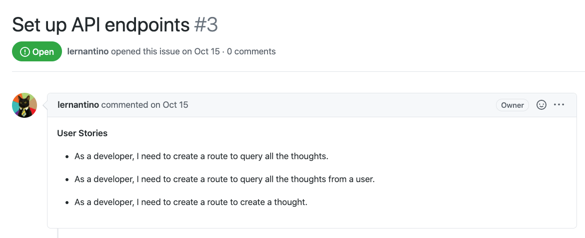
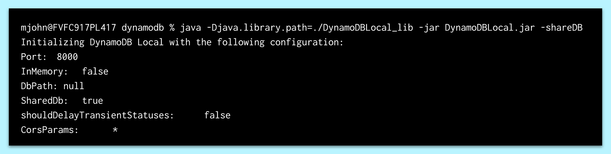
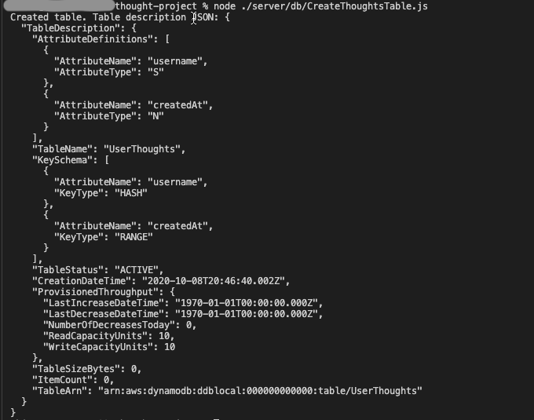
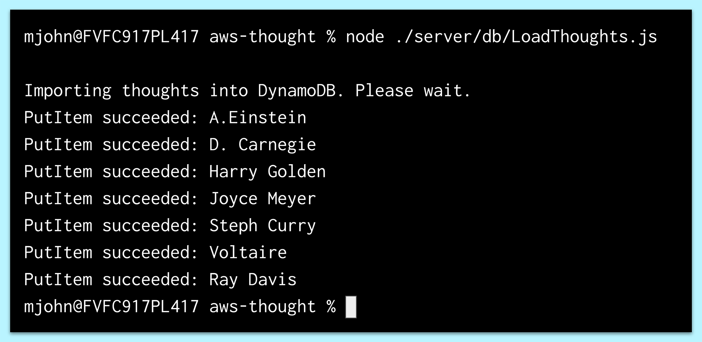
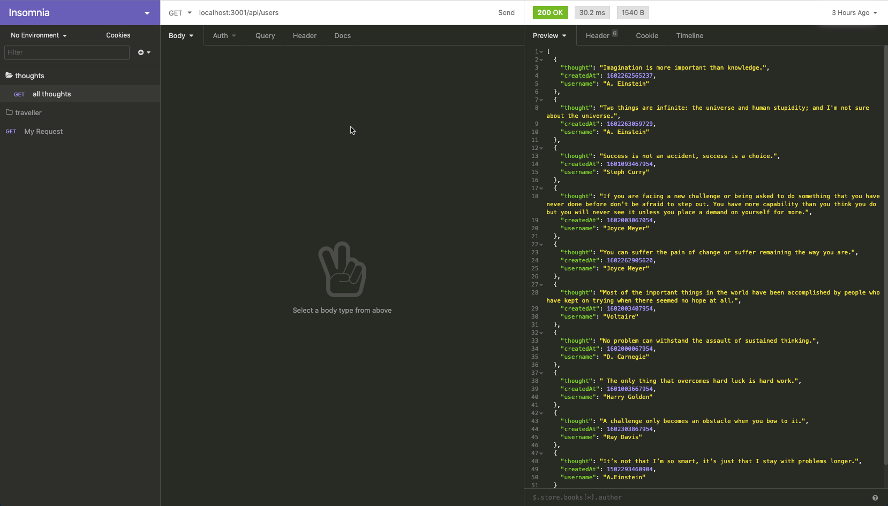
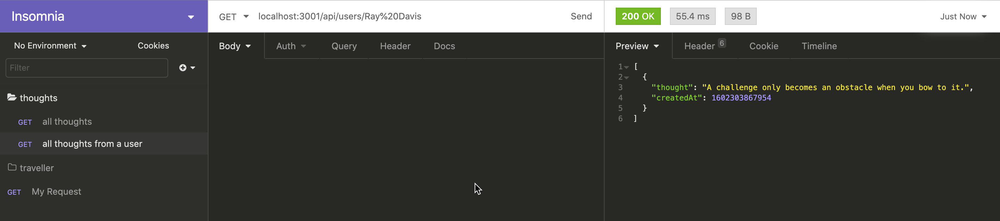
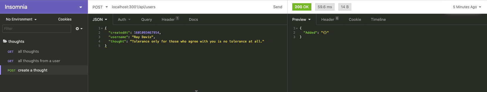
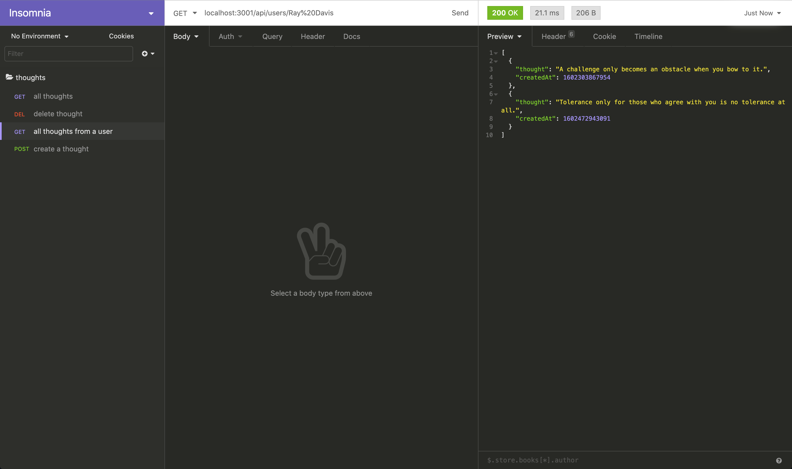

## Introduction

Now that you've learned the fundamentals of cloud computing, you probably have a good grasp on why the cloud has become a fixture of the internet. The cloud not only supplies backup storage for computing devices— but it also delivers a vast global infrastructure system that developers can use to deliver performant web solutions to people around the world.

In the previous lesson, we learned how companies can deliver web applications to consumers while shifting their infrastructure management to cloud providers. We also connected to AWS and created an S3 bucket in the Deep Thoughts application, as the following image shows:


In this lesson, we'll learn how to use another AWS service that the free tier makes available—Amazon DynamoDB. This is a NoSQL database service that uses a key-value method for storing data. We'll replace the MongoDB database in the Deep Thoughts application with DynamoDB.

To find the extent of the free service that's available to us, go to the [AWS Free Tier](https://aws.amazon.com/free/free-tier/) page, and then review the DynamoDB card. Notice that on the free tier, we can receive 25 GB of storage and up to 200,000 requests per month. That's more than sufficient for the Deep Thoughts application, with ample room to create more.

> **Deep Dive**
>
> For more information, refer to the [Amazon DynamoDB pricing](https://aws.amazon.com/dynamodb/pricing/) documentation.

We could have decided to use Atlas, the MongoDB web service that integrates with AWS. However, DynamoDB has special properties that apply to cloud computing on a large scale.

The overlying philosophy in AWS is to provide web services that can handle millions of requests every hour. With MongoDB and relational databases, like MySQL, the performance drops as the number of requests increase. By contrast, DynamoDB was designed with high performance under extreme load conditions in mind. If we use a large-scale-first mentality when designing web applications, we can get around the technical debt of database migration—by starting with a system that can handle a high-request load.

Typically, high-performance databases are expensive. But with the pay-as-you-go cost model of cloud computing, we need to pay DynamoDB only for read or write requests that occur beyond the limit of the free tier.

Let's review the GitHub issue that we'll complete in this lesson, as the following image shows:



In the preceding image, notice that GitHub Issue 3 is named "Set up API endpoints." And, it lists the following three user stories:

* As a developer, I need to create a route to query all the thoughts.

* As a developer, I need to create a route to query all the thoughts from a user.

* As a developer, I need to create a route to create a thought.

In this lesson, we'll create a data model for the application, create and populate a table by using DynamoDB, read and write data to the database, query a table in a NoSQL database, create API endpoints, and programmatically connect to AWS.

By integrating a database web service into an existing web application, we'll learn valuable skills. These include how to use web documentation to learn a new library, how to use a database web service to persist data, and how to integrate a database web service into API endpoints.

## Preview

The goal of this lesson is to integrate the DynamoDB web service into the Deep Thoughts application—to create a table and then to read and write data to that table. Specifically, we'll display a list of all the user thoughts on the homepage of the Deep Thoughts application.

The following image shows an example of what we'll build by the end of the lesson:


In the preceding image, notice that the Deep Thoughts application appears in the browser. It features an input form for submitting thoughts and a feed of already-submitted thoughts.

To get there, we’ll follow this game plan:

1. Create the data model.

2. Create and populate the table by using DynamoDB.

3. Create the API endpoints (for the GET and POST routes).

> **Note**
>
> When following the preceding steps, we'll use the starter code, which supplies the front end of the Deep Thoughts application. We'll integrate the database web service to persist the user thoughts.

Let's get started!

## Create the Data Model

In the previous lesson, we created a S3 bucket to store static files after we set up the database. The first step will be to model the data so that AWS can reproduce the back-end operations to store and query user data.

Before we start integrating web services into the Deep Thoughts application, we must figure out how the application will handle the data, as well as what the structure of the data will look like. In this simplified version of the Deep Thoughts application, users can create a thought, see the thoughts of other users, and select a user to review their other thoughts.

In the first step, we'll determine the access points of the data in the application. By **access points**, we mean which components will need access to the data, how variable the queries will be, and what type of data the components will need.

In this case, it's the homepage, or the `Home` component, that needs a list of all users' thoughts. Later on, we'll use the `ThoughtForm` component to create a new thought and render a specific user's thoughts on the user's profile page.

### Why Use Amazon DynamoDB?

In all of these cases, the requests will be repetitive and simple, meaning they will not change over time or have complex joins. So why is this important?

DynamoDB is specialized for high performance at high request loads because of its ability to handle simple and repetitive queries. For database queries that are very complex and dynamic in nature, we might need to leverage different databases, such as a relational database. AWS offers that in the form of Amazon RDS, or Relational Database Service.

> **On the Job**
>
> Several databases are often used in conjunction with a company's back-end application. This way, the specialized abilities of a relational database can be used in combination with the scalability and performance of a DynamoDB database. This hybrid approach is a way to load balance for performance.

### What Will the Data Look Like?

Now that we've established how the data will be used by the Deep Thoughts application, let's investigate what the data will look like.

We'll be creating a local DynamoDB instance for the development stage. With this local instance we'll create a table called `Thoughts`. In this table, we'll need to store the username, thought text, and when the thought was created. We'll keep it simple for now and add more as needed.

> **Deep Dive**
>
> For more information, refer to the [AWS documentation on DynamoDB](https://aws.amazon.com/dynamodb/).

Now let's move to the next step and create the table!

## Create and Populate the Table by Using Amazon DynamoDB

In the previous step, we created the data model. In this step, we'll create and populate the table by using DynamoDB.

First, we'll need to download the DynamoDB file and start a local instance of the database.

For both macOS and Windows users, complete the following steps:

1. Visit the [AWS DynamoDB download page](https://docs.aws.amazon.com/amazondynamodb/latest/developerguide/DynamoDBLocal.DownloadingAndRunning.html) and select the zip file in the US region.

2. Open the zip file to expand the folder.

3. Open the CLI, navigate to where this folder is located, and `cd` into this folder.

4. Run the following command:

   ```bash
   java -Djava.library.path=./DynamoDBLocal_lib -jar DynamoDBLocal.jar -sharedDb
   ```

   If the above command results in a `java: command not found`, refer to the "Up and Running" page to ensure you have Java installed on your machine.

5. On execution, you should see a message like the one shown in the following image:

   

   In the preceding image, notice that the message shows the initialization and configuration of the DynamoDB local instance on the computer. In particular, notice that this instance is located on Port 8000.

Nice work! Having a local DynamoDB instance is great for development work because we won't be interrupted in case the internet connection is unstable or we need to pay for each read or write operation while in development.

### Define the Table in DynamoDB

Next, before we create the table, let's discuss the components of a DynamoDB table. The following are the basic DynamoDB components:

* **Tables**: Similar to other database systems, DynamoDB stores data in tables. A table is a collection of data.

* **Items**: Each table contains zero or more items. An item is a group of attributes that is uniquely identifiable among all of the other items. An item is similar to a row or record in SQL.

* **Attributes**: Each item is composed of one or more attributes. An attribute identifies the data element, such as a column in SQL.

### Learn About Implementing Partition Keys to Divide the Table

Just like primary keys in SQL, DynamoDB has partition keys. However, there is a key distinction between how they are used and how unique they must be.

In SQL, the primary key uniquely identifies each row. In DynamoDB, the recommendation is to use an attribute with a high degree of cardinality or uniqueness, but it isn't mandatory like it is in SQL. This is because a sort key can be used in combination with the partition key to create a composite key. The composite key will attribute uniqueness by using both attributes as identifiers.

> **Deep Dive**
>
> To learn more, refer to the [AWS documentation on partition keys for DynamoDB](https://aws.amazon.com/blogs/database/choosing-the-right-dynamodb-partition-key/).

### Create a Git Branch

Now we're ready to begin development. Make a new branch to isolate the work.

1. Navigate to the project root folder in the command line, or open the integrated CLI in VS Code at the project's root directory.

2. Checkout to the `develop` branch, then checkout to a new branch called `feature/userthoughts-table`.

Great, now we can safely start developing the `Thoughts` table.

### Create the Folder Structure

Next, let's create the folder structure for the back end of the Deep Thoughts application by following these steps:

1. Create a `db` folder in the `server`.

   The current folder structure should look like the following example:

   ```pre
   ├─ client/
   ├─ server/
   │  ├─ db
   ```

2. In the `db` folder, create a file called `CreateThoughtsTable.js`.

### Add JavaScript

Here we'll be programmatically creating a new table in the local DynamoDB instance.

1. At the top of the file, we'll be importing the `aws-sdk` package, as follows:

   ```js
   const AWS = require('aws-sdk');
   ```

2. Then we'll modify the AWS config object that DynamoDB will use to connect to the local instance, as shown in the following example:

   ```js
   AWS.config.update({
     region: 'us-east-2',
   });
   ```

### Create the DynamoDB Service Object

Next, create the DynamoDB service object by adding the following expression:

```js
const dynamodb = new AWS.DynamoDB({ apiVersion: '2012-08-10' });
```

By specifying the API version in the preceding statement, we ensure that the API library we're using is compatible with the following commands. This is also the latest **long-term support** version, or **LTS**.

It is important to note that we're using the `DynamoDB` class to create a service interface object, `dynamodb`.

> **Deep Dive**
>
> For more information, read the [AWS documentation on the DynamoDB class](https://docs.aws.amazon.com/AWSJavaScriptSDK/latest/AWS/DynamoDB.html).

### Create the params Object

Next we'll create a `params` object that will hold the schema and metadata of the table, by adding the following code:

```js
const params = {
  TableName: 'Thoughts',
  KeySchema: [
    { AttributeName: 'username', KeyType: 'HASH' }, // Partition key
    { AttributeName: 'createdAt', KeyType: 'RANGE' }, // Sort key
  ],
  AttributeDefinitions: [
    { AttributeName: 'username', AttributeType: 'S' },
    { AttributeName: 'createdAt', AttributeType: 'N' },
  ],
  ProvisionedThroughput: {
    ReadCapacityUnits: 10,
    WriteCapacityUnits: 10,
  },
};
```

Because that was a lot of code, let's go through each line and interpret what is happening. Using an object-based key-pair definition, the keys indicate properties, and the values indicate the schema configurations.

In the first line, we designate the table name as `Thoughts`.

Next is the `KeySchema` property, which is where we define the partition key and the sort key. Here we see that the partition key is defined as the `KeyType: "HASH"` and the sort key is defined as the `"RANGE"`. We'll use these terms interchangeably throughout this module.

We defined the hash key as `username` and the range key as `createdAt` to create a unique composite key. One benefit of using `createdAt` as the sort key is that queries will automatically sort by this value, which conveniently orders thoughts by most recent entry.

> **Important**
>
> Knowing the types of queries when creating the table schema can improve the performance of the database and save on development time.

Next we see the `AttributeDefinitions` property. This defines the attributes we've used for the hash and range keys. We must assign a data type to the attributes we've declared. We assigned a string to the `username` and a number to `createdAt`, indicated by `"S"` and `"N"` respectively.

> **Deep Dive**
>
> Because it's a NoSQL database, DynamoDB also has access to more complex attribute types like arrays (known here as lists, or `"L"`) and objects or dictionaries (known here as maps, or `"M"`).
>
> For more information, review the [AWS documentation on attribute types](https://docs.aws.amazon.com/amazondynamodb/latest/APIReference/API_AttributeValue.html).

Next is the `ProvisionedThroughput` property. This setting reserves a maximum write and read capacity of the database, which is how AWS factors in pricing.

> **Deep Dive**
>
> For more information, refer to the [AWS documentation on the provisioned throughput](https://docs.aws.amazon.com/amazondynamodb/latest/APIReference/API_ProvisionedThroughput.html).

Notice that we only defined the keys for the `Thoughts` table. We didn't define any other attributes, such as the `thought` itself. Unlike in a relational database, the schema does not have to be predefined. Items in a DynamoDB table can have a different number of attributes, but they must have a partition key or composite key.

### Call the DynamoDB Instance to Create the Table

Now that the `params` object is configured, we can use it to make a call to the DynamoDB instance and create a table, by adding the following code:

```js
dynamodb.createTable(params, (err, data) => {
  if (err) {
    console.error(
      'Unable to create table. Error JSON:',
      JSON.stringify(err, null, 2),
    );
  } else {
    console.log(
      'Created table. Table description JSON:',
      JSON.stringify(data, null, 2),
    );
  }
});
```

In the preceding statement, we used the method, `createTable`, on the `dynamodb` service object. Next we pass in the `params` object and use a callback function to capture the error and response.

To run this file, run the following command from the root directory:

```bash
node ./server/db/CreateThoughtsTable.js
```

If the table was created successfully, we should see a message that resembles the following image:



### Seed the Table with Data

Next, we'll load some data into the new table so that we can query the database, by following these steps:

1. Create a `seed` folder in the `server` directory.

2. Create the seed data file in `seed` named `users.json`.

3. Copy and paste the following object into a JSON file named `users.json`:

   ```json
   [
     {
       "username": "A. Einstein",
       "createdAt": 1502293460904,
       "thought": "It’s not that I’m so smart, it’s just that I stay with problems longer."
     },
     {
       "username": "Steph Curry",
       "createdAt": 1601093467954,
       "thought": "Success is not an accident, success is a choice."
     },
     {
       "username": "Joyce Meyer",
       "createdAt": 1602003067054,
       "thought": "If you are facing a new challenge or being asked to do something that you have never done before don’t be afraid to step out. You have more capability than you think you do but you will never see it unless you place a demand on yourself for more."
     },
     {
       "username": "Voltaire",
       "createdAt": 1602003407954,
       "thought": "Most of the important things in the world have been accomplished by people who have kept on trying when there seemed no hope at all."
     },
     {
       "username": "D. Carnegie",
       "createdAt": 1602000067954,
       "thought": "No problem can withstand the assault of sustained thinking."
     },
     {
       "username": "Harry Golden",
       "createdAt": 1601003667954,
       "thought": " The only thing that overcomes hard luck is hard work."
     },
     {
       "username": "Ray Davis",
       "createdAt": 1602303867954,
       "thought": "A challenge only becomes an obstacle when you bow to it."
     }
   ]
   ```

   Note that we're using an array of objects with three properties: `username`, `createdAt`, and `thought`.

4. Create another file in the `db` folder, called `LoadThoughts.js`, to load the seed data file.

5. Open the file and add the following statement:

   ```js
   const AWS = require('aws-sdk');
   const fs = require('fs');
   ```

6. Again we'll use the `aws-sdk` to create the interface with DynamoDB. We'll also be using the file system package to read the `users.json` file, as shown in the following example:

   ```js
   AWS.config.update({
     region: 'us-east-2',
   });
   const dynamodb = new AWS.DynamoDB.DocumentClient({
     apiVersion: '2012-08-10',
   });
   ```

   This is similar to the `CreateThoughtsTable.js` configuration, with one key distinction. We'll use the `DocumentClient()` class this time to create the `dynamodb` service object. This class offers a level of abstraction that enables us to use JavaScript objects as arguments and return native JavaScript types. This constructor helps map objects, which reduces impedance mismatching and speeds up the development process. We'll be using this class for most of the database calls in this project.

   > **Deep Dive**
   >
   > For more information, review the [AWS documentation on the document client](https://docs.aws.amazon.com/AWSJavaScriptSDK/latest/AWS/DynamoDB/DocumentClient.html).

7. In the next step, we'll use the `fs` package to read the `users.json` file and assign the object to the `allUsers` constant, as follows:

   ```js
   console.log('Importing thoughts into DynamoDB. Please wait.');
   const allUsers = JSON.parse(
     fs.readFileSync('./server/seed/users.json', 'utf8'),
   );
   ```

   > **Important**
   >
   > The relative path for the `fs.readFileSync` function is relative to where the file is executed, not the path between files. In this case, the file path will work if this command is executed from the project's root directory.

8. Next we'll loop over the `allUsers` array and create the `params` object with the elements in the array, as follows:

   ```js
   allUsers.forEach(user => {
     const params = {
       TableName: "Thoughts",
       Item: {
         "username": user.username,
         "createdAt": user.createdAt,
         "thought": user.thought
       }
     };
   ```

   In the loop, we assigned the values from the array elements in the `Item` property.

9. While still in the loop, we make a call to the database with the service interface object, `dynamodb`, as shown in the following code:

   ```js
     dynamodb.put(params, (err, data) => {
       if (err) {
         console.error("Unable to add thought", user.username, ". Error JSON:", JSON.stringify(err, null, 2));
       } else {
         console.log("PutItem succeeded:", user.username);
       }
     });
   };
   ```

   Add the preceding code to complete the creation of the `LoadThoughts.js` file. In the preceding statement, we used the same pattern that we used to create the table, but this time we used the PUT method.

10. Due to the `fs.readFileSync` function, we must navigate to the root directory of the project first. Otherwise, we'll receive an error that no file was found. Then we can execute the following command:

    ```bash
    node ./server/db/LoadThoughts.js
    ```

If the data loaded successfully into the `Thoughts` table, we should see a message resembling the following image:



Great job! Before moving on, use the AWS CLI to verify that the table was created.

## Create the API Endpoints

In the previous step, we created and populated the table by using DynamoDB. In this step, we'll create the API endpoints.

In this section, we'll create the back end of the Deep Thoughts application. First we'll create the `package-json` file in the `server`. This will allow us to install `express` and help create the API routes.

1. Execute the following command inside the `server` directory:

   ```bash
   npm init --y
   ```

2. Next we'll install the `express` package, as follows:

   ```bash
   npm install express
   ```

3. Create the `server.js` file in the `server` directory.

4. We'll use a boilerplate or common server pattern to set up the back-end functionality, as shown in the following code block:

   ```js
   const express = require('express');
   const app = express();
   const PORT = process.env.PORT || 3001;
   const userRoutes = require('./routes/user-routes');

   // express middleware, used to be bodyparser
   app.use(express.json());
   app.use(express.urlencoded({ extended: true }));

   // Serve up static assets
   if (process.env.NODE_ENV === 'production') {
     app.use(express.static('client/build'));
   }

   // app.use(require('./routes'));
   app.use('/api/', userRoutes);

   // Start the API server
   app.listen(PORT, () =>
     console.log(`🌎  ==> API Server now listening on PORT ${PORT}!`),
   );
   ```

   Let's review a couple notable points of interest in the preceding code:

   * In order to make the above code functional, we need to create a `routes` directory in the `server` directory. And we need to create a `user-routes.js` file in the `routes` directory.

   * The API routes will use `/api/`.

5. Once `user-routes.js` has been created, open the file in the IDE. Now let's import `express` and use the `Router()` to create the routes, as follows:

   ```js
   const express = require('express');
   const router = express.Router();
   ```

Next, let's install the `aws-sdk` package, then import the `aws-sdk` and configure the service interface object, `dynamodb`.

1. In the command line, navigate to the `server` directory, then run the command `npm install aws-sdk`.

2. Configure the service interface object within the `user-routes.js` file as follows:

   ```js
   const AWS = require('aws-sdk');
   const awsConfig = {
     region: 'us-east-2',
   };
   AWS.config.update(awsConfig);
   const dynamodb = new AWS.DynamoDB.DocumentClient();
   const table = 'Thoughts';
   ```

   In the preceding code, we're using some familiar configuration assignments to connect with the local DynamoDB instance. We use the `DocumentClient` class to use native JavaScript objects to interface with the `dynamodb` service object. We're also setting the `table` value to `"Thoughts"`.

> **Pause**
>
> **Question:** Why did we not lock the version number for the `DocumentClient` class like we did for the `DynamoDB` class?
>
> **Answer:** While `DynamoDB` class had two versions, `DocumentClient` has only one, so there is no need to lock the version number for `DocumentClient`.

In the next step, we'll create the routes that will call on DynamoDB. But before we begin, let's figure out what type of data we need from the database and where we'll need it. Consider the following goals:

* Render all the users' thoughts on the homepage.

* List all of a user's thoughts on that user's profile page.

* Create a new user and thought on the thought form.

Based on that list, it looks like we'll need three routes to handle the application's requirements. Let's work on that next.

### Create the GET Route to Access All Thoughts

The first route needs the GET method at the `/api/users/` endpoint. We'll be retrieving all the users' thoughts from the `Thoughts` table. See the following code for an example:

```js
router.get('/users', (req, res) => {
  const params = {
    TableName: table,
  };
  // more to come . . .
});
```

In the preceding statement, we assign `"Thoughts"` to the `TableName` property in the `params` object.

Next, we'll pass the `params` object into the DynamoDB call, as follows:

```js
router.get('/users', (req, res) => {
  const params = {
    TableName: table,
  };
  // Scan return all items in the table
  dynamodb.scan(params, (err, data) => {
    if (err) {
      res.status(500).json(err); // an error occurred
    } else {
      res.json(data.Items);
    }
  });
});
```

In the preceding statement, we'll use the `scan` method to return all the items of the table. We also added a status code in case there was an internal error with retrieving the data from the table. Notice that the data in the table is actually in the `Items` property of the response, so `data.Items` was returned.

Next, we need to add the following expression to expose the endpoints:

```js
module.exports = router;
```

#### Test the GET Route

Now let's test this route by starting the Express.js server and using Insomnia to inspect the responses. From the root directory, use the following command to run the `server.js` file:

```bash
node ./server/server.js
```

> **Note**
>
> Moving forward, we will be adding functionality to the Express.js server and then testing that new functionality. It's important to stop and then restart the server to ensure that the code you've added in each section is recognized by the server _before_ you run any tests.

We should see the following message at the command prompt once the server is running:

```js
🌎  ==> API Server now listening on PORT 3001!
```

To test the GET route, open Insomnia and complete the following steps:

1. Create a new folder called `thoughts`.

2. Create a new request in the `thoughts` folder called `all thoughts`.

3. In the address bar, insert the route that you created: `localhost:3001/api/users`.

4. Select the GET method in the address bar from the drop-down menu.

5. Select Send.

If we get a response with data, we know that we created the route and seeded the data into the table correctly.

The following image verifies that the route is working properly:



Once this route has been verified as shown in the preceding image, we can move on to the next route, which will create a new thought.

> **Deep Dive** In case a response isn't returning properly from the GET route, it's a good idea to check that the DynamoDB instance is running.
>
> One way to check is to use the following AWS CLI command, which will return the contents of the table in the command line:
>
> ```bash
> aws dynamodb scan --table-name Thoughts
> ```
>
> To learn more, refer to the [AWS documentation on basic operations on DynamoDB tables](https://docs.aws.amazon.com/amazondynamodb/latest/developerguide/WorkingWithTables.Basics.html).

Now let's move on to the next endpoint, which will return all the thoughts from a user.

### Create the GET Route to Access All Thoughts from a User

We need to get all the thoughts for a specific user to populate the user's profile page. We'll get to the profile page by selecting the name of a user on the homepage.

Let's begin by creating the endpoint using the GET method. Place this route under the previously created route, but before the `module.exports` expression. Make sure that `module.exports` remains the last line of this file. See the following code for an example:

```js
// More to come
router.get('/users/:username', (req, res) => {
  console.log(`Querying for thought(s) from ${req.params.username}.`);
});
```

In the preceding route, we'll use query parameters to pass the `username` from the client to the server. We'll capture the query parameter with the `req.params` object.

Next we'll declare `params` to define the query call to DynamoDB. We'll use the `username` retrieved from `req.params` to provide a condition for the query, because we're only interested in one user. The goal is to find all the thoughts from this user. Begin by declaring `params`, as shown in the following expression:

```js
const params = {
  TableName: table,
  KeyConditionExpression: '#un = :user',
  ExpressionAttributeNames: {
    '#un': 'username',
    '#ca': 'createdAt',
    '#th': 'thought',
  },
  ExpressionAttributeValues: {
    ':user': req.params.username,
  },
  ProjectionExpression: '#th, #ca',
  ScanIndexForward: false,
};
```

Let's break down this expression and explain each of the four properties:

* The `KeyConditionExpression` property specifies the search criteria.

  > **Rewind**
  >
  > Similar to the `WHERE` clause in SQL, the `KeyConditionExpression` property is used to filter the query with an expression.

  As the name suggests, we can use expressions by using comparison operators such as `<`, `=`, `<=`, and `BETWEEN` to find a range of values.

  > **Deep Dive**
  >
  > To learn more, refer to the [AWS documentation on working with queries in DynamoDB](https://docs.aws.amazon.com/amazondynamodb/latest/developerguide/Query.html).

  We need to retrieve all the thoughts from a specific user, so we used the `=` operator to specify all items that pertain to a single username. The `#un` and `:user` symbols are actually aliases that represent the attribute name and value. The `#un` represents the attribute name `username`. This is defined in the `ExpressionAttributeNames` property. While attribute name aliases have the `#` prefix, the actual value of this key is up to us. DynamoDB suggests using aliases as a best practice to avoid a list of reserved words from DynamoDB that can't be used as attribute names in the `KeyConditionExpression`. Because words such as `time`, `date`, `user`, and `data` can't be used, abbreviations or aliases can be used in their place as long as the symbol `#` precedes it.

  > **Deep Dive**
  >
  > For more information, refer to the [AWS documentation on reserved words in DynamoDB](https://docs.aws.amazon.com/amazondynamodb/latest/developerguide/ReservedWords.html).

* For the same reason, the attribute values can also have an alias, which is preceded by the `:` symbol. The attribute values also have a property that defines the alias relationship. In this case, the `ExpressionAttributeValues` property is assigned to `req.params.username`, which was received from the client. To reiterate, we're using the username selected by the user in the client to determine the condition of the search. This way, the user will decide which username to query.

* Next is the `ProjectExpression` property. This determines which attributes or columns will be returned. This is similar to the `SELECT` statement in SQL, which identifies which pieces of information is needed. In the preceding code statement, we specify that the `thoughts` and `createdAt` attributes should be returned. We didn't add the `username`, because this value is part of the condition criteria; therefore, this info is redundant and won't be rendered.

* Last is the `ScanIndexForward` property. This property takes a Boolean value. The default setting is true, which specifies the order for the sort key, which will be ascending. The sort key was assigned to the `createdAt` attribute when we first created the table. Because we want the most recent posts on top, we set the `ScanIndexForward` property to false so that the order is descending.

Now that the `params` object is set, we have all the information we need to make the database call to the `Thoughts` table. Let's use the service interface object, `dynamodb`, and the `query` method to retrieve the user's thoughts from the database, by running the following function call:

```js
  dynamodb.query(params, (err, data) => {
    if (err) {
      console.error("Unable to query. Error:", JSON.stringify(err, null, 2));
      res.status(500).json(err); // an error occurred
    } else {
      console.log("Query succeeded.");
      res.json(data.Items)
    }
  });
}); // closes the route for router.get(users/:username)
```

Notice that the pattern is the same as before. We pass in the `params` object and a callback function to handle the response. The first conditional expression will return an internal request error with a status code of 500 if there's a problem with the query request to the database. All other responses will be considered a successful operation. Again we send the `data.Items` object back to the client. The response data from the database is located in the `Items` property of the response.

> **Important**
>
> The last `});` is necessary to end the router statement. Double-check the syntax just to make sure the route will execute properly.

The route to get all the thoughts of a user should look like the following code block:

```js
// get thoughts from a user
router.get('/users/:username', (req, res) => {
  console.log(`Querying for thought(s) from ${req.params.username}.`);
  const params = {
    TableName: table,
    ProjectionExpression: '#th, #ca',
    KeyConditionExpression: '#un = :user',
    ExpressionAttributeNames: {
      '#un': 'username',
      '#ca': 'createdAt',
      '#th': 'thought',
    },
    ExpressionAttributeValues: {
      ':user': req.params.username,
    },
    ProjectionExpression: '#th, #ca',
    ScanIndexForward: false,
  };
  dynamodb.query(params, (err, data) => {
    if (err) {
      console.error('Unable to query. Error:', JSON.stringify(err, null, 2));
      res.status(500).json(err); // an error occurred
    } else {
      console.log('Query succeeded.');
      res.json(data.Items);
    }
  });
});
```

Nice work! Let's test the route now to see if the work for this route is finished.

Open Insomnia and create a new route called `all thoughts from a user`, which you can duplicate from the `all thoughts` route. Change the URL in the address bar to reflect the query parameters needed for this route. Your request should resemble the following example:

```text
localhost:3001/api/users/Ray%20Davis
```

Notice how we used the `%20` escape symbol to allow a space between the first and last names of the users.

Once we select Send, a successful response will look like the following image:



Notice that only the `thought` and `createdAt` attribute names were retrieved as expected due to the `ProjectExpressions` assignment in the `params` configuration. If we had not supplied this property in the `params` object, we would've received all the attributes of each item.

Now it's time to work on the final endpoint of this lesson: create a new user and their corresponding thought.

### Create the POST Route to Create a New Thought

As a reminder, we need this route when a user creates a new thought in the `ThoughtForm` component. We need the database call to occur once a user selects submit.

We're creating a new thought, so we'll use the POST method, which will occur at the endpoint `/api/users`. Set up the following route under the last route, but before the `module.exports = router;` expression:

```js
// Create new user at /api/users
router.post('/users', (req, res) => {
  const params = {
    TableName: table,
    Item: {
      username: req.body.username,
      createdAt: Date.now(),
      thought: req.body.thought,
    },
  };
  // database call
});
```

In the preceding route, notice that we set the `params` object to the form data of the `ThoughtForm`, which we can access with `req.body`. Also notice that we use the JavaScript native `Date` object to set the value of the `createdAt` property. This is so that we know when this thought from the user was posted. Remember that we used the `createdAt` property as the sort key, which will help us sort the thoughts chronologically when we want to render them in the profile page.

Now all that's left is the database call, which looks like the following example:

```js
  dynamodb.put(params, (err, data) => {
    if (err) {
      console.error("Unable to add item. Error JSON:", JSON.stringify(err, null, 2));
      res.status(500).json(err); // an error occurred
    } else {
      console.log("Added item:", JSON.stringify(data, null, 2));
      res.json({"Added": JSON.stringify(data, null, 2)});
    }
  });
});  // ends the route for router.post('/users')
```

You might've noticed that this is the same pattern that we used before. However, a key distinction here is that we use the `put` method to add an item to the `Thoughts` tables.

The following completed endpoint shows how the route will look once we add both the `params` object and the corresponding database call:

```js
// Create new user
router.post('/users', (req, res) => {
  const params = {
    TableName: table,
    Item: {
      username: req.body.username,
      createdAt: Date.now(),
      thought: req.body.thought,
    },
  };
  dynamodb.put(params, (err, data) => {
    if (err) {
      console.error(
        'Unable to add item. Error JSON:',
        JSON.stringify(err, null, 2),
      );
      res.status(500).json(err); // an error occurred
    } else {
      console.log('Added item:', JSON.stringify(data, null, 2));
      res.json({ Added: JSON.stringify(data, null, 2) });
    }
  });
});
```

> **Important**
>
> Notice that because we're using the `DocumentClient()` class to instantiate the service object, `dynamodb`, the request and response from the database are native JavaScript objects. This greatly simplifies the code and improves the developer experience by sidestepping any impedance mismatch.

#### Test the POST Route

It's time to test the route!

1. Open Insomnia and create a POST request named `create thought` in the `thoughts` folder .

2. Duplicate the `all thoughts` route and change the method to a POST method.

3. Select Body in the menu bar and choose JSON. We'll simulate the form data by sending the route a JSON object.

4. Copy and paste the following JSON object, which will serve as a substitute for the form data:

   ```js
   {
     "createdAt": 1601093467954,
     "username": "Ray Davis",
     "thought": "Tolerance only for those who agree with you is no tolerance at all."
   }
   ```

5. Select Send to send the POST request with the sample form data.

If the route successfully created a thought, you'll see the following response from the database in Insomnia:



Let's do a quick check to verify that the new thought is in the `Thoughts` table by selecting the `all thoughts from a user` request we created previously. Select Send to see if the new thought from Ray Davis has been added to the `Thoughts` table. You should see something like the following image:



Hurray! We've successfully created the API endpoints needed by the Deep Thoughts application. Now that we've verified the data responses from DynamoDB, we can move on to connecting the API endpoints to the components on the client and rendering the data responses.

But before we forget, let's close the GitHub issue, add and commit the work, and then merge the `feature/userthoughts-table` branch into the `develop` branch.

## Reflection

You learned a lot during this lesson about working with a local DynamoDB instance! You used a large-scale-first approach, which enables an application to scale up without degrading the performance. In this scenario, the cloud provider maintains the database service with reliability, availability, durability, and security. You can thus focus on the application features instead of worrying about applying security patches, calculating capacity, designing the IT architecture, and buying equipment.

In this lesson, you accomplished the following:

* Created a data model for the application.

* Created and populated a table by using DynamoDB.

* Read and wrote data to the database.

* Queried a table in a NoSQL database.

* Created API endpoints

* Programmatically connected to AWS.

In the next lesson, we'll integrate the API endpoints with the client. The user will then be able to interact with the database&mdash;to display data and to post data to the database. We'll also add a new feature so that we can use images in the Deep Thoughts application.

---

© 2025 edX Boot Camps LLC. Confidential and Proprietary. All Rights Reserved.
