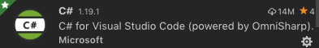
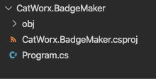
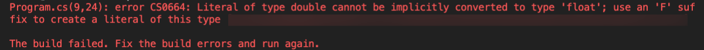
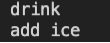
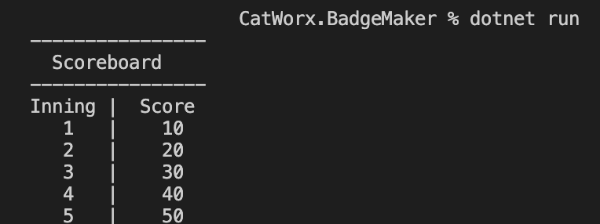

## Introduction

For many developers looking to expand their skill sets, C# is a natural next step. This object-oriented programming language from Microsoft is closely related to many other programming languages&mdash;making it easier to learn. It's also the perfect choice if you want to develop games or Microsoft applications.

In this module, you’ll use C# to build a console app that creates employee security badges for a rapidly expanding startup, CatWorx. You’ll use the .NET framework to import libraries that let you read and write to the file system, query APIs, and generate images.

Before you get started, you need to set up an environment that can build and run C# applications. You'll use VS Code, which you should already have set up from working with JavaScript. And because you already have VS Code installed, enabling it to write, debug, and build C# projects is just a two-step process.

In this lesson, you'll learn how to do the following:

* Set up a C# environment.

* Run a C# application.

* Declare a statically typed variable.

* Distinguish between JavaScript and C# syntax.

## Preview

The goal for this lesson is to set up the development environment in C# so that we can build the CatWorx application. We'll also review some of C#'s components.

This lesson contains the following steps:

1. Add the C# extension to VS Code.

2. Install .NET Core on your local machine.

3. Create a "Hello, World!" application.

4. Explore the Program.cs file.

5. Explore C# data types.

6. Explore C# data type conversions.

7. Explore loops in C#.

Let's get started!

## Add the C# Extension

First things first&mdash;let’s add the C# extension by following these steps:

1. Navigate to the Extensions panel in VS Code, then search for C#. Alternatively, you can view extensions by using the keyboard shortcut Command+Shift+X (macOS) or Ctrl+Shift+X (Windows).

2. Add the C# extension by OmniSharp. It should be near the top of the list and resemble the following image:



That's all there is to it! Next, we'll install .NET Core.

## Install .NET Core

Next we’ll install the .NET Core SDK from Microsoft. This package will install everything we need to build and run C# applications, including libraries, tools, and the .NET runtime environment.

The .NET runtime environment includes the dotnet application, which will allow us to install extra packages (called **assemblies**) and run C# applications from the command line. It's similar to Node's npm.

> **Deep Dive**
>
> The .NET Core SDK isn't specific to VS Code and can be used with other IDEs. For more information, refer to the [Microsoft Docs on the dotnet command](https://docs.microsoft.com/en-us/dotnet/core/tools/dotnet).

To install the .NET Core SDK, follow these steps:

1. Navigate to the [Microsoft Docs on .NET downloads](https://dotnet.microsoft.com/download/dotnet).

2. Select the .NET 6.0 option.

3. Upon selection, you will be navigated to a new page where you will need to select the correct installer for your system.

4. After downloading the correct installer, open the installer and it will guide you through the remaining steps to install .NET Core SDK.

### Confirm the Installation

Before we move on, let’s confirm that the C# environment was installed.

To do that, open a new instance of the command line and type `dotnet --info`. You should see something like the following output:

```bash
$ dotnet --info
.NET Core SDK (reflecting any global.json):
 Version:  6.0.202
 Commit:    f8a55617d2

Runtime Environment:
 OS Name:     Mac OS X
 OS Version:  12.3
.
.
.
```

If you get an error like "command not found," you might need to manually add a link to `dotnet` in your executable path.

>**Deep Dive**
>
> For more details, refer to this [GitHub issue about the dotnet command not found on macOS](https://github.com/dotnet/cli/issues/2544) or this [GitHub issue about the dotnet command not found on Windows](https://github.com/dotnet/sdk/issues/7428).

## Create a "Hello, World" App

How could we embark on learning a new programming language without creating a "Hello, World!" application? We'll initialize a new C# project using the dotnet executable, which creates a "Hello, World!" app for us.

### Create the CatWorx.BadgeMaker App

First, we'll create the badge-maker app by following this step:

* Navigate to the folder where you want your project to reside. At the command prompt, use dotnet to create the new console app called `CatWorx.BadgeMaker` by typing the following command:

```bash
$ dotnet new console -o CatWorx.BadgeMaker
```

This command will create a new folder called `CatWorx.BadgeMaker` that will contain the C# project. Let's look at the project files.

### View the Project Files

To view the project files, follow these steps:

1. In VS Code, select File from the main menu, and choose "Open..."

2. Navigate to the `CatWorx.BadgeMaker` folder that dotnet created.

3. Double-click `CatWorx.BadgeMaker` to open it in the VS Code Explorer pane.

You should see something like the following image:



Note that the project already contains the following files and folders:

* The `obj` folders shown in the preceding image are used by .NET Core to execute the C# code.

* The `CatWorx.BadgeMaker.csproj` file is very similar to a `package.json` file, which contains your program's dependencies and packages.

* The `Program.cs` file is where you'll develop the console application.

### The Program.cs File

Let’s look in the `Program.cs` file, shown here:

```c#
// See https://aka.ms/new-console-template for more information
Console.WriteLine("Hello, World!");
```

This is the new template generated by .NET 6.0, that uses something called [top-level statements](https://docs.microsoft.com/en-us/dotnet/csharp/fundamentals/program-structure/top-level-statements), which is a feature to minimize the amount of code needed to start writing programs. To find out more about this, feel free to visit the link that is in the comment in this file. In order to better understand the importance of the `Program.cs` file, we are going to convert it back to a previous, more verbose version.

Replace the contents of `Program.cs` with the following:

```c#
using System;

namespace CatWorx.BadgeMaker
{
  class Program
  {
    static void Main(string[] args)
    {
      Console.WriteLine("Hello, World!");
    }
  }
}
```

We'll review the contents of this file shortly.

### Run the "Hello, World!" App

To run the app, follow these steps:

1. At the command line, navigate to the `Catworx.BadgeMaker` folder.

2. Type the command `dotnet run`. The output will read, `"Hello, World!"`.

Congratulations&mdash;you've written your first C# program! Next you'll explore this C# app further to learn how it works.

## Explore the Program.cs File

Let's explore the contents of the `Program.cs` file to learn about some C# constructs. Here it is again, in the following code:

```c#
using System;

namespace CatWorx.BadgeMaker
{
  class Program
  {
    static void Main(string[] args)
    {
      Console.WriteLine("Hello, World!");
    }
  }
}
```

### Namespaces

In the `Program.cs` file, you'll notice the keyword `namespace` followed by the name of the app, `CatWorx.BadgeMaker`. **Namespaces** are used to organize and provide a level of separation in the code&mdash;something like modules in Node.js.

Think of namespaces as containers that have members. A member can be another nested namespace, a method, or a class (like in this case). After `namespace CatWorx.BadgeMaker`, everything inside the curly braces can be interpreted as members of that namespace.

> **Pro Tip**
>
> Common C# conventions are to use a company name for the root namespace in order to ensure that it is unique.

#### The System Namespace

On the very first line, with the `using` directive, we're importing a common namespace called `System`. Much like `require` or `import` when using modules in Node.js, in C# the `using` directive lets us use the corresponding namespace (`System`) without needing to qualify its use when using one of its members. For example, without this naming shortcut, every time `Console` is used, it would need to be preceded by `System` and a period.

The `System` namespace is part of the .NET framework. It is a collection of commonly used methods, data types, and data structures, which are the essential building blocks of a C# application.

> **Deep Dive**
>
> To learn more, refer to the [Microsoft Docs on the System namespace](https://docs.microsoft.com/en-us/dotnet/api/system?view=netframework-4.8).

You may have noticed that this line shows a message that says: "Unnecessary Using Directive". This is because in .NET 6.0 there is a setting called **implicit usings**, which is turned on by default. This setting automatically adds certain `using` directives based on the project type.

For console applications with this setting enabled, the following `using` directives are implicitly included:

* `using System;`

* `using System.IO;`

* `using System.Collections.Generic;`

* `using System.Linq;`

* `using System.Net.Http;`

* `using System.Threading;`

* `using System.Threading.Tasks;`

> **Note**
>
> Even though these directives are implicitly included with the default settings, they will be included in the code snippets. This inclusion will be for reference and so that if you change this setting your code will still work.

### The Main() Method

Within the namespace, you'll find a class named `Program` and a static method named `Main()`. You'll learn more about C# classes later, but for now, look more closely at the `Main()` method in `Program`.

`Main()` is a very special method that serves as the entry point of the application. The `Main()` method is invoked when the program runs&mdash;and it's where we'll place the code.

In order for `Main()` to be recognized as the program's entry point, the following syntax guidelines must be followed:

* `Main()` must be nested in a class.

* There can only be one entry point to a program.

* The keyword `void` signifies that the return of this executable method will be void.

* The keyword `static` implies that the scope of this method is at the class level, not the object level, and can thus be invoked without having to first create a new class instance. Hence the `Main()` method can be run as soon as the program runs.

We use the following syntax to initialize the `Main()` method, with or without parameters:

```c#
static void Main () //Entry Point
```

Alternatively, you can initialize it as follows:

```c#
static void Main (string[] args) //Entry Point
```

Now that we have a basic understanding of how a program is set up, let’s explore how to build one. We'll start with reviewing C# data types!

## C# Data Types

Like JavaScript, C# has various data types that can store values, each with their own set of properties and unique behavior.

However, unlike JavaScript, C# is a **statically typed language**. This means that the data type is explicitly labeled when a variable is declared. In JavaScript, declaring a variable with the keyword `var` allows the data type to be inferred; in contrast, C# variables MUST be declared with a data type.

Let's compare and contrast a JavaScript code block and a C# code block that declare variables for a car model and price.

Here's the JavaScript code block:

```js
// JavaScript
var carModel = "Explorer";
var carPrice = 500;
```

Here's the C# code block:

```c#
// C#
string carModel = "Intrepid";
int carPrice = 500;
```

As you can see, in the C# code block, the data types are explicitly defined when the variables are declared. The `carModel` variable was declared as a `string`, and `carPrice` was declared as `int` (an integer).

Statically typed languages have several advantages, namely that compilers are more likely to catch errors automatically early on, making the code more reliable and stable.

### Strings

Just as in JavaScript, C# strings store plain text. Let’s explore strings by doing a little coding. We'll type some code examples in `Program.cs` and then run the app using `dotnet run` to see the output printed in the console.

Type the following code inside the `Main()` method and try to guess what the outcome will be before executing the program:

```c#
string greeting = "Hello";
greeting = greeting + "World";
Console.WriteLine("greeting" + greeting);
```

Notice how the variable `greeting` is declared as a string data type. In C# it is necessary to use double quotes, or `""`, in order to define a string. Although JavaScript also allows single quotes or backticks to express a string, C# does not allow this flexibility.

### String Interpolation

There are a few other ways to print variables in C#. You might recognize some similarities to JavaScript in the following code example:

```c#
Console.WriteLine($"greeting: {greeting}"); 
Console.WriteLine("greeting: {0}", greeting);
```

In the preceding code block, the first statement interpolates the variable `greeting` with the use of the `$`, and curly braces surround the variable (`{greeting}`). The second statement interpolates the variable `greeting` by associating the zero index with the second argument of the function call.

### Numbers

Just like JavaScript, C# number data types are used to store numbers. They have unique properties inherent to the number data type.

For example, integer values and decimal values have different data types in C#, as is the case in virtually all programming languages. Can you guess which is which in C#? That’s right&mdash;`int` for integers and `float` for decimals.

> **Deep Dive**
>
> For more information, refer to the [Microsoft Docs on C# built-in types](https://docs.microsoft.com/en-us/dotnet/csharp/language-reference/builtin-types/built-in-types).

#### Example Math Operations

Now let's try an exercise to solve some basic math operations in C#. Try to solve the following problem by writing a solution in the `Main()` of the `Program.cs` file:

```c#
// How do you find the area of a square? Area = side * side
float side = 3.14;
```

Try to compute the solution programmatically by placing the code in the `Main()` function, and replace the "Hello, World!" statement in the `Program.cs` file. Then run the program with `dotnet run`.

If you get an error or get stuck, ask yourself the following questions:

* Do we need to declare the `area` as a variable?

* What data type should `area` be?

* What does the error suggest?

The following image shows an error in the console:



There are two ways that we could handle this error. The first solution involves changing the number to be a float. When we write a decimal with no suffix, it is by default the type `double`. If we want to convert the literal to be a float, we could use the `F` suffix suggested as shown in the following code:

```c#
float side = 3.14F;
float area = side * side;
Console.WriteLine("area: {0}", area);
```

Alternatively, we could change the type to `double` to match what the default type of a decimal with no suffix is. This solution is shown in the following code:

```c#
double side = 3.14;
double area = side * side;
Console.WriteLine("area: {0}", area);
```

How do we identify the data type of a variable? We use the `GetType()` function, as follows:

```c#
Console.WriteLine("area is a {0}", area.GetType());
```

> **Deep Dive**
>
> For more information, refer to the [Microsoft Docs on floating-point numeric types](https://docs.microsoft.com/en-us/dotnet/csharp/language-reference/builtin-types/floating-point-numeric-types)

### Math Operators

Try to guess what the outcomes will be for the following lines of code, then run them in your `Main()` method:

```c#
Console.WriteLine(2 * 3);         // Basic Arithmetic: +, -, /, *
Console.WriteLine(10 % 3);        // Modulus Op => remainder of 10/3
Console.WriteLine(1 + 2 * 3);     // order of operations
Console.WriteLine(10 / 3.0);      // int's and doubles
Console.WriteLine(10 / 3);        // int's 
Console.WriteLine("12" + "3");    // What happens here?

int num = 10;
num += 100;
Console.WriteLine(num);
num ++;
Console.WriteLine(num);
```

After running the application using the `dotnet run` command, we should see the following results in the console:


The preceding results from these math operations perform as expected, similarly to JavaScript. Strings concatenate, and the math operators abide by operation order.

### Booleans

C# also has a separate Boolean type, `bool`. We can declare any variable as a type `bool` and assign the variable a `true` or `false` value, as seen in the following declaration:

```c#
bool isCold = true;
Console.WriteLine(isCold ? "drink" : "add ice");  // output: drink
Console.WriteLine(!isCold ? "drink" : "add ice");  // output: add ice
```

Run the preceding statements in the `Main()` function in the `Program.cs` file with the command `dotnet run` to see the following results:



## Data Type Conversions

In JavaScript, there was often a need to convert data types. Let’s do this in C#.

Imagine that you're given the string `stringNum = "2"`. To use `stringNum` in a math operation, you need to do a data type conversion to a number.

Try writing code that converts the `stringNum` text to an `Int32` and stores it into a variable. Print the variable, and print the variable's type as well.

> **Hint**
>
> Use the `Convert` class from the `System` namespace, specifically the `ToInt32()` method. You'll also need to use `GetType()`.

When you're finished, your work should resemble the following code:

```c#
string stringNum = "2";
int intNum = Convert.ToInt32(stringNum);
Console.WriteLine(intNum);
Console.WriteLine(intNum.GetType());
```

> **Important**
>
> `Int32` designates the storage available for the variable. This calculates to 32 bits, which is 2^32 or 4,294,967,296 values. There are also `Int16` and `Int64` for different calculation sizes when necessary.

Now let’s move on to more complex data structures, which will allow us to start building the application.

## Data Structures

In this section, we'll look at dictionaries, arrays, and lists in C#. These more complex data types allow us to store lots of data in a structured format. Similar to how JavaScript used arrays and object literals, C# uses these data structures to maintain large sets of data with different accessibility operations. Choosing the right data structure for the job will optimize application performance.

### Dictionaries

Similar to object literals in JavaScript, **dictionaries** in C# use a key-value pair relationship. But just as with the data types, the type of data that can be stored must be explicitly stated when the dictionary is declared.

To use a dictionary, you must first import `System.Collections.Generic` at the top of the `Program.cs` file, by typing the following command:

```c#
using System.Collections.Generic;
```

Data types for a dictionary's key-value pair types are declared in angled brackets, as shown in the following examples:

```c#
<string, double>
<int, string> 
```

In the following code example, we're declaring that the variable, `myScoreBoard`, is a dictionary that has a string key and an integer value:

```c#
Dictionary<string, int> myScoreBoard = new Dictionary<string, int>();
```

To populate the dictionary, we use the `Add()` method in multiple lines to add data. See the following code for an example:

```c#
myScoreBoard.Add("firstInning", 10);
myScoreBoard.Add("secondInning", 20);
myScoreBoard.Add("thirdInning", 30);
myScoreBoard.Add("fourthInning", 40);
myScoreBoard.Add("fifthInning", 50);
```

Alternatively, we could initialize the dictionary by listing the key-value pairs in a function call. Using this method, we pass a comma-separated list of key-value pairs in curly braces, `{}`, for each entry we wish to create. See the following example:

```c#
Dictionary<string, int> myScoreBoard = new Dictionary<string, int>(){
    { "firstInning", 10 },
    { "secondInning", 20},
    { "thirdInning", 30},
    { "fourthInning", 40},
    { "fifthInning", 50}
};
```

This example is functionally equivalent to the first method.

#### Populate a Dictionary

Now try this yourself. Use one of the preceding patterns to populate the dictionary `myScoreboard`. Then add the following code block to print the dictionary:

```c#
Console.WriteLine("----------------");
Console.WriteLine("  Scoreboard");
Console.WriteLine("----------------");
Console.WriteLine("Inning |  Score");
Console.WriteLine("   1   |    {0}", myScoreBoard["firstInning"]);
Console.WriteLine("   2   |    {0}", myScoreBoard["secondInning"]);
Console.WriteLine("   3   |    {0}", myScoreBoard["thirdInning"]);
Console.WriteLine("   4   |    {0}", myScoreBoard["fourthInning"]);
Console.WriteLine("   5   |    {0}", myScoreBoard["fifthInning"]);
```

Now run the code in the console with the command `dotnet run`. You should see the following in the console:



### Arrays

Like in JavaScript, C# arrays are data structures that can store large amounts of data with similar accessibility features. As you'll recall, items in arrays can be accessed by their index, which starts at 0.

However, there are a couple of notable distinctions in the way C# handles arrays, because the data type of the array’s elements must be declared&mdash;just as we did for variables. This constraint allows for only a single data type to be contained in the array.

Another distinction is that the length of the array must also be set when the array is declared. No new elements can be added or subtracted from the array.

To declare an array in C#, we must declare the data type and size, as shown in the following code block:

```c#
string[] favFoods = new string[3]{ "pizza", "doughnuts", "icecream" };
string firstFood = favFoods[0];
string secondFood = favFoods[1];
string thirdFood = favFoods[2];
Console.WriteLine("I like {0}, {1}, and {2}", firstFood, secondFood, thirdFood);
```

#### Declare an Array

Remove any previous code from the `Main()` function and replace it with the preceding code. Run the code from the command line with `dotnet run`.

You should see the following output to the console:

```bash
I like pizza, doughnuts, and icecream
```

Thus, just as in JavaScript, we can access the array using `[]` and the array's index.

### Lists

C# lists might seem more similar to JavaScript arrays because their lengths are not static&mdash;they can expand to contain all the elements needed.

Like dictionaries, lists are located in the `System.Collections.Generic` namespace. So be sure to import this directive with the `using` statement at the top of the `Program.cs` file, as follows:

```c#
using System.Collections.Generic;
```

The following code block demonstrates how to declare a list and its data types using the angle bracket notation, similar to the dictionary:

```c#
List<string> employees = new List<string>() { "adam", "amy" };

employees.Add("barbara");
employees.Add("billy");
```

We also added more employee names using the `Add()` method.

Now that the list is populated with employee data, how can we access that list to print the employee names to the console?

> **Hint**
>
> Leverage your knowledge of JavaScript arrays!

We'd use the following code to accomplish this:

```c#
Console.WriteLine("My employees include {0}, {1}, {2}, {3}", employees[0], employees[1], employees[2], employees[3]);
```

We used the same bracket notation, `[]`, that we used with arrays.

Can you predict what the output will look like here? Add this code to the `Main()` function and run the application to check whether your prediction was correct. You should get the following response:

```bash
My employees include adam, amy, barbara, billy
```

Simple but redundant. How can we keep the code DRY? Imagine a huge company that needs to create an employee list. Doing it this way would take forever! Is there a JavaScript solution for printing array elements that lends itself to a more automated process?

If you guessed loops, you're right! You'll explore those next.

## Loops

It's time to test your googling skills. See if you can find the correct function to iterate through the employees list.

It turns out, just like in JavaScript, we can use `for` loops in C# to iterate through an array or, in this case, a list.

> **Deep Dive**
>
> To learn more, refer to this [tutorial on C# for loops](https://www.tutorialsteacher.com/csharp/csharp-for-loop).
>
> Can you note all the differences and similarities compared to `for` loops in Javascript?

### Write a for Loop

Replace the `Console.Writeline()` statement currently in the `Main()` function with the following code block, and run the application:

```c#
for (int i = 0; i < employees.Count; i++) 
{
  Console.WriteLine(employees[i]);
}
```

In the console, we can display each employee's name on a separate line, as follows:

```bash
adam
amy
barbara
billy
```

Pretty soon, we'll use a list to store the employee names for the badge-maker application. The list can grow to accommodate the size of the company, and it has a familiar interface to access and populate data into the list.

## Reflection

We've covered a lot in just one lesson, including many of the fundamental similarities and differences between C# and JavaScript. At this point, we've discovered some of what makes C# unique.

In this lesson, you learned how to do the following:

* Set up a C# environment.

* Run a C# application.

* Declare a statically typed variable.

* Use C# data types like strings, numbers, arrays and lists, dictionaries, and Booleans.

* Iterate using `for` loops.

That's a lot to learn in a short amount of time, but by leveraging your knowledge of OOP from JavaScript, you're well ahead of the curve. With these essential building blocks, you can start to build the security badge application and learn more about the utilitarian nature of C# and the .NET framework. You'll soon feel confident using C#’s assets to build simple programs!

Now that you have a basic understanding of the C# syntax, let’s explore how to interact with the user through the console.

---

© 2025 edX Boot Camps LLC. Confidential and Proprietary. All Rights Reserved.
