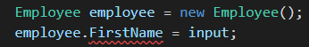
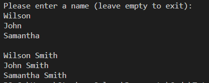
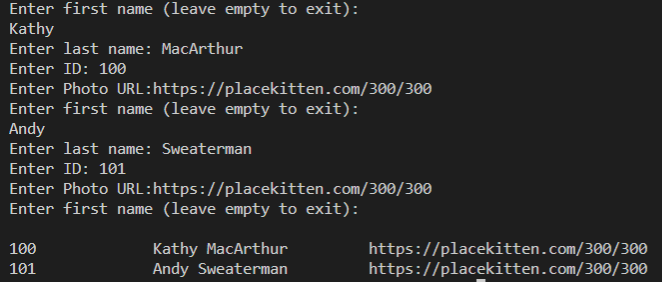

## Introduction

Now that you've set up the development environment, you're ready to build on the C# fundamentals you've already picked up&mdash;by building a badge-making app! First, to contain the employee data, you'll need to use some of the data storage types you've examined already.

In this lesson, you'll learn how to do the following:

* Interact with users via the command-line interface (CLI).

* Declare and call class methods.

* Create and instantiate a new class.

* Refactor the code along the way to keep the project organized, maintainable, and extensible.

Here's an overview of how we'll approach this:

1. Prompt the user and store their employee data.

2. Organize the code using methods with single responsibility.

3. Create a class to hold the employee objects.

4. Print the employee information.

Are you ready? Let's go!

## Preview

The goal for this lesson is to set up the basic architecture of the CatWorx application and declare data types to store the employee data.

The following steps detail how we'll approach this lesson's tasks:

1. Get a single employee name by using `ReadLine()`.

2. Organize the code.

3. Create an `Employee` class with a name property.

4. Store the employee names.

5. Update the output logic.

6. Add remaining properties and methods to the `Employee` class.

7. Collect and print all employee property values.

Ready? Let's go!

## Get a Single Employee Name by Using ReadLine()

Remember that you've already hardcoded employee names to get comfortable coding C#. In the real world, the employee names and other information will come from outside the application, and it would be cumbersome to update this list every time the company hires a new employee.

Fortunately, `Console` has a method that allows us to read input from the command line and assign it to a variable. Let’s try this out by updating the `Main()` method to ask the user for an employee name and then immediately display it.

To do that, type the following code in the `Program.cs` file:

```c#
using System;
using System.Collections.Generic;

namespace CatWorx.BadgeMaker
{
  class Program
  {
    static void Main(string[] args)
    {
      List<string> employees = new List<string>() { "adam", "amy" };
      employees.Add("barbara");
      employees.Add("billy");
      Console.WriteLine("Please enter a name: ");
      // Get a name from the console and assign it to a variable
      string input = Console.ReadLine() ?? "";
      employees.Add(input);
      for (int i = 0; i < employees.Count; i++) 
      {
        Console.WriteLine(employees[i]);
      }
    }
  }
}
```

Run the program in the VS Code CLI by typing `dotnet run`. After typing a name and pressing Enter, you should see that name added to the printed list. Note that when it encounters `Console.ReadLine()`, the .NET runtime halts and waits for input. Then it continues executing on the next line.

> **Note**
>
> You may have noticed that the syntax for the `Console.ReadLine()` that we used looks a little strange. This is necessary because by default in .NET 6.0, the compiler will warn you if there is a possible `null` reference. If `Console.ReadLine()` returned null, then there would be an issue because the `input` variable can only hold a `string` type. To solve for this, we use the **null coalescing operator** `??` which is quite similar to a ternary operator. This operator will check for `null` and replace the `null` value with the value after the operator. In this case, if we were to get a `null` value back from the `Console.ReadLine()` method, we would replace it with an empty string.

Now that we have an interactive command-line program, we can remove the hardcoded list of names and accept all names from the user. Using a `while` loop, we'll get multiple employee names and store them in a list.

Similar to how we iterated over the hardcoded list of employee names and output each one to `Console.WriteLine()`, we can loop over `Console.ReadLine()` and store user input in the employee list.

First, let’s remove the values we used to initialize the employees list, as well as the first two calls to `employees.Add()`. This will ensure that we're starting with an empty list. See the following code for an example:

```c#
static void Main(string[] args)
{
  List<string> employees = new List<string>();
  Console.WriteLine("Please enter a name: ");
  string input = Console.ReadLine() ?? "";
  employees.Add(input);
  for (int i = 0; i < employees.Count; i++) 
  {
    Console.WriteLine(employees[i]);
  }
}
```

Next, wrap the `Console.ReadLine()` call in a `while` statement. You might recognize `while` from JavaScript, where it behaves exactly the same: it executes a statement or a block of statements while a specified Boolean expression evaluates to true.

> **Deep Dive**
>
> To learn more, refer to the [Microsoft Docs on  while](https://docs.microsoft.com/en-us/dotnet/csharp/language-reference/keywords/while).

Examine the following code:

```c#
static void Main(string[] args)
{
  List<string> employees = new List<string>();
  // Collect user values until the value is an empty string
  while (true)
  {
    Console.WriteLine("Please enter a name: ");
    string input = Console.ReadLine() ?? "";
    employees.Add(input);
  } 
  for (int i = 0; i < employees.Count; i++) 
  {
    Console.WriteLine(employees[i]);
  }
}
```

Before we run this, let's think about how the application will behave. The first time through the loop, the user will enter a name, and we'll add it to employees. Then the loop will restart&mdash;infinitely. What small piece of code could we add to the `while` block to exit the loop when the user is done entering names?

One solution is to break out of the loop if the user presses Enter without typing a name. In that case, we should check for an empty string (`""`). We can check for this and break out of the loop as follows:

```c#
while (true)
{
  Console.WriteLine("Please enter a name: (leave empty to exit): ");
  string input = Console.ReadLine() ?? "";
  // Break if the user hits ENTER without typing a name
  if (input == "") 
  {
    break;
  }
  employees.Add(input);
} 
```

Remember, whenever you write a `while` statement, be sure to provide a mechanism to exit it, or you'll create an infinite loop!

Now the employee list can be populated entirely from the command line! Execute it by entering `dotnet run`, and confirm that it works as expected.

## Organize the Code

Nice work so far. As a refresher, `Main()` currently does the following things:

1. Serves as the entry point for the application, which is its primary responsibility.

2. Creates an empty list of employee names.

3. Collects input from the user.

4. Adds user input to the list of employee names.

5. Prints the contents of the list of employee names.

That's a lot of work, and there's more to come! To keep things manageable, let's organize the code into separate, specialized methods.

According to the **single-responsibility principle** in software design, every module, class, or function in a program should be responsible for a single part of the functionality. That's a hard goal to achieve, but we can at least move closer to it. Let's try to make `Main()` as lightweight as possible by delegating the heavy lifting to some new methods.

> **Deep Dive**
>
> To learn more, refer to the [Wikipedia page on SOLID](https://en.wikipedia.org/wiki/SOLID).

The work we've done so far falls into two categories: getting employee data from the user and printing the results to the console. So let's make two new methods, `GetEmployees()` and `PrintEmployees()`. We know we'll call `GetEmployees()` first, so it should probably return a list of employee names. Once we have that, we can pass that list to `PrintEmployees()`.

In C#, a method declaration (or **signature**) looks like the following example:

`[access_modifier] ["static"] return_type name([parameters])`

The parts in brackets are optional. We'll talk about access modifiers and the `static` keyword later&mdash;just remember that if a static method wants to call another method inside the same class directly, that method must also be static. Because `Main()` is static, any other method it needs to call within `Program` must also be static.

For now, let's focus on the return type and parameters. We know that `GetEmployees()` needs to return employee names, which we've decided to store in a list of strings. So let's make the return type of this method `List<string>`. Place the code for the function `GetEmployees()` after the closing block of `Main()`, as follows:

```c#
static List<string> GetEmployees()
{
  // I will return a List of strings
}
```

This method doesn't need parameters, because it will know how to get employee names from the user all by itself. Now we can move all of the employee-getting code from `Main()` into this new method, as follows:

```c#
static List<string> GetEmployees()
{
  List<string> employees = new List<string>();
  while (true) 
  {
    Console.WriteLine("Please enter a name: (leave empty to exit): ");
    string input = Console.ReadLine() ?? "";
    if (input == "") 
    {
      break;
    }

    employees.Add(input);
  }
  // This is important!
  return employees;
}
```

Because we'll hand off the list of employee names to the caller of the method, we must make sure to return it at the end of the method. This fulfills the contract we created in the method signature, which promises to  return a list of strings (`List<string>`).

To get the application functioning correctly, we need to call this method from `Main()`, in the place where we pulled out the employee-getting code. See the following example:

```c#
static void Main(string[] args)
{
  // This is our employee-getting code now
  List<string> employees = GetEmployees();

  for (int i = 0; i < employees.Count; i++) 
  {
    Console.WriteLine(employees[i]);
  }
}

static List<string> GetEmployees()
{
  List<string> employees = new List<string>();
  while (true) 
  {
    Console.WriteLine("Please enter a name: (leave empty to exit): ");
    string input = Console.ReadLine() ?? "";
    if (input == "") 
    {
      break;
    }
      
    employees.Add(input);
  }
  // This is important!
  return employees;
}
```

Note the syntax of the `GetEmployees()` method call. The left-hand side of the statement assigns a `List<string>` to employees. The right-hand side calls the new method, which returns a `List<string>`. This is very similar to the original employees declaration that we moved into `GetEmployees()`, shown in the following example:

```c#
List<string> employees = new List<string>();
```

This symmetry is common in C#, contributing to its elegance!

Now that we've moved the employee-getting logic into a method, let's move the employee-printing logic into a new `PrintEmployees()` method.

> **Hint**
>
> `GetEmployees()` had a return type but no parameters. `PrintEmployees()` will require a parameter but won't have a return type.

This one is a little tricky, because we haven't talked about how to specify no return type. If we look at the `Main()` method, we can see that its signature states that it will return void. Any method that does not return a value must be defined to return void.

Let's define `PrintEmployees()` below `GetEmployees()`, as follows:

```c#
static void PrintEmployees(List<string> employees)
{
  for (int i = 0; i < employees.Count; i++) 
  {

    Console.WriteLine(employees[i]);

  }
}
```

Because this method won't return anything, we don't need to add a return statement at the end of the method.

The entire `Program` class now looks as follows:

```c#
class Program
{
  static List<string> GetEmployees()
  {
    List<string> employees = new List<string>();
    while (true)
    {

      Console.WriteLine("Please enter a name: (leave empty to exit): ");

      string input = Console.ReadLine() ?? "";

      if (input == "")
      {
        break;
      }
      employees.Add(input);
    }
    return employees;
  }

  static void PrintEmployees(List<string> employees)
  {
    for (int i = 0; i < employees.Count; i++)
    {
      Console.WriteLine(employees[i]);
    }
  }

  static void Main(string[] args)
  {
    List<string> employees = GetEmployees();
    PrintEmployees(employees);
  }
}
```

## Create an Employee Class with a Name Property

Now that we can collect employee names and print them to the console, it’s time to work on the employee data. The badges we'll be creating must display an employee’s first name, last name, identification number, and photograph. We’ll call these data **properties**.

The following table illustrates the `Employee` entity you’ll be working with, including each property’s type:

```html
<table>
    <tr>
        <td>Employee</td>
        <td></td>
    </tr>
    <tr>
        <td>string</td>
        <td>First Name</td>
    </tr>
    <tr>
        <td>string</td>
        <td>Last Name</td>
    </tr>
    <tr>
        <td>integer</td>
        <td>Id</td>
    </tr>
    <tr>
        <td>string</td>
        <td>Photo URL</td>
    </tr>
</table>
```

As we learned previously, C# provides a dictionary structure, which can store keys and values similar to Javascript objects. This might seem like a candidate for storing the employee data, but remember that dictionaries can only store values of the same type.

> **Deep Dive**
>
> For more information, refer to the [Microsoft Docs on dictionaries](https://docs.microsoft.com/en-us/dotnet/api/system.collections.generic.dictionary-2?view=netframework-4.8).

The employee data we’re dealing with is mostly strings, except for the employee ids, which are integers. We could transform the ids into strings for storage using a technique called **casting**&mdash;but if we ever need to treat ids like integers, we’ll need to cast them back into integers.

> **Deep Dive**
>
> To learn more, refer to the [Microsoft Docs on casting and type conversions](https://docs.microsoft.com/en-us/dotnet/csharp/programming-guide/types/casting-and-type-conversions).

We can’t anticipate all the possible cases for dealing with these properties, so let's store them in their original types and only cast them to other types as the need arises. A better option for storing employee data is to create an `Employee` class, which will allow us to define each property type individually.

### Create an Employee Class

We've mentioned that `Program` is a class containing the program’s `Main()` entry point method. C# permits defining multiple classes in a single file, so we could put the `Employee` class in `Program.cs`. But for the sake of code organization, we’ll follow the popular convention of defining classes in separate files.

All right, now to create a new file named `Employee.cs` in the `CatWorx.Badgemaker` folder. Let’s start by crafting a minimal class, as follows:

```c#
namespace CatWorx.BadgeMaker
{
  class Employee
  {
    // more to come!
  }
}
```

Note the namespace scope declaration. By wrapping the class in the `CatWorx.BadgeMaker` namespace, we can access it directly from any class that uses `CatWorx.BadgeMaker`. For example, if we wanted to use `Employee` in a class in a separate project&mdash;say, `Corporate.HumanResources`&mdash;we'd add using `CatWorx.BadgeMaker` at the top of the file in which the `HumanResources` class was defined. We could then use `Employee` anywhere in that class.

To ensure that this is a valid class that we can instantiate in the application, let’s go back to `Program.cs` and create a new `Employee` instance. We'll assign it to a variable named `employee`.

Remember that all variable declarations must include a type, as follows:

```c#
dataType variableName = value
```

Can you guess what the data type of `currentEmployee` will be in the following example?

```c#
____?____ currentEmployee = new Employee();
```

> **Hint**
>
> Look at how we declared the employee list at the top of `Main()`.

When you define a class in C#, it registers that class name as a **custom type**, so the type of any instance of `Employee` is also `Employee`. See the following code for an example:

```c#
while (true)
{
  Console.WriteLine("Please enter a name: (leave empty to exit): ");
  string input = Console.ReadLine() ?? "";
  if (input == "")
  {
    break;
  }

  // Create a new Employee instance
  Employee currentEmployee = new Employee();
  employees.Add(input);
}
```

If we run the application now, it should behave the same as before. This assures us that the `Employee` class is working (although not very hard, for the time being).

## Store the Employee Names

Let’s start adding properties to the `Employee` class in `Employee.cs`. We’re only dealing with an employee’s first name right now, so let’s start there. Like all variable declarations in C#, we must specify the type. We’ll store employees’ first names as strings in a property named `FirstName`.

Properties are declared in the body of a class, like in the following example:

```c#
class Employee
{
  string FirstName;
}
```

Similar to JavaScript, this property can be accessed directly on an `Employee` instance using dot notation. For example, we could set this property inside the `Main()` method of `Program`, as shown in the following image:



But VS Code doesn’t like this, as indicated by the red squiggly line. If you try to run the program, you'll get the following warning:

```bash
Program.cs(22,26): error CS0122: 'Employee.FirstName' is inaccessible due to its protection level
```

### Protection Levels

What’s a **protection level**? By default, properties and methods defined in a class are given the protection level of **private**, which means that they can only be accessed within the class itself. If we try to access a private property from outside the class, we'll get an error. Fortunately, we can control the access level of properties when we declare them, using an **access modifier**.

The following example shows how we'd explicitly set the access level for the `FirstName` property when we declare it:

```c#
class Employee
{
  private string FirstName;
}
```

This is equivalent to the default access level of properties when we don’t explicitly define an access level. Can you guess the name of an access modifier that would allow us to access `FirstName` from within `Program`? Here's a hint&mdash;it's the opposite of private.

If you guessed **public**, you’re right! While there are several access levels, you'll use only public and private in the scope of this tutorial.

> **Deep Dive**
>
> To learn more, refer to the [Microsoft Docs on access modifiers](https://docs.microsoft.com/en-us/dotnet/csharp/programming-guide/classes-and-structs/access-modifiers).

Let’s make `FirstName` accessible from `Program` by changing the access modifier to `public`, as shown in the following example:

```c#
class Employee
{
  public string FirstName;
}
```

When you save `Employee`, you’ll see that the red squiggly line under `FirstName` in `Program` has disappeared. If you run the application, you'll see that it no longer returns an error about protection levels.

So why do public and private access modifiers even exist? After all, JavaScript doesn’t use access modifiers, and it’s one of the most popular programming languages in the world! Well, you might have seen JavaScript developers prepend variables with one or more underscores, like `_sum`, `__currentIndex`, or `_calculateCatDensity()`. This convention simulates private variables. It’s like a signal to other developers not to reference the variable anywhere else&mdash;even if JavaScript allows it&mdash;because it only makes sense in that one spot.

In contrast, C# and other languages make access levels a first-class language feature, giving developers full control over where properties or methods can be used. By declaring something as private, we can be assured that it won’t leak out of the class and cause damage elsewhere; if we declare something as public, we’re confident that it’s safe everywhere.

This concern about property access is part of the object-oriented software design principle of **encapsulation**. We’ll talk a little bit more about this as we flesh out `Employee`.

Let’s add the rest of the properties that we care about to the `Employee` class, making all of the properties `public` (for now), so that we can access them from `Program`. We'll do this with the following code:

```c#
class Employee
{
  public string FirstName;
  public string LastName;
  public int Id;
  public string PhotoUrl;
}
```

### Constructors

Okay, so now we can store values for these properties. But we still need to set values for each employee! Thanks to C#’s special **constructor method**, we can set values all at once when we create a new instance of the `Employee` class. The following example shows this easy, intuitive way to instantiate an `Employee` when we have all of the necessary values handy:

```c#
Employee currentEmployee = new Employee("Vince", "McMahon", 123, "https://placekitten.com/300/300");
```

You're probably familiar with JavaScript constructors, which are called in exactly the same way&mdash;by passing values to a class as arguments in parentheses, as follows:

```js
var date = new Date('December 17, 1995 03:24:00');
var regex = new RegExp("Fudge\\WSauce\\!?");
var fancyPants = new Pants("fancy");
```

There are two popular constructor styles in JavaScript. Before ECMAScript 2015, constructor functions were commonly defined implicitly in class-like functions. See the following example:

```js
var Employee = function(firstName, lastName) {
  this.firstName = firstName;
  this.lastName = lastName;
  this.isEmployeeBob = function(name) {
    return name === "Bob";
  }
}
```

There's no obvious constructor here, just the magical behavior that assigns arguments from `var e = new Employee("John", "Smith")` to a mysterious place called `this`. We called it a constructor because it behaved similarly to conventional constructor methods in object-oriented programming languages. It was common to define ALL of a class's properties and behaviors within this function.

In JavaScript, we learned about OOP, classes, and constructor methods. We can define a class in JavaScript as follows:

```js
class Employee {
  constructor(firstName, lastName) {
    this.firstName = firstName;
    this.lastName = lastName;
  }

  isEmployeeBob(name) {
    return name === "Bob";
  }
}
```

A constructor makes it clear exactly what needs to happen before an instance of the class is returned to the new operator. And thanks to the class syntax, other functions could be defined outside of the constructor for better clarity and organization. It's also much closer to the way in which constructor methods work in true object-oriented languages&mdash;like C#!

In C#, a class's constructor method has the same name as its class, as shown in the following example:

```c#
class Employee
{
  public string FirstName; 
  public string LastName;
  public Employee(string firstName, string lastName) 
  {
    FirstName = firstName;
    LastName = lastName;
  }
}
```

You might notice the following differences in the C# version:

* Properties must be declared in the class before you can use them.

* The constructor method must be made public.

* To distinguish between public and private variables, use PascalCase for public variables and camelCase for private variables.

Why do you think the constructor must be made public?

> **Hint**
>
> The new operator calls a class's constructor immediately before returning an instance of the class.

If the constructor were defined as private, the new operator wouldn't be able to call it, and it wouldn't be able to return an instance of the class. There are some cases in which this can be useful, but we won't deal with any such situations for now.

Using the preceding C# example as a guide, try to update `Employee` to add a constructor that accepts a first name and sets the `FirstName` property.

You should now have an `Employee` class that looks like the following example:

```c#
class Employee
{
  public string FirstName;
  public string LastName;
  public int Id;
  public string PhotoUrl;
  public Employee(string firstName) {
    FirstName = firstName;
  }
}
```

Now that we can set the employee's first name when we instantiate `Employee`, let's update `GetEmployees()` in `Program`, as shown in the following example:

```c#
// Create a new Employee instance

Employee currentEmployee = new Employee(input);
employees.Add(input);
```

In `Employee.cs`, revise the `Employee` constructor to include the `lastName`, as shown in the following code:

```c#
Employee(string firstName, string lastName) {
  FirstName = firstName;
  LastName = lastName;
}
```

Later, we'll update the CLI logic to collect all of the employee values from the user. For now, let's always set the last name to "Smith." In `Program`, add the following code:

```c#
// Create a new Employee instance
Employee currentEmployee = new Employee(input, "Smith");
employees.Add(input);
```

Now we can create an `Employee` instance and set its `FirstName` and `LastName` properties in one statement. How might we put an employee's entire name (for example, "John Smith") in the employees list? The following code shows one way to do that:

```c#
employees.Add(currentEmployee.FirstName + " " + currentEmployee.LastName);
```

Following this approach, every time someone uses an `Employee` instance to get an employee's entire name, they'd have to handle the formatting. As the application grows and the `Employee` class is used in more situations, a lot of similar code would have to be written in the calling classes. Let's make `Employee` more user-friendly by creating a `GetFullName()` method that does that work, returning a nicely formatted, full name.

Update `Employee` as follows:

```c#
public Employee(string firstName, string lastName) {
  FirstName = firstName;
  LastName = lastName;
}

public string GetFullName() {
  return  FirstName + " " + LastName;
}
```

By now it should be little surprise that type declarations are required in method definitions. In addition to the access modifier `public`, we also define the type of value that `GetFullName()` will return. Like the `GetEmployees()` method in `Program`, this method returns something too&mdash;a string. So we must add this keyword to the method declaration.

Let's update `Program` to use this handy method, as follows:

```c#
// Create a new Employee instance
Employee currentEmployee = new Employee(input, "Smith");
employees.Add(currentEmployee.GetFullName());
```

When we run the application, we're still prompted for first names. But the resulting list prints each employee's full name, as shown in the following image:



## Update the Output Logic

We've covered a lot of ground here, exploring the power of the `Employee` class. But we have a few more employee properties to manage, and the existing `employees` list of first names won't cut it. `Employee` can now output full names; soon it will output ids and photo URLs too. With all that in mind, it makes sense to store `Employee` instances instead of the simple strings we used initially.

Currently, we're declaring `employees` as follows, in the `GetEmployees()` method in `Program`:

```c#
List<string> employees = new List<string>();
```

How can we alter this declaration to handle `Employee` instances instead of strings?

> **Hint**
>
> Remember that `Employee` is now a custom type.

We simply change the list type from `string` to `Employee`, as follows:

```c#
List<Employee> employees = new List<Employee>();
```

We'll have to make a couple more changes in `GetEmployees()` to work with a list of employees. First, we're no longer adding strings to `employees`; we're adding `Employee` instances. We should specify that as follows:

```c#
while (true)
{
  Console.WriteLine("Please enter a name: (leave empty to exit): ");
  string input = Console.ReadLine() ?? "";
  if (input == "")
  {
    break;
  }
  Employee currentEmployee = new Employee(input, "Smith");
  // Add currentEmployee, not a string
  employees.Add(currentEmployee);
} 
```

Finally, we're no longer returning a list of strings; we're returning a list of `Employee` instances. So let's update the return value of the method, like in the following example:

```c#
// Update the method return type

static List<Employee> GetEmployees()
```

Now to update `PrintEmployees()`. First we need to change the method signature to set the correct parameter type. It will accept a `List<Employee>` instead of a `List<string>`, as follows:

```c#
// Change the type of the employees parameter

static void PrintEmployees(List<Employee> employees)
```

When we iterate over employees, we're no longer iterating over strings but `Employee` instances! Now we'll get an employee's full name straight from the instance via `GetFullName()`. Let's update `PrintEmployees()` to use `GetFullName()`, as shown in the following example:

```c#
for (int i = 0; i < employees.Count; i++) 
{
  // each item in employees is now an Employee instance
  Console.WriteLine(employees[i].GetFullName());
}
```

Before the app can be run, the employees declaration in `Main()` must be edited to match the class we're using. We'll do that by changing the statement `List<string> employees = GetEmployees();` in `Main()`, as follows:

```c#
static void Main(string[] args) {
  List<Employee> employees = GetEmployees();
  PrintEmployees(employees);
}
```

Okay, let's run the app! It should behave exactly the same as it did before we made these changes. That might seem anticlimactic, but we've actually set the stage for a powerful application that can manage a massive list of complex employee data.

Phew! You can take a break now. This is the perfect time to reflect on what you've learned and how much progress you've made.

## Add Remaining Properties and Methods to Employee Class

After you've taken a breather, get ready to jump back in! There's plenty more to be done.

At this point, the `Employee` class still needs to store and return an employee's id and photo URL. Update the constructor to accept these arguments and set them to the properties we've already defined. Don't forget to use camelCase for the parameters and PascalCase when assigning them to properties.

Refer to the following example for guidance:

```c#
public Employee(string firstName, string lastName, int id, string photoUrl) {
    FirstName = firstName;
    LastName = lastName;
    Id = id;
    PhotoUrl = photoUrl;
}
```

## Collect and Print All Employee Property Values

Now we can go back to `Program` and pass specific values in the `Employee` instances. We hardcoded "Smith" for `lastName`, and we could hardcode the other values too. But at some point hardcoding won't be sufficient anymore&mdash;we'll need to get all the values from the user, via the CLI. To that end, how could we alter the user input logic to ask for each property for every employee?

> **Hint**
>
> You can call `Console.ReadLine()` multiple times in a row.

We could do this a few different ways, but a straightforward solution is to call `Console.ReadLine()` for each value we want from the user. Let's update the `GetEmployees()` method in `Program` to do this. Take care to set the variables to the correct types, corresponding to the property types for `Employee`. See the following example for reference:

```c#
static List<Employee> GetEmployees()
{
List<Employee> employees = new List<Employee>();
while(true) 
{
  // Move the initial prompt inside the loop, so it repeats for each employee
  Console.WriteLine("Enter first name (leave empty to exit): ");

  // change input to firstName
  string firstName = Console.ReadLine() ?? "";
  if (firstName == "") 
  {
    break;
  }

  // add a Console.ReadLine() for each value
  Console.Write("Enter last name: ");
  string lastName = Console.ReadLine() ?? "";
  Console.Write("Enter ID: ");
  int id = Console.ReadLine() ?? "";
  Console.Write("Enter Photo URL:");
  string photoUrl = Console.ReadLine() ?? "";
  Employee currentEmployee = new Employee(firstName, lastName, id, photoUrl);
  employees.Add(currentEmployee);
  }

  return employees;
}
```

That's a lot of code, so let's walk through it. (We'll talk about the red squiggly line under the id assignment in a minute.)

First we moved the initial `Console.ReadLine()` prompt inside the `while` loop so that it repeats for each new employee entry. Then we changed input to `firstName`, because that's how we've been using it all along. Now that we have other values to capture, it makes sense to be more specific. Next we called `Console.ReadLine()` three more times, capturing `lastName`, `ID`, and `photoUrl`.

Note that if a highlight appears on `ID` from the IDE, it might be because `Console.ReadLine()` returns only string types. We want to store it in an `int` variable type, consistent with how `Employee` stores it, and that's not possible in C#.

Fortunately, several C# utilities enable us to alter, or cast, values from one type into another. To store a string as an integer, we can use the `Int32.Parse()` method. This is similar to the `parseInt()` function in JavaScript. Let's update that line to turn the `Console.ReadLine()` string into an `int`, as follows:

```c#
Console.Write("Enter ID: ");
int id = Int32.Parse(Console.ReadLine() ?? "");
```

Now VS Code should be happy. Let's save and run the application to confirm that everything works!

> **Pro Tip**
>
> When prompted for the photo URL, you can use [Place Kitten](http://placekitten.com/). All you have to do is type your desired image width and height after their URL (for example, <https://placekitten.com/300/300>), and Place Kitten will provide a placeholder kitten photo in that size!

The application works, but it still prints only the employee's name to the console. We want to see ALL of the employee's information. To print more than just the name, we need to get it out of the `Employee` instance.

Earlier in the project, we used dot notation to access `Employee` instance properties directly, but we've also used a method to access `Employee`'s `FirstName` property. The argument for the latter approach was to simplify formatting. But we might opt to access properties indirectly through methods for any of the following reasons:

* You can process the property (such as formatting or validating it) before returning it.

* You can change the type of the value before returning it.

* You can provide a stable interface to the property, even if it changes internally. For example, `GetId()` will always return an integer `ID`. But maybe in the future, the class will query a database to find the id based on the employee's name, which would be a string and would therefore require type conversion.

* You can return different values based on the time of day (for instance, `GetGreeting()` might return `"Good Morning"` before noon and `"Good Afternoon"` later).

You'll encounter plenty of other advantages as needs arise!

We mentioned the software design principle of encapsulation earlier. In short, users of a class shouldn't have to know how it operates or stores values. They should only need to know what the inputs and outputs are. It's a best practice to use methods to set and get properties on a class instance, thus enhancing encapsulation.

Phew again! Having said all that, we'll create methods inside `Employee` to return the remaining properties. Also, to double-down on encapsulation, we'll change all of the property access modifiers to `private` to ensure that users of this class can only access them through the methods we provide.

The following code shows the final `Employee` class:

```c#
namespace CatWorx.BadgeMaker {
  class Employee
  {
    private string FirstName;
    private string LastName;
    private int Id;
    private string PhotoUrl;
    public Employee(string firstName, string lastName, int id, string photoUrl) {
        FirstName = firstName;
        LastName = lastName;
        Id = id;
        PhotoUrl = photoUrl;
    }
    public string GetFullName() {
        return  FirstName + " " + LastName;
    }
  
    public int GetId() {
        return Id;
    }

    public string GetPhotoUrl() {
        return PhotoUrl;

    }
  }
}
```

The last step of this section is to print out all of the employee information for each employee. In the `PrintEmployees()` method of `Program`, update the code in the `for` block as follows:

```c#
for (int i = 0; i < employees.Count; i++) 
{
  string template = "{0,-10}\t{1,-20}\t{2}";
  Console.WriteLine(String.Format(template, employees[i].GetId(), employees[i].GetFullName(), employees[i].GetPhotoUrl()));
}
```

What's up with that mess of characters in the template string? You might recognize `String.Format()` from its brief introduction earlier. In C#, `String.Format()` works similarly to template literals in JavaScript; it takes a string to use as a template and then fills in the placeholders with values. But in C#, each placeholder can define how its value is formatted, and the values follow the template in the list of arguments.

Let's walk through the formatting string `string template = "{0,-10}\t{1,-20}\t{2}";`.

We want the first argument (argument `{0}`), the id, to be left-aligned and padded to at least 10 characters, so we enter `{0,-10}`. Then we want to print a tab character (`\t`). We want the next argument (`{1}`), the name, to be left-aligned and padded to 20 characters&mdash;hence `{1,-20}`.

Next, we want to print another tab character (`\t`). And finally, we want to print the last argument (`{2}`), the photo URL, with no formatting: `{2}`.

Put that all together, and it makes `{0,-10}\t{1,-20}\t{2}`, which is the formatting formula for the output.

The results will look like the following image:



> **Deep Dive**
>
> To learn more, refer to the [Microsoft Docs on the String.Format method](https://docs.microsoft.com/en-us/dotnet/api/system.string.format?view=net-5.0).

## Reflection

This was a big chunk of information, and we covered a lot of territory. Let's review what we've accomplished. In this lesson, we did the following:

* Interacted with users via the CLI.

* Declared and called class methods.

* Created and instantiated a new class.

* Refactored the code along the way to keep the project organized, maintainable, and extensible.

Hopefully you can see a lot of similarities between C# and JavaScript. And there are certainly a lot of differences, especially around C#'s strong type system and class syntax.

Okay, now it's time to start pumping out some security badges!

---

© 2025 edX Boot Camps LLC. Confidential and Proprietary. All Rights Reserved.
