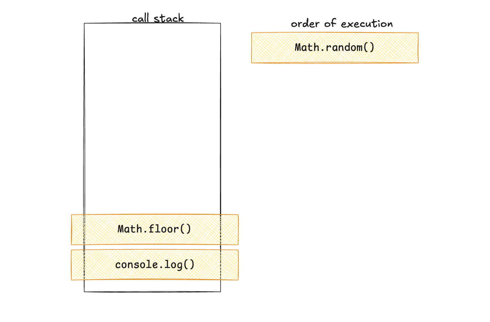

## Introduction

As our programs grow in complexity, keeping track of all that data can become cumbersome. Managing multiple everchanging variables that all rely on the state of each other can be overwhelming. Thankfully, these issues can be overcome with careful planning and structuring of how we store our data.

**Data structures** are simply ways of organizing data so that it can be stored and used efficiently by the computer. By leveraging and understanding data structures, we can greatly improve both the efficiency of our applications and the readability of our code.

In this lesson you will learn how to do the following:

* Define stacks and queues and how they differ from arrays.

* Explain the JavaScript call stack, callback queue, and event loop.

* Implement stacks and queues in JavaScript.

* Define a linked list, how it differs from an array, and what advantages it offers.

* Implement a linked list in JavaScript.

* Explain the concepts of advanced data structures, including maps, trees, and graphs.

* Implement a binary search tree in JavaScript.

## Preview

This lesson is focused on data structures and their implementation in JavaScript.

This lesson contains the following steps:

1. Define data structures and how they improve our code.

2. Define stacks and queues and compare them to arrays.

3. Implement stacks and queues in JavaScript.

4. Explain the call stack, callback queue, and event loop in JavaScript.

5. Define and implement linked lists in JavaScript.

6. Define maps, trees, and graphs.

7. Implement a binary search tree in JavaScript.

Let's get started!

## What is a Data Structure?

A **data structure** is a efficient way to organize and store data in a coding application. In practice, this allows us to easily manipulate our data sets and improves the efficiency of our applications. Data structures generally are non-opinionated, meaning their only concern is how the data is stored, not what data is stored in them. This means we can store any type of data within them. 

JavaScript natively supports two data structures: arrays and objects. As a reminder, arrays allow us to store indexed collections of data, while objects allow us to store key-value pairs. 

Since JavaScript does not include native constructors fo other data structures, we will treat them as abstractions, as in, conceptual ways of holding your data. Focus on the conceptual understanding over the practical. While we will implement some of these new structures in JavaScript, the key takeaway should be the concepts over the execution.

Let's start with a look at a classic data structure: the array.

## Arrays

Arrays are a common data structure used to store a collection of data, called elements. Arrays are **indexed**, meaning each element is stored and can be retrieved from a specific position in the array. Arrays are zero indexed, meaning the first element in the array is stored at index 0.

JavaScript array's behave differently than those in other programming languages. In most languages, arrays are a fixed length that needs to be defined at creation time. In JavaScript, arrays can have a variable length, with the `.push()` method adding new elements to the end of the array. Additionally, most languages only allow arrays to store a single type of data, while JavaScript arrays allow for mixed types.  

Arrays are a useful data abstraction for storing collections of data. When combined with `for` loops, arrays allow us create efficient, DRY (Don't Repeat Yourself) solutions to complex problems.

Now, let's take a look at a couple of data structures that share a lot of similarities with arrays: stacks and queues.

## Stacks

**Stacks** are similar to arrays, in that they store a collection of data, but there are some key differences. Stacks follow a "Last In First Out", or LIFO, pattern, meaning the last item added to the stack is the first item removed from the stack. Additionally, only the last item added can be modified. 

Imagine adding batteries to a flashlight. When you open the flash light to change the batteries, the only one visible at that point is the last one you added, as each battery sits on top of all previously added batteries. That means the first battery out will be the last one that was added. This is an example of a stack.

Stacks typically use three methods for data: `push` to add items to the stack, `pop` to remove items from the stack, and `peek` to view the top item in the stack. You may recognize some of these method names from JavaScript, where the array methods `push` and `pop` can be used to mock functionality of a stack.

While we could use the built in array methods to mock stack functionality, let's take it one step further by creating our own `Stack` class.

First, we create a class we call `Stack`: 

```js
class Stack {
  ...
}

```

Our class' constructor function takes a single argument, `container`, that we default to an empty array. We then set the outputted objects `container` key to match this argument:

```js
constructor(container = []) {
  this.container = container;
}
```

To add items to the stack, we add a method called `addToStack` that takes an argument called `el` and adds that element to the end of the array. This is our equivalent of the stacks push method:

```js
addToStack(el) {
  return this.container.push(el);
}
```

To remove items from the stack, we add a method called `removeFromStack`. This method takes no arguments and removes the last element from the array. This is our equivalent of the stack's pop method:

```js
removeFromStack() {
  return this.container.pop();
}
```

To test this constructor, we create an instance of the class we call `numStack` then call the `addToStack` method to add a few items to the stack. When we log the stack, we expect to see an object with a `container` array containing all the values we added to the stack:

```js
const numStack = new Stack();
numStack.addToStack(2);
numStack.addToStack(4);
numStack.addToStack(6);
console.log(numStack); //=> { container: [2,4,6] }
```

Next, we call the `removeFromStack` method. When we log the `numStack` again, we should expect to see the last item removed from the `container` array:

```js
numStack.removeFromStack();
console.log(numStack); //=>{ container: [2,4] }
```

Next up, let's take a look at another array like structure: queues.

## Queues

**Queues** also store collections of data, like arrays and stacks. However, queues follow a "First In, First Out" (FIFO) pattern, meaning the first item added to the collection is the first item removed from the collection. Queues function like the lines for a roller coaster, wherein each person is removed from the line in the same order in which they were added to it.

Queues are also not natively supported in JavaScript, but we can create a class to mock this functionality. First, we create a class we call `Queue`:

```js
class Queue {
  ...
}
```

Our constructor function takes a single argument, `container`, that defaults to an empty array. The function will then assign a property to the constructed object called `container` whose value is equal to this argument:

```js
constructor(container = []) {
  this.container = container;
}
```

To add an item to the queue (or **enqueue**, as it is known) we create a method called `addElementToQueue`. This method takes in a new item and will add to the end of the queue:

```js
addToQueue(el) {
  return this.container.push(el);
}
```

To remove, or **dequeue** an item, we create a method called `removeFromQueue`. This will remove the item that has been in the queue the longest. We use the `.shift()` array method, which removes the first element of an array:

```js
removeFromQueue() {
  return this.container.shift();
}
```

To test this, we first create a new instance of the class we call `numQueue`. We then add a few numbers to our queue. When we log our `numQueue`, we expect to see the items we added in the order we added them:

```js
const numQueue = new Queue();
numQueue.addToQueue(1);
numQueue.addToQueue(14);
numQueue.addToQueue(2);
console.log(numQueue); //=> { container: [1,14,2]}
```

Next we call our `removeFromQueue()` method. When we log the `numQueue` again, we expect the first element we added to be removed from the queue:

```js
numQueue.removeFromQueue();
console.log(numQueue); //=> { container: [14,2]}
```

As you can see, both stacks and queues can be easily reproduced using JavaScript arrays and some creative class methods. But what are some real world examples of these structures in action?

Let's take a look at a real world example that uses both stacks and queues, the JavaScript call stack and callback queue.

## JavaScript Call Stack & Callback Queue

Let's say we wanted to select a random number from 1 to 10. To do this, we would need to use the `Math.random()` method to generate a random number between 0 and 1, including 0 but not 1, then multiply it by our largest possible value, in this case, 10. Next, we use the `Math.floor()` method to round the result down. Since `Math.random()` is inclusive of 0 but exclusive of 1, we now have a random number from 0 to 9. Since we want our number to be between 1 and 10, we add 1 to the result. We could perform this as three discreet steps:

```js
const randomResult = Math.random();
const randomDecimal = randomResult * 10;
const randomNum = Math.floor(randomDecimal) + 1;
console.log(randomNum);
```

Since JavaScript is a synchronous programming language, each of these expressions is evaluated in the order they are created. This means our code will be evaluated line by line from the top of the program. 

However, a common pattern is to combine these expressions into a single statement, like in the following example:

```js
console.log(Math.floor(Math.random() * 10) + 1);
```

Both these solutions will generate a random number between 1 and 10. But how does this second expression decided when to call each function?

Under the hood, whenever a function is called in JavaScript, it is added to the **call stack**. Since JavaScript is a single-threaded language, it can only perform one operation at a time. The call stack helps JavaScript keep the functions ordered. Functions on the stack are executed once the function call is complete. Since this is a stack, only the last item added to the stack can be removed, so if a function is called **within** a function call, the inner function will be executed first.  

Let's break down the previous example, diagramming the call stack at each step.When the program is executed, JavaScript first encounters the `console.log()` function, so that gets added to the call stack:


Before that function resolves, we call the `Math.floor` function, so that also gets added to the stack:


Within the `Math.floor()` function we call the `Math.random()` function, so that needs to be added to the stack:


Next, we are ready to execute the `Math.random()` function, so it is removed from the stack and executed:




Working down the stack, we next execute our `Math.floor()` function and remove it from the stack:


Finally, we execute the `console.log()` function:

.

As we can see, the call stack ensures that our functions execute in order. But what about asynchronous functions, like `fetch()` or `setTimeout()`? How are they handled?

Asynchronous functions cannot be resolved immediately, since we have to wait for their operations to complete. In the meantime, the program will continue to execute lines of code until the asynchronous function has been resolved. JavaScript only has a single thread of execution, so only one operation can be performed at a time. To handle this, JavaScript uses two new tools: The callback queue and event loop.

Whenever an asynchronous function is ready to execute, JavaScript adds that function to the end of the **callback queue**. Functions will be added to the queue as they are ready to be executed, then removed from the queue in the order they were added. 

For JavaScript to execute a function, that function must be added to the call stack. The **event loop** handles this process. The event loop will move the first item in the callback queue into the call stack only if the call stack is empty. The event loop continuously checks if the call stack is empty to ensure the program is executed as efficiently as possible.

Let's take a look at another example, and diagram out the call stack, callback queue, and event loop as we go. In this example, we have a nested function call and a few asynchronous functions:

```js
function outer() {
  setTimeout(() => {
    console.log('Hello world');
  }, 10);

  function inner() {
    setTimeout(() => {
      console.log('Are you listening?');
    }, 0);
    console.log("Yes, I'm listening");
  }

  inner();
  console.log('I like turtles');
}

outer();
```

There is a lot going on here, but lets break it down step by step, focusing on the execution of functions.  All of our code is contained within our `outer` function, which is then called, so let's add it to the call stack:


Next, we call `setTimeout`,passing in a callback that will log `helloWorld` after 10 milliseconds have passed. The `setTimeout` function get immediately called, so it is added and then removed from the call stack. The callback function will not be added to the callback queue until 10 milliseconds have passed, so we leave it off for now:


Next, we define a function, `inner()`, which we then call, adding it to the stack. However, before it can be resolved, we call `setTimeout()`, passing a callback function that will log "Are you listening?" after 0 milliseconds have passed. `setTimeout()` gets added then immediately removed from the call stack and called. The callback function resolves immediately and is added to the callback queue:


Remember, the event loop will only move functions from the callback queue to the call stack if the call stack is empty. So even though our `setTimeout()` function was set to wait for no time at all, it still will not execute immediately, it must wait for all other functions on the stack to be called.

Next, we call the `console.log()` function, logging the string "Yes, I'm listening". This function is immediately resolved, removing it from the stack and logging the message:


At this point, the `inner()` function is fully resolved, so it is removed from the stack and executed:


Finally, we call the `console.log()` function that logs "I like turtles". This function resolves immediately, so it is added then removed from the call stack. This was the last step in our `outer` function, so that is also removed from the stack. Additionally, let's assume 100ms have passed since our first `setTimeout()`, and add that callback to the queue:


Now that the call stack is empty, event loop moves the first function from the callback queue into the call stack:


That function is executed and removed from the stack, and the next function is added to the stack and executed. At this point, all of our code has finished running: 


Now that we have diagrammed out the entire order of execution, we expect to see the following items logged in this order:

1. `Yes I'm listening`

2. `I like turtles`

3. `Are you listening?`

4. `hello world`

As we can see, by combining stacks and queues JavaScript is able to keep track of several variables and make sure all code gets executed in the correct order. While it may seem confusing at first, an understanding of the call stack, callback queue, and event loop will greatly improve your abilities as a developer.  

Next, let's take a look at linked list, an efficient structure for storing collections of data.

## Linked Lists

Anytime we create functions or variables in our program, those items need to be saved to memory. While modern computers have enormous amounts of memory available, it is still a finite resource. 

Imagine memory like spaces in a parking lot. You can make a bigger and bigger parking lot, but you still always have a limited number of spaces. Memory functions similarly.

Whenever we create an array to hold a set of data, JavaScript needs to track both the data itself and its location within the array. To do this, the array must be stored in contiguous memory, as in, spots right next to each other.  That way, when accessing an item by index, we simply move to the next memory slot to retrieve it. 

To use our parking lot example, an array is like trying to park a bus in a parking lot.  The bus is useful for keeping a bunch of people together and easily accounted for, but for the bus to park is going to require multiple empty spaces all right next to each other.  This can be inefficient, as memory can be used in several ways. 

On the other hand, a **linked list** is a data structure that allows us to store a collection of data. Conceptually, a linked list is comprised of a series of **nodes**, each of which contains a piece of data and a pointer to the next node. This way, the data can be slotted anywhere in memory without losing the connections, improving the memory efficiency of our application. 

While linked lists do not natively exist in JavaScript, we can use objects and classes to mock the functionality. First, we define a `Node` class. The `constructor` function of this class accepts a single argument, `val`, which represents the value of the node. The constructor also sets the `next` pointer to null by default:

```js
class Node {
  constructor(val) {
    this.val = val;
    this.next = null;
  }
}
```

Next, we define our `LinkedList` class. This class' constructor takes in a `val` argument and sets the `head` property of the list to a new node, passing the received `val` argument:

```js
class LinkedList {
  constructor(val) {
    this.head = new Node(val);
  }
  ...
}
```

Next, we create a method to add items to our list.  One of the downsides to linked lists when compared to arrays is that we can only access the first node of a linked list, whereas in an array we can access any element by index. To find the end of a linked list, we must start at the first node, called the **head**, and follow the `next` pointers until we reach an node without a `next` pointer. This node will be the last node in the list, called the **tail**.

Our `add` method takes in a single argument, `val`, representing the new value we want to add to the list. Since we need to walk through the entire list to find the tail, we create a variable to keep track of the current node and default it to the list's head:

```js
add(val) {
  let currentNode = this.head;
  ...
}
```

Now we need to find the last node in the list, and add our new value after that node. To do so, we use a `while` loop, since we don't know exactly how long the list is. As long as the `currentNode` variable has a `next` property, our loop will continue to run. Within the loop, we update the `currentNode` variable to be the `next` property on our current node.  If our `currentNode` doesn't have a next property, that means we have reached the end of the and `currentNode` is the tail of the list. This means we can add our value as a node node and attach it as the `next` property on our current node:

```js
while (currentNode.next) {
  currentNode = currentNode.next;
}
currentNode.next = new Node(val);
```

We are using a deeply nested object to mock the principles of a linked list here, so if we try to log the result it is going to be difficult to follow the data flow. To assist, we create a `printPretty()` method that will simply log the value of each node separated by `->`. First, we create a tracking variable for our string, `result`, which we default to the head value of our list:

```js
printPretty() {
  let result = `${this.head.val}`;
  ...
}
```

Next, we need to walk through the whole list, just like we did for the `add` method. So again we create a variable, `currentNode`, which we default to the head node's next node. We then create a `while` loop that checks if `currentNode` exists. If it does, we add our separator ` -> ` and the value of the current node to our `result` string, then set the `currentNode` variable to the next node. If `currentNode` doesn't exist, we have therefore reached the end of the list and we log our `result` string:

```js
let currentNode = this.head.next;
while (currentNode) {
  result += ' -> ';
  result += currentNode.val;
  currentNode = currentNode.next;
}
console.log(result);
```

To test this functionality, we create a new list, add a few nodes to it, then call the `printPretty` method:

```js
const myList = new LinkedList(3);
myList.add(-1);
myList.add(2);
myList.printPretty(); //=> 3 -> -1 -> 2
```

Linked lists excel at efficient data storage and are a common data structure for coding interviews. While they are not natively supported in JavaScript, you should be sure you conceptually understand their parts and use cases. If you are looking to expand further on this topic, try and add methods to remove elements from the list or reverse the list.

Next, let's take a look at a similar structure, the tree.

## Trees

**Trees** are similar to linked lists, in that they are a collection of nodes connected to each other. However, unlike linked lists, trees have 2 pointers on each node, typically called `left` and `right`. Each node can have up to two different pointers, making trees a great choice for branching data sets.

One of the most common trees found in programming is he **binary search tree**, wherein each `left` pointer has a value less than the node, while each `right` node is greater than the node.  This makes for fast lookup or addition, as both operations can be performed in O(log(n)) time.

Take a look at this example:


Each node (represented by a circle) contains a value and up to two pointers (represented by arrows), one to the left and one to the right. All left pointers contain lesser values than the node, and all right pointers contain greater values than the node.  

Let's search through this binary search tree (BST) for the value 11. The first node, called the **root** of our tree, has the value of 10, so we move to the right pointer, since 11 is greater than 10. The right pointer on the root node points to a node with the value of 13. 11 is less than 13, so we move to the left. The left pointer points to a node with the value of 11, which we were searching for:

.

As you can see, we only have to check 3 elements, even though the tree currently contains 7 elements. Very efficient!

Next, let's add a new node to our tree with the value 3. Since our root node has a value of 10, we move to the left. The next node has a value of 6, so we again move to left. Since the node with the value of 6 does not have a left pointer, we add our new node to the left of that node:

.

Again, it only took 3 operations to add this new node, even though there are now 8 nodes in the tree. 

Let's implement a BST in JavaScript, using nested objects and classes. First, we create a `Node` class. The constructor for this class takes in a `val` argument and assigns three properties: `val`, which will be the provided argument, and `left` and `right`, which will be the left and right pointers but default to null:

```js
class Node {
  constructor(val) {
    this.left = null;
    this.right = null;
    this.val = val;
  }
}
```

Next, we create our `Tree` class. This constructor takes in a `val` and creates a new instance of the `Node` class with the provided value, assigning it to a property called `root`:

```js
class Tree {
  constructor(val) {
    this.root = new Node(val);
  }
  ...
}
```

Our `insertNode` method will take an argument, `val`, and insert a new node with that value to the correct location in the tree. To do this, we will use a recursive function we call `insert`. The `insert` function takes in two arguments, `node`, representing the current node, and `val`, representing the value we want to insert. We then call this `insert` function with our root node and new value:

```js
insertNode(val) {
  const insert = (node, val) => {
    ...
  };
  insert(this.root, val);
}
```

Within our `insert` function, we first check if the value we are inserting or is less than our current value. If that true, we need to check if our current node has a `left` pointer. If our current node does not have a left pointer, we insert a new node left of the current node. If there is a node to the left of the current node, we call `insert` again, this time using the `left` node as the argument:

```js
if (val < node.val) {
  //go left
  if (!node.left) {
    const newNode = new Node(val);
    node.left = newNode;
  } else {
    insert(node.left, val);
  }
} 
```

If the value we are inserting in greater than the current node value, we need to check if the current node has a `right` pointer. If it does not have a `right` pointer, we create a new node with our insert value and set it as the `right` pointer. If there is a node to the right of the current node, we call `insert` again, this time using the node to the right of our current node as our argument:

```js
else if (val > node.val) {
  //go right
  if (!node.right) {
    const newNode = new Node(val);
    node.right = newNode;
  } else {
    insert(node.right, val);
  }
}
```

Bringing it all together, our `insertNode` function looks like this: 

```js
insertNode(val) {
  const insert = (node, val) => {
    if (val < node.val) {
      //go left
      if (!node.left) {
        const newNode = new Node(val);
        node.left = newNode;
      } else {
        insert(node.left, val);
      }
    } else if (val > node.val) {
      //go right
      if (!node.right) {
        const newNode = new Node(val);
        node.right = newNode;
      } else {
        insert(node.right, val);
      }
    }
  };
  insert(this.root, val);
}
```

To search for a value in our binary search tree, we use a method we call `searchVal()` and pass in the value we are searching for. We again need a recursive function here, so we create one called `search()`. The `search()` function takes in two parameters, `node`, which is our current node, and `val`, the value we are searching for.  We call the `search` function with the root of our tree and our initial search value. Since we want to eventually return a node out of this method, we need to return each execution of our recursive function to ensure the data is passed out of this method, so we return our initial execution of `search`:

```js
searchVal(val) {
  const search = (node, val) => {
   ...
  };
  return search(this.root, val);
}
```

Within our `search` function, we first check if our `node` parameter exists. If it does not, that means we have moved through the entire tree without finding a matching node, so we return `null`:

```js
if (!node) {
  return null;
}
```

If the node does exist, we check if the nodes value matches the value we are searching for. If it does, we have found the node we are searching for and return it:

```js
if (val === node.val) {
  return node;
}
```

If the values do not match, we check if the value we are searching for is less than the current value. If it is, we return another execution of `search`, passing in the current nodes `left` node. If the value we are searching for is not less than the current value, we return an execution of `search`, passing in the current nodes `right` node:

```js
else if (val < node.val) {
  return search(node.left, val);
} else {
  return search(node.right, val);
}
```

Let's use our new `Tree` class to create the binary search tree we diagramed before. As a reminder, it looked like this: 


To recreate this, first we create a new instance of the `Tree` class, passing in our root value of `10`:

```js
const myBst = new Tree(10);
```

Next, we call the `insertNode` method several times to create the tree:

```js
myBst.insertNode(6);
myBst.insertNode(13);
myBst.insertNode(3);
myBst.insertNode(9);
myBst.insertNode(11);
myBst.insertNode(16);
myBst.insertNode(7);
```

Next, we search for some values and log the results:

```js
console.log(myBst.searchVal(10));
console.log(myBst.searchVal(7));
console.log(myBst.searchVal(13));
console.log(myBst.searchVal(-1));
```

Since the `searchVal` function returns the node searched for, we would expect to see an instance of our `Node` class logged, along with it's `left` and `right` values. For example, when we log the result of `myBst.searchVal(10)`, we expect to see this:

.

As you can see, the function has returned an instance of the `Node` class where the `val` property is `10`, the `left` Node has a `val` of 6, and the `right` node has a `val` of 13, just as we would expect.

Additionally, when we call `searchVal()` with a value that doesn't exist in our tree, like `-1`, the function returns `null`, as we would expect. 

We have now completed a functioning binary search tree for efficient data storage and lookup. Great work!

Next, let's take a broad view of a few more data structures, starting with graphs.

## Graphs

Similar to a linked list or a tree, a **graph** is a data structure designed to store interconnected data. Each node, or **vertex**, is connected to any number of other vertices by **edges**. This differs from a tree because there is no limit to the number of edges each vertex can have. While the execution of graphs can be very complicated, they excel at social media apps (mapping out friends of friends) and mapping algorithms (finding the shortest path between two locations). 

## Maps

In JavaScript, we use an object when we want to store associated data. Objects are very powerful, but they have some limitations. 

**Maps** are a very similar data structure to objects. Maps store key-value pairs, just like objects. However, objects can use any data type as the key, whereas object keys must be strings. Additionally, maps can be looped over using a `for...of` loop, which will return keys in the same order they were inserted. This increased flexibility is very useful when you want associated data like an object but need to maintain insertion order and keep track of the size of the dataset, like with an array.

## Sets

A **set** is an iterable collection of data, just like an array. Sets can contain any type or number of elements, and they can be looped over. The main difference between a set and an array is that every element in a set must be unique. Sets are very useful for ensuring your data set contains no duplicate data.

## Reflection

Since all code we write is going to have a limited amount of memory to run, it is imperative that we do everything we can to maximize the efficiency of our applications. By utilizing both data structures and algorithms carefully, we can ensure that our data is stored efficiently, improving the runtime of our application while simultaneously reducing memory usage. This is an expected skill for all developers, and these efficiency tradeoffs should be considered whenever you start to code.

In this lesson, you learned the following:

* How to define stacks and queues and how they differ from arrays.

* How the JavaScript call stack, callback queue, and event loop work in tandem to ensure proper order of execution.

* How to implement stacks and queues in JavaScript.

* How to define a linked list, how it differs from an array, and what advantages it offers.

* How to implement a linked list in JavaScript.

* How to explain the concepts of advanced data structures, including maps, trees, and graphs.

* How to implement a binary search tree in JavaScript.

Now that we have both sorting algorithms and data structures under our belt, we have completed our baseline understanding of computer science fundamentals! Congratulations, this is a big accomplishment!

Next up, we'll take a look at a popular coding paradigm, functional programming, and how to implement it in JavaScript.

---

© 2025 edX Boot Camps LLC. Confidential and Proprietary. All Rights Reserved.
