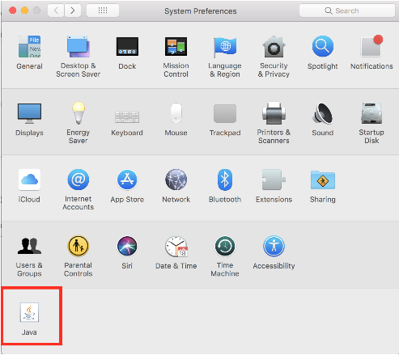
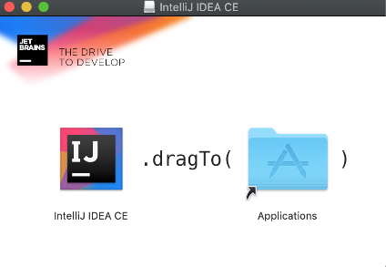
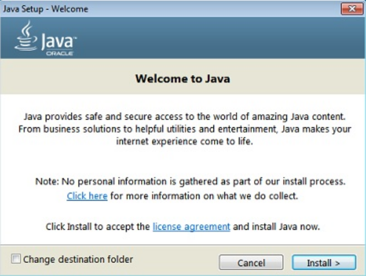
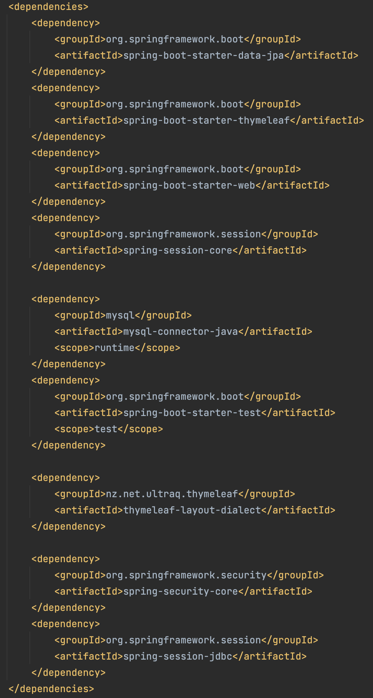

## Introduction

At this point, you've learned several back-end development technologies, including the following:

* Node.js&mdash;a JavaScript runtime environment

* Express.js&mdash;a library that facilitates web server features in Node.js

* Sequelize&mdash;an ORM that helps to abstract database tables as models

* Handlebars.js&mdash;a template engine for delivering HTML and data together

These technologies all form part of the JavaScript ecosystem, but not every company uses JavaScript for their back-end needs. For example, Java&mdash;an alternative to Node.js and Express.js&mdash;has long been the most popular programming language for enterprise-level applications. 

You'll likely interact with a Java API at some point in your development career. When you do, you'll find that the open source Spring framework provides useful support for Java-based applications, thanks to a robust programming and configuration model.

Spring Boot offers autoconfiguration of the Spring framework, enabling us to select prepackaged dependency bundles that provide all of the Java libraries necessary to build a stand-alone, production-ready API capable of deployment to the cloud. This streamlined process helps empower development teams to create **microservices**, which break down large applications into smaller suites of services. 

In this module, you'll experience the benefits of Spring Boot firsthand as you code the back end of a social news website. You've built something like this before, including capabilities for users to create accounts, post links to interesting articles, and upvote or comment on other users' posts.

The difference is that this time, we'll use the following Java-based technologies in place of MERN:

* Spring Boot will replace Node.js and Express.js.

* Spring Data JPA will replace Sequelize.js.

* Thymeleaf will replace Handlebars.js.

* Spring Session will replace Express Session.

That's a lot of new tools! But the general concepts used across both Java and JavaScript are actually similar, which will make it easier for you to accomplish the goals in this lesson.

## Preview

The goal for this lesson is to set up your Java development environment for the social news site that you'll be coding, create a GitHub repo, and connect the necessary project folders. To accomplish all that, you'll complete the following steps:

1. Install the necessary software.

2. Create the Java Spring Boot project with Spring Initializr.

3. Import the project and create the project root folder.

4. Set up the GitHub repository.

5. Connect the project to the GitHub repository.

6. Connect IntelliJ to the project root folder and observe the project folder structure.

Let's get started!

## Install Your Software

For your first foray into Java, you'll need the Java Development Kit (JDK) and a code editor. 

Although we've used code editors before, we'll need something bigger and better for the purposes of this lesson. VS Code and Sublime work fine for simpler languages like JavaScript, but Java requires a bona fide **integrated development environment (IDE)**. An IDE is a robust code editor with a built-in compiler and debugger. We'll use IntelliJ IDEA, one of the most popular IDEs in the industry.

You'll also use MySQL Workbench and POSTMan, but these should already be installed because you've used them before. For installing the JDK and IntelliJ IDEA, refer to the installation guide for your operating system (macOS or Windows).

## Install the JDK and IntelliJ IDEA on macOS

To install the JDK and IntelliJ IDEA on your Mac, make sure to follow the instructions closely. Each step must be completed exactly as described in order for the installations to work.

### Install the JDK on macOS

In order to install the Java programming language, you need the JDK. But first you must [create an Oracle account](https://docs.oracle.com/en/cloud/get-started/subscriptions-cloud/csgsg/get-oracle-com-account.html). When you have an account with Oracle, complete the following steps:

1. Navigate to the [JDK download page](https://www.oracle.com/technetwork/java/javase/downloads/jdk8-downloads-2133151.html).

2. Select the "mac OS x64" download option.

3. Click the user agreement and scroll to the bottom, then check the box to accept the agreement. 

4. Sign in to your Oracle account.

5. When the download is complete, open the installation files package.

6. When the installation package window pops up, double-click the package icon to launch the install wizard.

7. In the Introduction section of the install wizard, click Continue.

8. The Destination Select section should automatically choose an installation location and redirect you to the next section.

9. In the Installation Type section, click Install.

10. Enter your password in the pop-up prompt, and click Install Software.

11. When the installation is complete, you should see a message that says, "The software was successfully installed."

12. You'll be automatically directed to the Summary Section, which means that you've successfully installed Java!

13. Click the close button, and select "Move to Trash" for the installation files.

14. Open Terminal and run the command `java -version` to check that the installation completed successfully. You can also verify this by opening System Preferences and looking for a Java icon there, as shown in the following image:

    

> **Hint** 
>
> For further guidance, watch this [video on installing the JDK for Mac](https://youtu.be/9Bw8vpjYRiA).

### Install the IntelliJ IDEA Community Edition for macOS

Next, you’ll install IntelliJ IDEA to use as your code editor. Complete the following steps:

1. Navigate to the [IntelliJ IDEA download page](https://www.jetbrains.com/idea/download/#section=mac).

2. Download the Community Edition for macOS.

3. Run the disk image file after it downloads.

4. In the Finder window that pops up, drag the IntelliJ IDEA CE icon into your Applications folder, as shown in the following image:

    

5. In the Applications folder, open IntelliJ in Launchpad.

6. Click Open when prompted to open a third-party app downloaded from the internet.

7. If prompted to import IntelliJ settings from a config or installation folder, choose the default "Do not import settings" option and click OK.

8. The next step is left to your own discretion! You can either choose to send usage statistics or choose the "Don't send" option to keep from sharing data. 

9. Next, you might be prompted to customize IntelliJ IDEA. If so, you can choose to "Skip remaining and set defaults", or you can click through (to set the theme and so on) until you reach the "Start Using IntelliJ" button.

10. Don't forget to eject the install drive and delete the IntelliJ IDEA disk image from your Downloads folder after successful installation.

Great work. You've installed IntelliJ IDEA! Note that on the first launch of IntelliJ IDEA, it might ask you to choose some settings. If so, in the bottom left of that screen, choose the Set Defaults option.

> **Hint** 
>
> For further guidance, watch this [video on installing IntelliJ Idea for Mac](https://youtu.be/TYQan9aRAbs).

Phew! Installations can be tedious, but they form essential pillars for everything you'll do going forward.

## Install the JDK and IntelliJ IDEA on Windows

To install the JDK and IntelliJ IDEA on your Windows computer, make sure to follow the instructions closely! Each step must be completed exactly as described in order for the installations to work.

### Install the JDK on Windows

In order to install the Java programming language, you need the JDK. But first you must [create an Oracle account](https://docs.oracle.com/en/cloud/get-started/subscriptions-cloud/csgsg/get-oracle-com-account.html). When you have an account with Oracle, complete the following steps:

1. Navigate to the [JDK downloads page](https://www.oracle.com/technetwork/java/javase/downloads/jdk8-downloads-2133151.html).

2. Select the "Windows x86" download option.

3. Click the user agreement and scroll to the bottom, then check the box accepting the agreement.

4. Sign in to your Oracle account.

5. Run the install file.

6. On the first setup page, click Install, as shown in the following image:

    

7. Select the install path and click next.

8. On the "Change in License Terms" page, click OK.

9. Once again, choose the installation directory.

10. Click Next. When the Complete page appears, you've successfully installed Java!

> **Hint** 
>
> For further guidance, watch this [video on JDK installation for Windows](https://youtu.be/o25N3nb_yiM).

### Install IntelliJ IDEA for Windows

Next you’ll install IntelliJ IDEA to use as your code editor. Complete the following steps: 

1. Navigate to the [IntelliJ IDEA download page](https://www.jetbrains.com/idea/download/#section=windows).

2. Download the Community Edition.

3. Run the install file.

4. On the first setup page, choose Next.

5. Select the destination folder and click Next.

6. Mark the "Update PATH variable option", create the ".java" association, and click Next.

7. Click Install.

8. Choose your preferred option for when to reboot.

9. Once you've rebooted, launch IntelliJ.

10. Accept the Privacy Policy and continue.

11. This final step is left to your own discretion. You can either choose to send usage statistics or choose the "Don't send" option to keep from sharing data. 

Great work. You've installed IntelliJ IDEA! Note that on the first launch of IntelliJ IDEA, it will ask you to choose some settings. In the bottom left of that screen, choose the Set Defaults option.

> **Hint** 
>
> For further guidance, watch this [video on IntelliJ installation for Windows](https://youtu.be/JOc9lVFVQso).

Phew! Installations can be tedious, but they form essential pillars for everything you'll do going forward. 

## Create the Spring Boot Java Project

Although we've installed all the required technology, we still have some setup to do. For one thing, we have to create the Spring Boot project. We'll use the application Spring Initializr to help do that. Spring Initializr's user interface allows us to select the configuration variables and dependencies that we need for a project.

Dependencies are bundled into groups of libraries that address certain common tasks. Let's consider, then, some of the tasks that we'll tackle for this project: we'll create an API that will connect to a MySQL database, and we'll use an ORM to map Java objects to the database tables, perform session management, and present HTML template pages to the API's users. We'll need to keep these tasks in mind while setting up the project because we'll select dependency bundles based on those needs. 

Now to get started with Spring Initializr! Open your browser and navigate to the [Spring Initializr website](https://start.spring.io/). On that webpage, you'll have to choose from a series of settings and other options to initialize your project. Use the following instructions to complete the form:

* In the Project section, select Maven Project (the default).

* In the Language section, select Java (the default).

* In the Spring Boot section, select version 2.6.4 (or whatever the default version is).

* In the Project Metadata section, input the following information:

  * Group: com.technews

  * Artifact: tech-news-java-api

  * Name: tech-news-java-api

  * Description: Tech News Java API Project

  * Package Name: com.technews
  
  * Packaging: Jar (default)

  * Java: 8

* In the Dependencies section on the right side of the page, click the Add Dependencies button. Then search for and add the following dependencies:

  * Spring Web

  * Spring Data JPA

  * MySQL Driver

  * Spring Session

  * Thymeleaf

Once you've added all project information and dependencies, click the Generate button at the bottom of the page. Spring Initializr will generate the project with the proper folder structure, conveniently downloading it to a .zip file!

Now you need a root project folder on your machine. Create a new folder called `technews`, then navigate to your Downloads folder and find the .zip file generated by Spring Initializr. Unzip that file to your newly created `technews` folder.

## Create the GitHub Repository for the Project

The next step is to create a repository for the project. Open your browser, navigate to [GitHub](https://www.github.com), and create a new repository. Be sure to match the name of new repository with the project that you created with Spring Initializr (`tech-news-java-api`). 

After you've created the repo, copy the Git remote from the repository page on GitHub, as you've done for previous projects&mdash;you'll use this command in just a moment. This code should look like the following example:

```bash
git remote add origin git@github.com:username/tech-news-java-api.git
```

Then open the command prompt and navigate into your project folder. Type the command `git init`, to initialize the folder as a Git repository.

> **Important** 
>
> Don't add any new files to the repository. That will come later.

Now that we've initiated the repository, we can apply the standard Git commit process, as follows:

```bash
git status
git add -A
git commit "commitMessage"
```

If your default branch isn't named `main` already, run the following:

```bash
git branch -M main
```

Finally, you need to add the proper Git remote. Paste the command that you copied from the GitHub website earlier, shown again as follows:

```bash
git remote add origin git@github.com:username/tech-news-java-api.git
```

Now we can type `git push -u origin main` and press Enter. 

Great! Now we have the GitHub repository all set up. Let's move on to manually adding some final dependencies that couldn't be added by Initializr.

## Manually Add Thymeleaf Layout Dialect and Spring Session JDBC Dependencies

We've already added dependencies with Spring Initializr. However, we also want to incorporate the Spring Security Core, Thymeleaf Layout Dialect, and Spring Session JDBC dependencies&mdash;which aren't available in Spring Initializr. Knowing how to add dependencies manually without relying on Initializr is a valuable skill, so this will be good practice!

You can discover and obtain dependency bundles from Maven Central (also known as MVNRepository). This process might remind you of working with Node.js and npm!

To add these dependencies, launch IntelliJ. You might see a welcome screen appear; click on Open and navigate to your `technews` folder to open the project. If you don't see a welcome screen, you can click on the File dropdown menu, then click on Open to navigate to that directory and open the project.

> **Deep Dive** 
>
> Learn more about getting started with IntelliJ IDEA, check the [IntelliJ documentation.](https://www.jetbrains.com/help/idea/getting-started.html)

Next, open your browser and navigate to the [MVNRepository website](https://mvnrepository.com/repos/central). Once the page loads, search for Thymeleaf Layout Dialect in the search bar at the top center of the page.

When you select Thymeleaf Layout Dialect, you'll see a page displaying the many version options. Click the link for version 2.4.1, and on the next screen you'll see the dependency options. Next, select the Maven tab. This tab will provide the XML version of the dependency that you're looking for, as shown in the following code block:

```xml
<dependency>
  <groupId>nz.net.ultraq.thymeleaf</groupId>
  <artifactId>thymeleaf-layout-dialect</artifactId>
  <version>2.4.1</version>
</dependency>
```

Let's copy the preceding code but remove the `<version> </version>` tags from the XML dependency. Spring Boot will automatically configure the proper version, leaving us with the following snippet:

```xml
<dependency>
  <groupId>nz.net.ultraq.thymeleaf</groupId>
  <artifactId>thymeleaf-layout-dialect</artifactId>
</dependency>
```

Now that we've copied the XML to the clipboard, we need to enter it somewhere&mdash;namely, the `pom.xml` file. Open the `pom.xml` file in IntelliJ and add the dependency to the `<dependencies>` section of the file.

Finally, grab the following XML for Spring Security Core and Spring Session JDBC: 

```xml
<dependency>
  <groupId>org.springframework.security</groupId>
  <artifactId>spring-security-core</artifactId>
</dependency>
<dependency>
  <groupId>org.springframework.session</groupId>
  <artifactId>spring-session-jdbc</artifactId>
</dependency>
```

Once we've entered all three of the dependencies, the `pom.xml` file should resemble the following image: 



As the image shows, we did add the dependency, but it isn't automatically imported. Let's trigger IntelliJ to import the newly added dependency. We'll do that by navigating to the File dropdown menu (on macOS this is under the "IntelliJ" menu) and selecting Settings (called "Preferences" on macOS). From this menu, select the "Editor > General > Auto Import" tab.

From there, select the "Show auto-import tooltip" and "Add unambiguous imports on the fly" checkbox options (if not already selected). Select "Apply" and close the window. In the `pom.xml` file, a small button with an "m" on it should appear in the upper-right corner of the editor. Click that button to ensure all dependencies are imported. Sometimes it may take reloading the application altogether for the settings to work.

> **Deep Dive** 
>
> Learn more about these settings in the [IntelliJ documentation.](https://www.jetbrains.com/help/idea/settings-auto-import.html#java)

Make sure to push up all of your work to GitHub, using the typical Git workflow, as follows:

```bash
git add -A
git commit -m "message"
git push origin main 
```

## Reflection

Congratulations on taking the first step toward creating this Java API! You've constructed the foundation of the news app, so now you'll be able to incrementally build each module of the project. Then you can integrate these modules with the back-end database and the front-end user-facing templates.

In this lesson, you've achieved the following tasks:

* Installed project support software.

* Created the Spring Boot project with Spring Initializr.

* Imported the project and created the project root folder.

* Set up a new GitHub repository.

* Connected the project to the GitHub repository.

* Connected IntelliJ to the project root folder and noted the project folder structure.

* Manually added Thymeleaf Layout Dialect, Spring Session JDBC, and Spring Security Core dependencies to the project from MVNRepository.

Next, you'll create the entity model classes that the Spring Data JPA will use to create the database tables supporting the API. Keep up the hard work!

---

© 2025 edX Boot Camps LLC. Confidential and Proprietary. All Rights Reserved.
