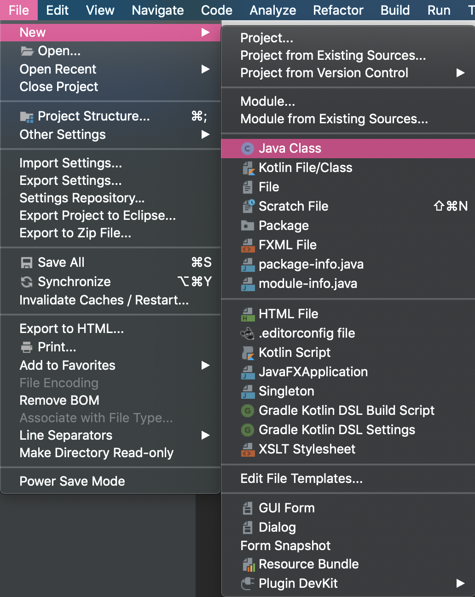
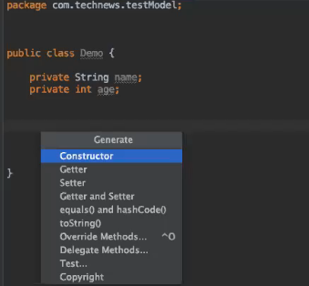
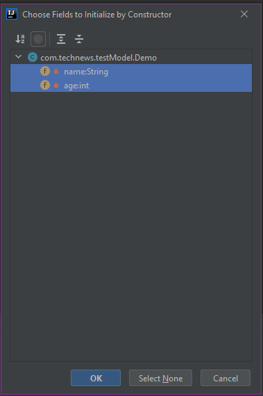

## Introduction

At this point, you've installed essential software, created your Spring Boot project using Spring Initializer, imported the project, and connected it to GitHub and IntelliJ. Phew! That was a lot of setup, but now that you've created your Java development environment, you can actually start writing Java code. 

This project involves building a Java back end to support an existing front end for a social news website. Remember, in back-end development, it is crucial to ensure proper database setup, successful table creation, and effective table relationships. So our first step is to create the Java classes that will become the application's entity models&mdash;which will then be converted into database tables. 

You'll learn how to do the following:

* Create variables with data-type definitions and private access.

* Implement public getter and setter methods. 

* Generate constructor functions for instance variables by using IntelliJ.

* Leverage Spring by using annotations.

Much like we've done before, we'll use the MySQL database for this project. But because we're working with Java now, we'll use Spring Data JPA for the ORM instead of Sequelize.

## Preview

The primary goal for this lesson is to start setting up the database for Just Tech News, by building the entity model classes. These entity model classes will form the database table definitions that will be generated by the Spring Data JPA.

In the process, you'll explore a lot of Java fundamentals, including **class creation**, **method creation**, and **encapsulation**. You'll also learn the importance of the Spring framework and how annotations facilitate functionality by telling the Spring Data JPA how to define and create the tables in the database. 

IntelliJ IDEA can do a lot of heavy lifting for us when it comes to creating classes. We'll start with some example classes and then move on to create the entity model classes!

To achieve the goals for this lesson, we'll tackle the following steps:

1. Create a "Hello, World!" program in Java and practice making demo entity models.

2. Create the `User` entity model for the database.

3. Create the `Post` entity model.

4. Create the `Comment` entity model.

5. Create the `Vote` entity model.

## Create a "Hello, World!" Program in Java

Time for your first adventure in Java&mdash;creating a "Hello, World!" program.

To do this, open IntelliJ. In the directory navigator on the left side of the window, select the `src/main/java/com.technews` folder. Then open the File dropdown menu, point the cursor at New, and select Java Class, as shown in the following image: 



Name the class `HelloWorld`, and there you go! You’ve created your first class. IntelliJ should open to your newly created `HelloWorld.java` file. 

When you create a class, the name of the file must correspond to the name of the class in your code. You named your file `HelloWorld`, so you’ll see that your class is also named `HelloWorld`, as follows:

```java
public class HelloWorld {
}
```

> **Deep Dive** 
>
> You’ll see `public` a lot in Java. The `public` keyword (as opposed to `private`) signifies that a method or variable can be accessed by elements in other classes. 
>
> For more information, see the [Oracle documentation on Java](https://docs.oracle.com/en/java/index.html).

You might recall that a **class** in JavaScript is essentially a blueprint that can be used to create new objects, by using the `new` keyword. However, in Java, you'll often use classes for their static properties and methods without creating new objects (although you can also instantiate new objects from them like in JavaScript). This means that you can use classes themselves similarly to how you use objects in JavaScript.

This works because in Java, unlike JavaScript, all of the code must be written inside of a class. There’s no concept of global variables or functions. At least one class in every Java program needs a `main()` method, which serves as an entry point for the program and gets everything started. See the following code for an example:

```java
public static void main(String[] args){}
```

We'll dissect the keywords in this method later. For now, let's add a `main()` method right inside the `HelloWorld` class declaration, as shown in the following example:

```java
public class HelloWorld {
  public static void main(String[] args) {

  }
}
```


Though we aren’t calling this method, it does accept a string array of arguments when the program first starts. 

> **Rewind** 
>
> Does this remind you of anything in Node.js? It should! The `main()` method resembles `process.argv` in that it allows us to pass in arguments to the program.

The preceding code is what makes Java a **high-ceremony language**. Whereas in JavaScript we can simply input `console.log("Hello, World!")` and run the code as is, Java requires a bit more work to get to that point. 

Okay, now that we've fulfilled those requirements, let’s move on. Inside the `main()` method, add the following code:

```java
public class HelloWorld {
    public static void main(String[] args) {
        System.out.println("Hello, World!");
    }
}
```

Just like `log()` belongs to the `window.console` object in JavaScript, `println()` belongs to the `System.out` object in Java and is used to print messages to the console.

So we have the code necessary to print "Hello, World!" But before we can run it, we need to go through a step called **compilation**. This process involves converting the Java code into **bytecode**, which is readable by the **Java virtual machine (JVM)**. Compilation allows the code we write to be run and understood by any computer with the JVM installed.

In that case, let's start compilation! In IntelliJ IDEA, right-click `HelloWorld.java`, then select "Run `HelloWorld.main()`."

Your code will be compiled and then run. This should open a window in the bottom of your editor that shows the path to the `java.exe` file, the file you're running, and the line you printed: `"Hello, World!"`. 

Congratulations, you’ve written your first Java program! 

### Create a VariableTypes Project

Now we'll create another demo project that will help us explore some of the primary differences between Java and JavaScript, particularly regarding variables.

You might recall that JavaScript is dynamically typed. This means that a variable can hold one type of data (like a Boolean) at first but can later hold another type of data (like a string), as follows:

```js
var isFavorite = false;
isFavorite = "not really";=
```

As a **dynamically typed** language, JavaScript allows for more flexibility in variable declaration and return typing. But it also requires the computer to do a lot of value-definition checking when the program runs. 

Java, on the other hand, is a **statically typed** language. This means that when you declare a variable, you must tell the computer what type of data it will hold, and that can never change. See the following code for an example:

```java
boolean isFavorite = false;
String favString = "not really";
```

So although JavaScript allows for more flexibility, Java offers greater efficiency due to its rigid requirements for declaring variables. Let’s discover how to harness this powerful characteristic of Java.

Using the same process as the `HelloWorld` project, create a new project called `VariableTypes`. Then create an associated class with the same name. Add the `main()` method to the class, as follows:

```java
public class VariableTypes {
 public static void main(String[] args) {

  }
}
```

Now we can explore the various data types inside the `main()` method. Java includes many built-in types, but for now we'll focus on the following: 

* The `String` keyword indicates a string of characters, as shown in the following example:

  ```java
  String name = "Cleopatra";
  ```

* The `int` keyword indicates whole numbers (or integers, like 1, 2, or 3), as follows:

  ```java
  int age = 2016 + 69;
  ```

* The `double` data type stores decimal values (like 1.2, 2.3, or 3.54), as shown in the following example:

  ```java
  double price = 1999.99;
  ```

* A `boolean` data type stores Boolean values (either `true` or `false`), as shown in the following example:

  ```java
  boolean truth = true;
  boolean falseness = !truth;
  ```

Let's practice a bit before we move on to generating constructors, getters and setters, and other methods.

### Create a VariablesPractice Project

Using the same process that you did for the `HelloWorld` and `VariableTypes` projects, create a new project called `VariablesPractice`. Like you've done before, create a new class with a `main()` method.

Inside the `main()` method, complete the following steps and answer the questions. Try different types for each question until you can figure it out.

* Create two variables&mdash;one `int` and one `double`. Add them together to find the sum, and store the result as a variable called `sum`. What type is `sum`?

* Create a `String` variable. Add it to your `int` and store the result as a variable. What type is it?

* When you think you know the data types of the resultant variables, use `System.out.println` to check the values.

* Is `sum` a whole number or a decimal value?

  * Decimal value, as `b` is a decimal value. 

* Now compare these results to JavaScript. What happens when we add a string and a number together in JavaScript?

  * The string and number will be concatenated (as in `4 + cat = 4cat`). See the following code block for an example:

    ```java
    public class VariablesPractice {

      public static void main(String[] args) {

        int a = 4;
        double b = 3.5;
        String c = "cat";

        // calculated variable sum is a double
        double sum = a + b;

        // calculated variable concat is a String
        String concat = a + c;

        // value of sum is 7.5
        System.out.println(sum);

        // value of concat is "4cat"
        System.out.println(concat);

      }
    }
    ```

Great job! 

### Create a testModel.Demo Class

Now you'll practice creating constructor functions. Remember, a **constructor function** creates objects based on a class blueprint. You've done this before in JavaScript&mdash;in Java, IntelliJ IDEA can generate constructor functions for instance variables! As you work through this demo, you'll get a peek at how creating entity models will look.

First, delete the `HelloWorld` class from earlier, found in the file navigation on the left side of the IDE. After it's deleted, select `src/main/java/com.technews`. From the File dropdown menu, select New. Then select Class, and name the new class `testModel.Demo`. 

Inside your `Demo` class, create private `String` and `int` instance variables, as follows:

```java
public class Demo {

  private String name;
  private int age;

}
```

Awesome! Now right-click anywhere between the opening and closing curly brackets of your `Demo` class, and press Generate. This should display a list of options, as shown in the following image:



Let's select Constructor in this case. Then we'll be prompted to "Choose Fields to Initialize by Constructor". We want to use both the name and age fields, so highlight them by holding down `Shift` and clicking on both options. Then select OK, as shown in the following image:



You'll notice that the generated constructor has the same name as the class that it was derived from and that the method has NO return type. That is, there is no type before `Demo` and after `public` in the constructor definition, as shown in the following example:

```java
public Demo(String name, int age) {
  this.name = name;
  this.age = age;
}
```

Now that we've generated the constructor via IntelliJ IDEA, let's generate some getters and setters! 

### Generate Getters and Setters for the Demo Class

Private variables can only be accessed from within the same class where they were created and initialized. However, we can circumvent that rule by using getters and setters. Getters and setters access private variables using public `get()` and `set()` methods. The `get()` method returns the variable value, while the `set()` method allows us to set the value.

To create some basic getters and setters, right-click below your constructor inside the `Demo` class. Like you did for the constructors, select Generate. You'll see individual "Getters" and "Setters" options, but you'll want to choose the combined "Getters and Setters" option. 

At that point, you'll be prompted to "Select Fields to Generate Getters and Setters". Choose both the `name` and `age` variables and press OK. 

You should see the following code generated in the `Demo` class:

```java
public String getName() {
  return name;
}

public void setName(String name) {
  this.name = name;
}

public int getAge() {
  return age;
}

public void setAge(int age) {
  this.age = age;
}
```

As shown in this example, the name of each method is preceded first by `public` or `private` and then by a return type. Let's say that the method returns a string; in that case, the line of code would be `public String getName()`. If the method doesn't need to return a value, then we can use the `void` keyword in place of a return type.

Then, just like in JavaScript, you can name your function and specify the type as well as the identifier of the arguments you'd like&mdash;for example, `setName(String name)`. You can comma-separate your arguments and have more than one, but unlike JavaScript, they do require a type. Similar style, different rules!

### Generate equals(), hashCode(), and toString() Methods for the Demo Class

We're almost ready to write the actual code for Just Tech News. But first let's do a final round of practice. To start, we'll add the `equals()` and `hashCode()` methods to the `Demo` class.

Spring Data JPA will use the `equals()` method to compare two objects. However, this method compares objects by **hash code** (or reference number), rather than by value. Thus, two distinct objects with the same value would be interpreted as NOT equal. We'll override that functionality so that `equals()` compares objects based on values, but we'll also need to override `hashCode()` when we do that because it is closely linked. 

To create these methods, right-click under your getters and setters but inside your `Demo` class. Select Generate. This will bring up a prompt. Just click "next" all the way through! When you're done, the code for `equals()` and `hashCode()` will look like the following example:

```java
@Override
public boolean equals(Object o) {
  if (this == o) return true;
  if (o == null || getClass() != o.getClass()) return false;
  Demo demo = (Demo) o;
  return age == demo.age &&
    Objects.equals(name, demo.name);
}

@Override
public int hashCode() {
  return Objects.hash(name, age);
}
```

Finally, let's generate a `toString()` method using IntelliJ.  By default, `toString()` returns the reference number of an object&mdash;but wouldn't it be more useful to view the actual value of an object, rather than just its reference number?

In the same way that we overrode the default functionality for the `equals()` and `hashCode()` methods, we can also override `toString()` to change its behavior. When we're done, we'll be able to view the value of an object within the log file. 

Right-click under the `hashCode()` closing bracket, and select Generate. Then select `toString()`. The generated code should look like the following example:

```java
@Override
  public String toString() {
    return "Demo{" +
            "name='" + name + '\'' +
            ", age=" + age +
            '}';
  }
```

You might have noticed the `@Override` annotation at the top of each of the methods we just generated. You'll learn more about annotations soon. When you see the `@Override` annotation on a method, it means that the method is coming to the class from a superclass (or parent class). In this case, that superclass is the `Object` class. 

> **Note** 
>
> The `@Override` annotation isn't required, but it is best practice to include it.

Wow! We've covered a lot of new concepts in these practice exercises. Now we're prepared to write some real code. Let's delete the `testModel` folder and `Demo` class and start creating the first entity model for the project.

## Create the User Entity Model

When we created the Spring Boot project for this application, we included the Spring Data JPA dependency bundle. In Spring Data JPA, entity models serve as the blueprints for database tables and columns. We'll use the Spring Data JPA for table creation, primary key creation and auto-generation, foreign key constraint and table relationship creation, column creation, and data validations.

> **Pro Tip** 
>
> You might have noticed that the driving force behind Spring is to provide a framework of libraries that can simplify and streamline common tasks. This facilitates standardization of structure and process across Java, enabling developers to tackle certain tasks quickly and easily.

Wow, the Spring Data JPA does a lot! We can achieve all this functionality by using **annotations**, or metadata about a project. Annotations are available at the following levels:

* **Class-level annotations** are declared above a class.

* **Instance variable-level annotations** are declared above the instance variables.

* **Method-level annotations** are declared above the methods.

Basically, the level of the annotation determines how much of an effect it will have on the code. Based on the annotations we use and their placement throughout the entity model classes, the Spring framework will decide which libraries to pull in and how to configure them. 

Okay, so let's use this knowledge to build the `User` entity model. This is a basic **POJO** (or **plain old Java object**) class, and it is structurally no different from the demo classes that we created earlier. To begin, navigate to IntelliJ IDEA and create a new package (Java terminology for project folders) called `model` inside `src/main/java/com.technews`. Then, inside the `model` package, create a new class called `User`, as shown in the following example:


### Create the Class-Level Annotations for the User Class

We'll start writing annotations at the class level and then work downward. Add the following three annotations above `public class User{}`:

```java
@Entity
@JsonIgnoreProperties({"hibernateLazyInitializer", "handler"})
@Table(name = "user")
```

After you add those annotations, the code should look like the following example:

```java
package com.technews.model;


import com.fasterxml.jackson.annotation.JsonIgnoreProperties;
import javax.persistence.Entity;
import javax.persistence.Table;

@Entity
@JsonIgnoreProperties({"hibernateLazyInitializer", "handler"})
@Table(name = "user")
public class User {
    
}
```

> **Note**
>
> Ideally, import statements should be automatically generated at the top of the file, since we selected "Add unambiguous imports on the fly" in the last lesson. If you don't see these statements, you can import an annotation (or any other Java element) by clicking on it, entering Option+Return (macOS) or Alt+Enter (Windows) on your keyboard, and selecting the correct package to import from.

Here's a brief overview of the annotations you've just added:

* `@Entity` marks this as a persistable object, so that the `User` class can map to a table.

* `@JsonIgnoreProperties` specifies properties that should be ignored when serializing this object to JSON. The two arguments that follow the annotation are the properties to be ignored. Note that you could add many more if necessary.

* `@Table` specifies the name of the table that this class maps to. If this annotation isn't present, the table name will be the class name by default.

### Create the Instance Variable-Level Annotations for the User Class

With the class created, along with its class-level annotations, we can start adding instance variables. We'll create eight instance variables: `id`, `username`, `email`, `password`, `loggedIn`, `posts`, `votes`, and `comments`. Of those, the `posts`, `votes`, and `comments` instance variables will be **lists**&mdash;collections of objects of the same type. Add the following code to create these instance variables:

```java
public class User {
  private Integer id;
  private String username;
  private String email;
  private String password;
  boolean loggedIn;

  private List<Post> posts;
  private List<Vote> votes;
  private List<Comment> comments;
  
}
```

Excellent! Now for the proper instance-level annotations. First, we want to attach the `@Id` and `@GeneratedValue` annotations to the `id` private variable. The first signals that `id` will be used as the unique identifier, and the second denotes that it will be a generated value. We'll pass an argument into `@GeneratedValue` to say that this number should be generated automatically, by adding `(strategy = GenerationType.AUTO)`. 

You can use the following code to do all that:

```java
@Id
@GeneratedValue(strategy = GenerationType.AUTO)
private Integer id;
```

Now let's add the annotation `@Column(unique = true)` to `email`, to signal that this value must be unique; duplicates won't be allowed. With that, the `email` variable should look like the following example:

```java
@Column(unique = true)
private String email;
```

Finally, we'll add `@Transient` to the `loggedIn` variable. `@Transient` signals to Spring Data JPA that this data is NOT to be persisted in the database, because we don't need or want a user's logged-in status to persist in the data. This annotation will look like the following example:

```java
@Transient
boolean loggedIn;
```

### Create Table Relationships for the User Class

Next we need to create relationships for the tables in the database. Remember one-to-many relationships in SQL? Well, in Java, we can use an annotation called `@OneToMany`, which will create the relationships between the tables automatically. 

Above each of the list variables (`posts`, `votes`, and `comments`), add the `@OneToMany` annotation and three arguments, as follows:

```java
@OneToMany(mappedBy = "userId", cascade = CascadeType.ALL, fetch = FetchType.EAGER)
private List<Post> posts;

// Need to use FetchType.LAZY to resolve multiple bags exception
@OneToMany(mappedBy = "userId", cascade = CascadeType.ALL, fetch = FetchType.LAZY)
private List<Vote> votes;

// Need to use FetchType.LAZY to resolve multiple bags exception
@OneToMany(mappedBy = "userId", cascade = CascadeType.ALL, fetch = FetchType.LAZY)
private List<Comment> comments;
```

Note that the `Posts` variable gets the `FetchType` of `EAGER`, meaning that this list will gather all of its necessary information immediately after being created, while the variables designated as `LAZY` only gather information as they need it. You can only ever designate a single list as `EAGER`. 

### Generate the Methods for the User Class

Now that you have all of the instance variables, you can generate the `User` class constructor, getters and setters, and `equals()`, `hashCode()`, and `toString()` methods. Create all of those, being sure to include all of the instance variables. 

Finally, let's make this class implement an interface called `Serializable`. In our next lesson, we'll go more in-depth with interfaces and the `implements` keyword, but for now, just make sure we add `implements Serializable` after `public class User`.

By implementing Serializable, we inform the Java Virtual Machine that this model will be "serialized", or coverted into a bytestream in order to store entries for these models in a database. Java handles this process for us under the hood, so other than making sure to implement the inferface in each of your entity models, you won't need to worry more about serialization when buidling this app.

By the end, your code should resemble the following example:

```java
package com.technews.model;

import com.fasterxml.jackson.annotation.JsonIgnoreProperties;

import javax.persistence.*;
import java.io.Serializable;
import java.util.List;
import java.util.Objects;

@Entity
@JsonIgnoreProperties({"hibernateLazyInitializer", "handler"})
@Table(name = "user")
public class User implements Serializable {

@Id
@GeneratedValue(strategy = GenerationType.AUTO)
private Integer id;
private String username;
@Column(unique = true)
private String email;
private String password;
@Transient
boolean loggedIn;

@OneToMany(mappedBy = "userId", cascade = CascadeType.ALL, fetch = FetchType.EAGER)
private List<Post> posts;

// Need to use FetchType.LAZY to resolve multiple bags exception
@OneToMany(mappedBy = "userId", cascade = CascadeType.ALL, fetch = FetchType.LAZY)
private List<Vote> votes;

// Need to use FetchType.LAZY to resolve multiple bags exception
@OneToMany(mappedBy = "userId", cascade = CascadeType.ALL, fetch = FetchType.LAZY)
private List<Comment> comments;

public User() {
}

public User(Integer id, String username, String email, String password) {
  this.id = id;
  this.username = username;
  this.email = email;
  this.password = password;
}


public Integer getId() {
  return id;
}

public void setId(Integer id) {
  this.id = id;
}

public String getUsername() {
  return username;
}

public void setUsername(String username) {
  this.username = username;
}

public String getEmail() {
  return email;
}

public void setEmail(String email) {
  this.email = email;
}

public String getPassword() {
  return password;
}

public void setPassword(String password) {
  this.password = password;
}

public boolean isLoggedIn() {
  return loggedIn;
}

public void setLoggedIn(boolean loggedIn) {
  this.loggedIn = loggedIn;
}

public List<Post> getPosts() {
  return posts;
}

public void setPosts(List<Post> posts) {
  this.posts = posts;
}

public List<Vote> getVotes() {
  return votes;
}

public void setVotes(List<Vote> votes) {
  this.votes = votes;
}

public List<Comment> getComments() {
  return comments;
}

public void setComments(List<Comment> comments) {
  this.comments = comments;
}

@Override
public boolean equals(Object o) {
  if (this == o) return true;
  if (!(o instanceof User)) return false;
  User user = (User) o;
  return isLoggedIn() == user.isLoggedIn() &&
        Objects.equals(getId(), user.getId()) &&
        Objects.equals(getUsername(), user.getUsername()) &&
        Objects.equals(getEmail(), user.getEmail()) &&
        Objects.equals(getPassword(), user.getPassword()) &&
        Objects.equals(getPosts(), user.getPosts()) &&
        Objects.equals(getVotes(), user.getVotes()) &&
        Objects.equals(getComments(), user.getComments());
  }

@Override
public int hashCode() {
  return Objects.hash(getId(), getUsername(), getEmail(), getPassword(), isLoggedIn(), getPosts(), getVotes(), getComments());
}

@Override
public String toString() {
  return "User{" +
          "id=" + id +
          ", username='" + username + '\'' +
          ", email='" + email + '\'' +
          ", password='" + password + '\'' +
          ", loggedIn=" + loggedIn +
          ", posts=" + posts +
          ", votes=" + votes +
          ", comments=" + comments +
          '}';
  }
}
```

Wow, look at all that code! IntelliJ generated a lot of it, and the annotations also offer extensive functionality&mdash;with little effort from us. 

You might have noted we provided two constructors for `Post`&mdash;one with arguments and one without. We'll do the same for all of our entity models, and we'll use both of them in the controller classes that we'll create later. By default, if we don't provide any constructors at all, Java will automatically generate a constructor that does not take arguments. However, if we provide a constructor that does use arguments, the Java compiler won't generate a no-argument constructor, meaning we need to write both if we need to use them.

We aren't finished yet, though! We need to create three more entity models for this project: `Comment`, `Post`, and `Vote`. So let's get back to work.

## Create the Post Entity Model

You're now fully equipped to create entity models on your own. You just need the proper class-level annotations as well as the instance variables and their associated annotations. Time to use these new skills, starting with the `Post` model.

Click your `model` package, and create a class called `Post`. Like `User`, this will implement the `Serializable` interface as well. Inside that class, add the following instance variables:

```java
private Integer id;
private String title;
private String postUrl;
private String userName;
private int voteCount;
private Integer userId;
private Date postedAt = new Date();
private Date updatedAt = new Date();
private List<Comment> comments;
```

Then we'll need the following code for the class-level annotations:

```java
@Entity
@JsonIgnoreProperties({"hibernateLazyInitializer", "handler"})
@Table(name = "post")
public class Post implements Serializable {

}
```

Now for the instance-level variables. We can start by adding `@Id` and `@GeneratedValue(strategy = GenerationType.AUTO)` to the `id` variable, as follows:

```java
@Id
@GeneratedValue(strategy = GenerationType.AUTO)
private Integer id;
```

Then we'll add the `@Transient` annotation to both the `userName` and `voteCount` variables, as follows: 

```java
@Transient
private String userName;
@Transient
private int voteCount;
```

All right, now you'll tackle a data type that you haven't used before. The variables `postedAt` and `updatedAt` are both of type `Date`, which allows for a bit of extra functionality. You might recognize the value of these variables as how you invoke the `Date()` method. 

To these two `Date` typed variables, we need to add three annotations&mdash;`@NotNull`, `@Temporal(TemporalType.DATE)`, and `@Column(name = "posted_at")`. The instance variables should resemble the following code:

```java
@NotNull
@Temporal(TemporalType.DATE)
@Column(name = "posted_at")
private Date postedAt = new Date();

@NotNull
@Temporal(TemporalType.DATE)
@Column(name = "updated_at")
private Date updatedAt = new Date();
```

Let's review these new annotations:

* `@NotNull` signals to the Spring Data JPA that this variable is not to be allowed to be null in the database. 

* `@Temporal` allows us to use the type `Date` in the database and signals to the JPA that these fields will house data of that type. 

* `@Column(name = "name_here")` designates the name of the column for the database.

Create the constructor, getters and setters, and the `equals()`, `hashCodes()`, and `toString()` methods, and your file should resemble the following example:

```java
package com.technews.model;

import com.fasterxml.jackson.annotation.JsonIgnoreProperties;
import com.sun.istack.NotNull;

import javax.persistence.*;
import java.io.Serializable;
import java.util.Date;
import java.util.List;
import java.util.Objects;

@Entity
@JsonIgnoreProperties({"hibernateLazyInitializer", "handler"})
@Table(name = "post")
public class Post implements Serializable {

@Id
@GeneratedValue(strategy = GenerationType.AUTO)
private Integer id;
private String title;
private String postUrl;
@Transient
private String userName;
@Transient
private int voteCount;
private Integer userId;

@NotNull
@Temporal(TemporalType.DATE)
@Column(name = "posted_at")
private Date postedAt = new Date();

@NotNull
@Temporal(TemporalType.DATE)
@Column(name = "updated_at")
private Date updatedAt = new Date();

// Need to use FetchType.LAZY to resolve multiple bags exception
@OneToMany(mappedBy = "postId", cascade = CascadeType.ALL, fetch = FetchType.LAZY)
private List<Comment> comments;


public Post() {
}

public Post(Integer id, String title, String postUrl, int voteCount, Integer userId) {
  this.id = id;
  this.title = title;
  this.postUrl = postUrl;
  this.voteCount = voteCount;
  this.userId = userId;
}

public Integer getId() {
  return id;
}

public void setId(Integer id) {
  this.id = id;
}

public String getTitle() {
  return title;
}

public void setTitle(String title) {
  this.title = title;
}

public String getPostUrl() {
  return postUrl;
}

public void setPostUrl(String postUrl) {
  this.postUrl = postUrl;
}

public String getUserName() {
  return userName;
}

public void setUserName(String userName) {
  this.userName = userName;
}

public int getVoteCount() {
  return voteCount;
}

public void setVoteCount(int voteCount) {
  this.voteCount = voteCount;
}

public Integer getUserId() {
  return userId;
}

public void setUserId(Integer userId) {
  this.userId = userId;
}

public Date getPostedAt() {
  return postedAt;
}

public void setPostedAt(Date postedAt) {
  this.postedAt = postedAt;
}

public Date getUpdatedAt() {
  return updatedAt;
}

public void setUpdatedAt(Date updatedAt) {
  this.updatedAt = updatedAt;
}

public List<Comment> getComments() {
  return comments;
}

public void setComments(List<Comment> comments) {
  this.comments = comments;
}

@Override
public boolean equals(Object o) {
  if (this == o) return true;
  if (!(o instanceof Post)) return false;
  Post post = (Post) o;
  return getVoteCount() == post.getVoteCount() &&
          Objects.equals(getId(), post.getId()) &&
          Objects.equals(getTitle(), post.getTitle()) &&
          Objects.equals(getPostUrl(), post.getPostUrl()) &&
          Objects.equals(getUserName(), post.getUserName()) &&
          Objects.equals(getUserId(), post.getUserId()) &&
          Objects.equals(getPostedAt(), post.getPostedAt()) &&
          Objects.equals(getUpdatedAt(), post.getUpdatedAt()) &&
          Objects.equals(getComments(), post.getComments());
}

@Override
public int hashCode() {
  return Objects.hash(getId(), getTitle(), getPostUrl(), getUserName(), getVoteCount(), getUserId(), getPostedAt(), getUpdatedAt(), getComments());
}

@Override
public String toString() {
  return "Post{" +
          "id=" + id +
          ", title='" + title + '\'' +
          ", postUrl='" + postUrl + '\'' +
          ", userName='" + userName + '\'' +
          ", voteCount=" + voteCount +
          ", userId=" + userId +
          ", postedAt=" + postedAt +
          ", updatedAt=" + updatedAt +
          ", comments=" + comments +
          '}';
  }
}
```

Like before, don't forget to add the `@OneToMany` annotation above your `comments` list.

Nice work! You can move on to create the `Comment` entity model next.

## Create the Comment Entity Model

As you've done before, select your `model` folder and create a class called `Comment`. Inside that class, add the following instance variables:

```java
private Integer id;
private String commentText;
private Integer userId;
private Integer postId;
```

Perfect. For the class-level annotations and implementations, we'll need the following code:

```java
@Entity
@JsonIgnoreProperties({"hibernateLazyInitializer", "handler"})
@Table(name = "comment")
public class Comment implements Serializable {}
```

We only need annotations on one instance-level variable, `id`, as follows:

```java
@Id
@GeneratedValue(strategy = GenerationType.AUTO)
private Integer id;
```

Now generate everything just like before. Your file should look like the following example when complete: 

```java
package com.technews.model;

import com.fasterxml.jackson.annotation.JsonIgnoreProperties;

import javax.persistence.*;
import java.io.Serializable;
import java.util.Objects;

@Entity
@JsonIgnoreProperties({"hibernateLazyInitializer", "handler"})
@Table(name = "comment")
public class Comment implements Serializable {

@Id
@GeneratedValue(strategy = GenerationType.AUTO)
private Integer id;
private String commentText;
private Integer userId;
private Integer postId;

public Comment() {
}

public Comment(Integer id, String commentText, Integer userId, Integer postId) {
  this.id = id;
  this.commentText = commentText;
  this.userId = userId;
  this.postId = postId;
}

public Integer getId() {
  return id;
}

public void setId(Integer id) {
  this.id = id;
}

public String getCommentText() {
  return commentText;
}

public void setCommentText(String commentText) {
  this.commentText = commentText;
}

public Integer getUserId() {
  return userId;
}

public void setUserId(Integer userId) {
  this.userId = userId;
}

public Integer getPostId() {
  return postId;
}

public void setPostId(Integer postId) {
  this.postId = postId;
}

@Override
public boolean equals(Object o) {
  if (this == o) return true;
  if (!(o instanceof Comment)) return false;
  Comment comment = (Comment) o;
  return Objects.equals(getId(), comment.getId()) &&
          Objects.equals(getCommentText(), comment.getCommentText()) &&
          Objects.equals(getUserId(), comment.getUserId()) &&
          Objects.equals(getPostId(), comment.getPostId());
}

@Override
public int hashCode() {
  return Objects.hash(getId(), getCommentText(), getUserId(), getPostId());
}

@Override
public String toString() {
  return "Comment{" +
          "id=" + id +
          ", commentText='" + commentText + '\'' +
          ", userId=" + userId +
          ", postId=" + postId +
          '}';
  }
}
```

Awesome! We've almost completed this stage of the project. We just need to create the `Vote` entity model now.

## Create the Vote Entity Model

Select your `model` package, and create a class called `Vote`. Inside that class, add the following instance variables:

```java
private Integer id;
private Integer userId;
private Integer postId;
```

Okay, now we'll need the following class-level annotations and implementations:

```java
@Entity
@JsonIgnoreProperties({"hibernateLazyInitializer", "handler"})
@Table(name = "vote")
public class Vote implements Serializable {}
```

Like the `Comment` model, we only need annotations on the `id` instance variable, as follows:

```java
@Id
@GeneratedValue(strategy = GenerationType.AUTO)
private Integer id;
```

Now generate everything just like before, and your file should look like the following example when complete: 

```java
package com.technews.model;

import com.fasterxml.jackson.annotation.JsonIgnoreProperties;

import javax.persistence.*;
import java.io.Serializable;
import java.util.Objects;

@Entity
@JsonIgnoreProperties({"hibernateLazyInitializer", "handler"})
@Table(name = "vote")
public class Vote implements Serializable {

@Id
@GeneratedValue(strategy = GenerationType.AUTO)
private Integer id;
private Integer userId;
private Integer postId;

public Vote() {
}

public Vote(Integer id, Integer userId, Integer postId) {
  this.id = id;
  this.userId = userId;
  this.postId = postId;
}

public Vote(Integer userId, Integer postId) {
  this.userId = userId;
  this.postId = postId;
}

public Integer getId() {
  return id;
}

public void setId(Integer id) {
  this.id = id;
}

public Integer getUserId() {
  return userId;
}

public void setUserId(Integer userId) {
  this.userId = userId;
}

public Integer getPostId() {
  return postId;
}

public void setPostId(Integer postId) {
  this.postId = postId;
}

@Override
public boolean equals(Object o) {
  if (this == o) return true;
  if (!(o instanceof Vote)) return false;
  Vote vote = (Vote) o;
  return Objects.equals(getId(), vote.getId()) &&
          Objects.equals(getUserId(), vote.getUserId()) &&
          Objects.equals(getPostId(), vote.getPostId());
}

@Override
public int hashCode() {
  return Objects.hash(getId(), getUserId(), getPostId());
}

@Override
public String toString() {
  return "Vote{" +
          "id=" + id +
          ", userId=" + userId +
          ", postId=" + postId +
          '}';
  }
}
```

Great job! You've built the entire structure of the database, which is a huge accomplishment and a key step toward creating your first Java API.

Push all of your work so far to GitHub, using the following Git workflow:

```git
git add .
git commit -m "message"
git push origin main 
```

## Reflection

The most exciting portion of development for this API is yet to come, but what we accomplished in this lesson was no less important. Just like building a house, we need to build a secure and solid foundation before we can make it look pretty. 

To that end, in this lesson you learned how to do the following:

* Create a Java class.

* Create a Java method.

* Identify the important structural parts of a method.

* Create Java entity model classes.

* Add Spring annotations to the entity model classes, allowing Spring Data JPA to create the database and the database tables.

With that foundation in place, now we can create database repository interfaces, start the Java API, and spin up the database! We'll tackle all of that next.

---

© 2025 edX Boot Camps LLC. Confidential and Proprietary. All Rights Reserved.
