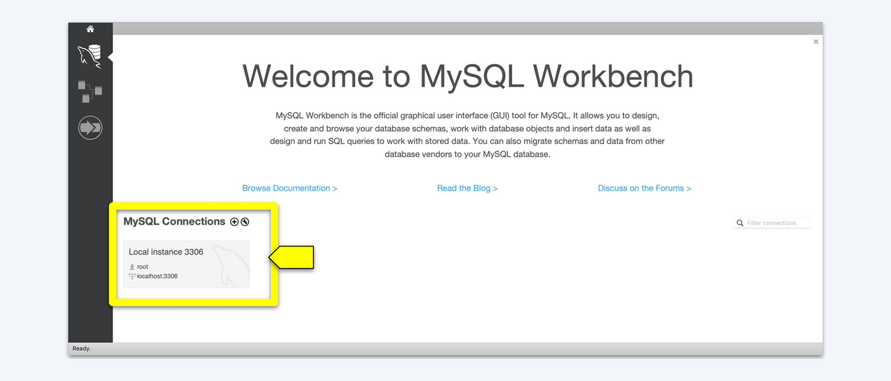
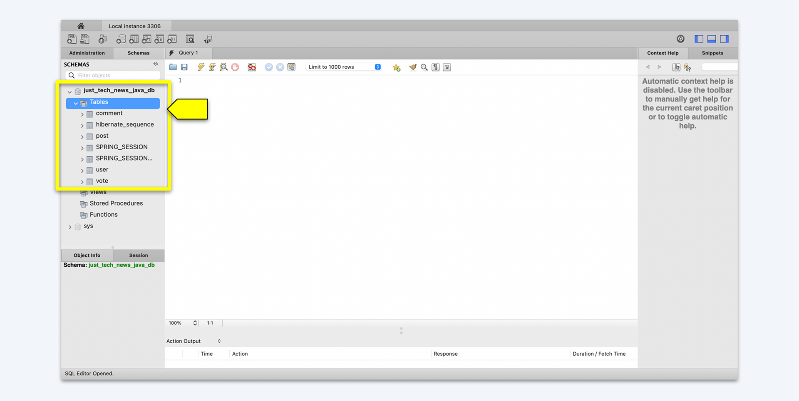

## Introduction

Congratulations on creating and annotating the entity model classes for the Java API! That probably seemed like a lot of code with no real payoff, but you've laid the foundation for your next step. Those entity models will become the database tables, and all the annotations and code you wrote will dictate their structure.

Now we'll create repository interfaces for each of the model classes. Once those are in place, we'll start up the Java API for the first time&mdash;and observe how Spring Data JPA automatically generates the database tables and table relationships based on the entity models we created.

Throughout this lesson, we'll learn how to do the following:

* Create a repository interface.

* Implement CRUD functionality by using Spring Data JPA alongside SQL.

* Create custom SQL queries to address any additional database operation needs. 

* Write manual SQL queries to use in the Spring Data JPA framework.

* Configure the database.

* Configure Spring Sessions.

* Start the Java API.

* Confirm database creation via MySQL Workbench.

Next let's preview how we'll approach this lesson.

## Preview 

The goal for this lesson is to create the repository interfaces for the entity models we created in the previous lesson. This step will provide the necessary connectivity, mapping, and translations between the database tables and the Java entity model objects. We'll then configure the MySQL database connection to work with the Java API. At that point, we'll start up the API to confirm that the database tables have been created with the expected columns and table relationships. 

To achieve all this, we'll complete the following steps:

1. Create the repository interfaces for the entity models.

2. Configure the data source, Spring Session, and port number for the API.

3. Start up the database.

4. Confirm successful database table creation.

Let's get started!

## Create the Entity Model Repositories

First we'll create the repository interfaces for each entity model. An **interface** in Java is an abstract class that groups related empty methods. To access these methods, one of the classes has to use the `implement` keyword (instead of a keyword like `extends` that indicates inherited behavior). 

When we made classes previously, we were basically creating blueprints by which we could produce objects. In contrast, a Java interface resembles a contract more than a blueprint. The interface itself can do nothing on its own. Instead, it defines the methods that an implementing class MUST account for. 

So if we create an interface named `Movement` that includes a method named `run()` and another method named `jump()`, then any class that implements that interface MUST include both a `run()` and a `jump()` method. The class that implements the interface will have the method body, which dictates how that class will specifically implement the `run()` and `jump()`. So a `Dog` class implements the `Movement` interface and provides the specifics of how a dog runs and jumps. Then a `Cat` class would implement the `Movement` interface and provide its own specific `run()` and `jump()` movements for a cat. In the end, you're assured that both `Dog` and `Cat` have those methods, but each class can implement the methods in a way specific to that class. 

To demonstrate all this in action, let's create this `Movement` interface, as shown in the following example:

```java
Interface Movement {
  public void run();
  public void jump();
}

class Dog implements Movement {
  public void run() {
    System.out.println("This dog can run a long time!");
  }

  public void jump() {
    System.out.println("This dog can't jump very high!");
  }
}

class Cat implements Movement {
  public void run() {
    System.out.println("This cat can run really fast!");
  }

  public void jump() {
    System.out.println("This cat jump really high!");
  }
}
```

As shown in the preceding code, we created two empty methods (`run()` and `jump()`) within the interface named `Movement`. We then implemented that interface in both of the classes in two different ways. Remember, in order to implement an interface, a class must use all of the methods contained within that interface.

### Create the User Repository Interface

Great! Now you'll create the first interface for Just Tech News. In IntelliJ IDEA, click `src/main/java/com.technews`. Select File, New, and then Java Class. Select Interface on the menu that pops up. You'll want to create the `UserRepository` inside of a package named `repository`. Type `repository.UserRepository`, as shown in the following image, and press Enter:


Okay, now you should be taken to your newly created `UserRepository` interface. The code should look like the following example:

```java
package com.technews.repository;

public interface UserRepository {

}
```

Let's add the class-level annotation `@Repository`. A **repository** in Java is any class that fulfills the role of a **data access object (DAO)**&mdash;in other words, it contains data retrieval, storage, and search functionality. 

Even though the repository CRUD methods and SQL aren't visible in the interface, we'll ensure that the methods are still available via **inheritance**. To do that, we need to alter the `public interface UserRepository` statement to extend the `JpaRepository`&mdash;thus, the interface will inherit the methods used to access the database for standard CRUD operations. Those methods will be available to any class that autowires the repository, like the controller classes that we'll create later that will perform the CRUD operations. 

> **Note**
>
> The term **autowiring** refers to scanning a project and instantiating only the objects required for a class or method to run.

To ensure that the repository can take `User` (from the entity model we created) and the id of that user, we specify an `Integer`. Now the code should resemble the following example:

```java
package com.technews.repository;

import com.technews.model.User;
import org.springframework.data.jpa.repository.JpaRepository;
import org.springframework.stereotype.Repository;

@Repository
public interface UserRepository extends JpaRepository<User, Integer> {

    
}
```

Finally, let's add the custom query method, which we'll call `findUserByEmail()`. This method will allow us to do what the name implies&mdash;find users by their email. Naming methods in this specific way allows Spring Data JPA to write the SQL for that method based solely on the name. The following example shows what the `findUserByEmail()` method should look like:

```java
User findUserByEmail(String email) throws Exception;
```

So the final `Interface` file should look like the following example:

```java
package com.technews.repository;

import com.technews.model.User;
import org.springframework.data.jpa.repository.JpaRepository;
import org.springframework.stereotype.Repository;

@Repository
public interface UserRepository extends JpaRepository<User, Integer> {
  User findUserByEmail(String email) throws Exception;
}
```

Excellent! You just created your first interface. Now you need to make three more, corresponding to the `Post`, `Comment`, and `Vote` classes. 

### Create the Post Repository Interface

You'll tackle the `Post` repository next. Create a new interface and name it `PostRepository`. Add the same `@Repository` class-level annotation, and extend the `JpaRepository` just like you did for the `UserRepository`. But instead of `<User, Integer>`, use `<Post, Integer>`. 

We also need to create the query method, named `findAllPostsByUserId(Integer id)`. The return type will be `List<Post>`, so the final code should look like the following example:

```java
package com.technews.repository;

import com.technews.model.Post;
import org.springframework.data.jpa.repository.JpaRepository;
import org.springframework.stereotype.Repository;

import java.util.List;

@Repository
public interface PostRepository extends JpaRepository<Post, Integer> {

  List<Post> findAllPostsByUserId(Integer id) throws Exception;

}
```

### Create the Comment Repository Interface

Great, now do the same for the `CommentRepository`. Follow all the steps you took previously&mdash;but instead of `<Post, Integer>`, use `<Comment, Integer>`. The method within the interface, named `findAllCommentsByPostId()`, will take a return type of `List<Comment>` and take an argument `postId` of value `int`. 

The code in your `CommentRepository` file should look like the following example:

```java
package com.technews.repository;

import com.technews.model.Comment;
import org.springframework.data.jpa.repository.JpaRepository;
import org.springframework.stereotype.Repository;

import java.util.List;

@Repository
public interface CommentRepository extends JpaRepository<Comment, Integer> {

    List<Comment> findAllCommentsByPostId(int postId);
}
```

Nice work! We only have a single interface left to create now. 

### Create the Vote Repository Interface

The `Vote` interface will differ a little from the other three. First, we won't add the `@Repository` class-level annotation but instead will add an instance-level annotation, `@Query`. Second, we'll add `<Vote, Integer>` to the ` extendsJpaRepository<>`, adding a bit more specificity to the query that will be structured from the interface. 

Let's set up the skeleton of the interface, as follows:

```java
package com.technews.repository;

public interface VoteRepository extends JpaRepository<Vote, Integer> {

}
```

Next, for the body of the interface, let's add a method named `countVotesByPostId()` with a return type of `int`. This method will have two arguments&mdash;one is a method-level annotation of `@Param("id)`, to use the id as a parameter, and the other is the `Integer id`. So the code should look like the following example:

```java
package com.technews.repository;

import com.technews.model.Vote;
import org.springframework.data.jpa.repository.JpaRepository;
import org.springframework.data.repository.query.Param;

public interface VoteRepository extends JpaRepository<Vote, Integer> {

  int countVotesByPostId(@Param("id") Integer id);

}
```

Next, let's add the instance-level annotation, `@Query`, right above the method we just declared. This annotation will take a single argument, which will be the specific query we want to use (`"SELECT count(*) FROM Vote v where v.postId = :id"`). With that, the code should look like the following example:

```java
package com.technews.repository;

import com.technews.model.Vote;
import org.springframework.data.jpa.repository.JpaRepository;
import org.springframework.data.jpa.repository.Query;
import org.springframework.data.repository.query.Param;

public interface VoteRepository extends JpaRepository<Vote, Integer> {

  @Query("SELECT count(*) FROM Vote v where v.postId = :id")
  int countVotesByPostId(@Param("id") Integer id);

}

```

Nice work! You've created all of your repository interfaces&mdash;and the contracts by which your classes will implement these methods. You can move on to configuring the datasource, Spring session, and port number for the API so that you can get testing.

Make sure that all of your work is pushed up to GitHub, using the following Git workflow:

```git
git add .
git commit -m "message"
git push origin main 
```

## Configure the Data Source, Spring Session, and Port Number for the API

You've done a whole lot of work, but now you're just one simple step away from being able to run the API. Namely, you need to configure some environment-level variables for the Database, Spring Session, and of course choose a port number.

To complete the setup, open IntelliJ IDEA. In the file navigation, open the file called `application.properties` (which is nested in the `src` folder, then `main`, and finally `resources`). Inside this file, paste the following code:

```java

server.port=8082

spring.datasource.url=jdbc:mysql://localhost:3306/just_tech_news_java_db?useSSL=false&serverTimezone=UTC&createDatabaseIfNotExist=true&allowPublicKeyRetrieval=true
spring.datasource.username=root
spring.datasource.password=${DB_PASSWORD}
spring.jpa.hibernate.ddl-auto=update
spring.jpa.show-sql=true
spring.jpa.properties.hibernate.format_sql=true

```

Let's break down this code. 

First we pick a port. In this case, we'll use `8082`. The next variable will be the data source URL, as shown in the following code:

```java
spring.datasource.url=jdbc:mysql://localhost:3306/just_tech_news_java_db?useSSL=false&serverTimezone=UTC&createDatabaseIfNotExist=true&allowPublicKeyRetrieval=true
```

This URL is called a **connection string**. First we specify the `jdbc` as `mysql`, then provide a string of parameters for the MySQL connection. We'll be testing locally, so we pass in `localhost` and what we want to name the database, `localhost:3306/just_tech_news_java_db`. We'll chain parameters, starting with `useSSL` set to `false`; the `serverTimezone` will be `UTC`; and most importantly, we want to create the database if it doesn't exist, so we pass `createDatabaseIfNotExist=true`. We also want to set up the database with the ability for the client to request the public key from the server.

Additionally, you'll need to change the username and password to whatever is set up on YOUR machine, and you'll need to set up the way the schema tools will manipulate the database at startup (`hibernate.ddl-auto=update`).

Note the value we gave our `password`. Does that format look familiar to you? It's the same format we use for template literals in JavaScript, but here we're using it to set our password in an environment variable. When deploying to Heroku, we'll use Heroku's settings to set environment variables, but locally, we'll use IntelliJ to set our database password. This allows us to push our code to GitHub without publishing sensitive data, which we'll do shortly.

Lastly, we'll have the JPA dump out the SQL statements (`show-sql=true`), and the final variable (`properties.hibernate.format_sql`) will make these statements more readable! 

Now all we need to do before we run the API is set up the Spring Session variables. Under the `properties.hibernate.format_sql` variable, add the following code:

```java
spring.session.store-type=jdbc
spring.session.jdbc.initialize-schema=always
spring.session.timeout.seconds=600
spring.h2.console.enabled=true
```

In the preceding code, we set the `store-type` as `jdbc`, stating that we want to initialize the schema every time we start up the session. We set `timeout` to six seconds for this example, but it can be set to any length of time. Finally, we enabled the H2 console, an embedded GUI console for browsing the contents of a database and running the queries. 

That's it! At last, we can compile the program and start the API.

Now that you've reached this milestone, push all of your work to GitHub, as follows:

```git
git add .
git commit -m "message"
git push origin main 
```

## Set Local Environment Variables in IntelliJ

Let's set up an environment variable to contain our password in IntelliJ. First, right-click on the `TechNewsJavaApiApplication.java` file under `technews` on IntelliJ's file explorer, then select "Modify Run Configuration...".


Then, enter an environment variable in the "Environment variables:" input box. We'll use the same format as we used in our .env files in Node.js&mdash;that is, an all-caps key, followed by and equals sign and our actual database password on the right of the equals sign. It should look something like this:

```text
DB_PASSWORD=your_real_mysql_password_here
```


Click on Apply, then OK to save the environment variable. That's it!

## Start Up the Java API and Confirm Database Table Creation

So far we haven't had to test anything for this project. Unlike JavaScript, Java programs have to go through a build process before they're executed. But now we've completed that process, and it's time to actually compile and run the Java API to verify that it's functioning. 

As we've discussed previously, all Java applications are executed through a `main()` function. The `main()` function is essential to starting any Java app; without it, the program would fail instantly.

When we generated this project with Spring Intitializr, a class called `TechNewsJavaApiApplication` was created. It can be found in the `src` folder, nested inside `main`, `java`, and `com.technews`. Open this file in IntelliJ IDEA. It should resemble the following code: 

```java
package com.technews;

import org.springframework.boot.SpringApplication;
import org.springframework.boot.autoconfigure.SpringBootApplication;

@SpringBootApplication
public class TechNewsJavaApiApplication {

  public static void main(String[] args) {
    SpringApplication.run(TechNewsJavaApiApplication.class, args);
  }

}
```

The body of the `main()` function contains an autogenerated function that will spin up the API for us, using the `run()` method. Right-click the `TechNewsJavaApiApplication` class in the file navigator of IntelliJ IDEA, then select `Run main()`, as shown in the following image:


Once you click Run, an integrated log should open at the bottom, showing you the processes being run and the current state of the application. Once the build is complete and the application starts up, you should see something like the following image:


Awesome! Let's just confirm that the API actually created the database and tables as expected. Open MySQL Workbench, then open the localhost connection, as shown in the following image:



Next, near the center on the left side, choose the Schemas tab (next to Administration), as shown in the following image:


Great&mdash;you can see `just_tech_news_java_db` in the list of databases! Finally, click the arrow to show the tables. You'll see all the tables that you set up via the entity models, as shown in the following image:



The API is running, and the database and associated tables&mdash;including all of the necessary relationships&mdash;have been created. That's worth celebrating! 

## Reflection

We wrote a lot of code before we reached the testing stage, but that's the nature of a high-ceremony language like Java. Although it requires investing a lot of up-front work and writing a lot of extra code to achieve functionality, the result is a robust and powerful foundation. At this point, we've created a working Java API, connected it to the database, and even had it configure said database. 

In this lesson, you've completed the following tasks:

* Created Java repository interfaces for the database entity models.

* Configured the data source, Spring Session, and port number to connect to external sources and allow for greater API functionality.

* Started up the API.

* Created database tables based on the Java entity model objects by using the Spring Data JPA.

Moving forward, we'll create the server-side CRUD controllers, which will be responsible for processing requests and responses for the application&mdash;equivalent to routes in Express.js. We're making fantastic progress!

---

© 2025 edX Boot Camps LLC. Confidential and Proprietary. All Rights Reserved.
