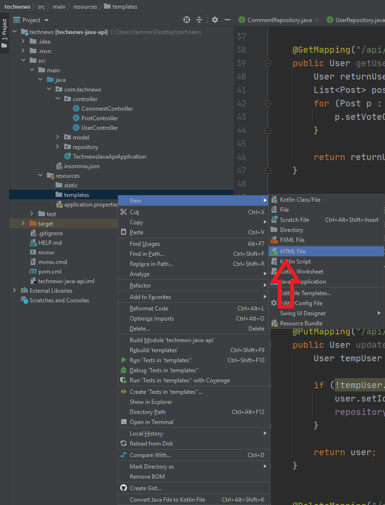
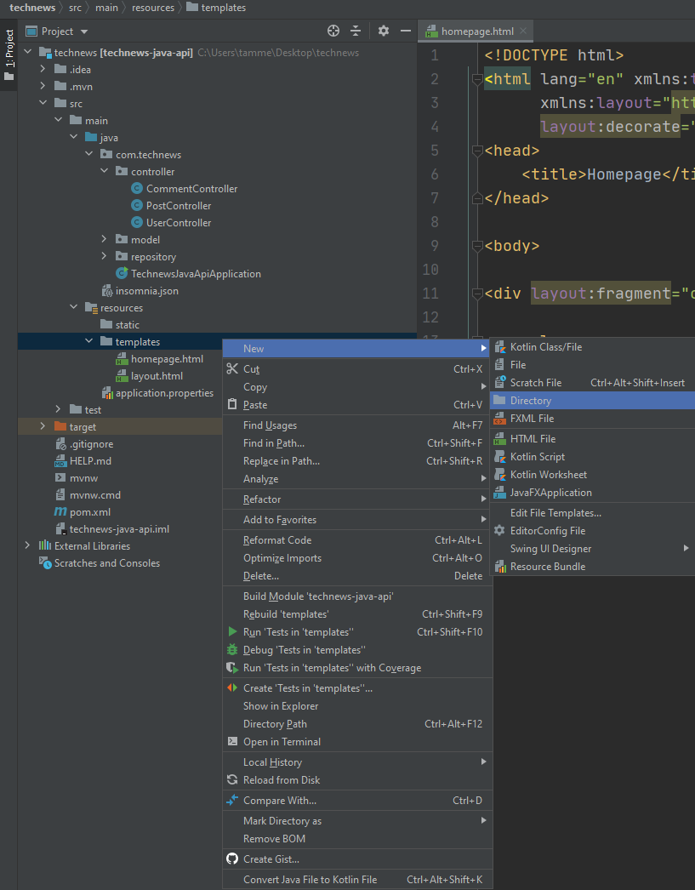
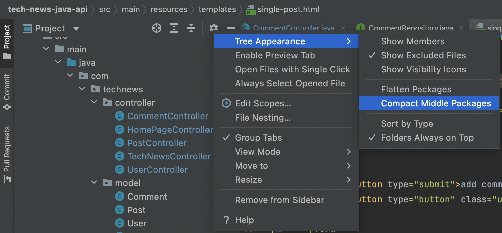

## Introduction

Congratulations on creating the server-side CRUD controllers and testing those controllers with Insomnia test transactions! We'll use these CRUD controllers as we continue working on the API&mdash;which is now fully functional, processing incoming requests and responding with outgoing responses. The next step to this project, then, is making the API not just functional but interactive.

You'll accomplish this with the help of HTML templates, which will serve as an interface to users. Remember, a **template** is an HTML page that combines standard HTML tags with language-specific style statements and objects, all to be included in the construction and presentation of the page to the end user. This tool will allow your application to receive data from the user and populate data on the page, a critical function of an API.

Templates and template engines should already be familiar to you from your previous work with Handlebars.js. For this project, you'll use the Thymeleaf template engine, but the overall concept is the same. 

In this lesson, you'll learn how to do the following: 

* Implement the Thymeleaf Layout Dialect.

* Add a CSS style sheet for HTML templates.

* Explain the structure of a Thymeleaf template.

* Create main templates with Thymeleaf.

* Explain that Java objects can be passed in and out of template pages.

* Implement the template syntax necessary to display data, retrieve data, and collect data.

* Create a Thymeleaf form in a template.

* Create and use Thymeleaf template fragments to represent template code that's repeated in multiple places in the API.

* Explain how the date format helper, the plural words helper, and the URL format helper can assist with making displays consistent.

## Preview 

The goal for this lesson is to create HTML templates that will make the Just Tech News API not just functional but interactive. We'll use the Thymeleaf template engine for this purpose, along with the Thymeleaf Layout Dialect. This means that we'll create one main layout page, and then all additional templates and template-fragments will be displayed within the body of that main layout template&mdash;just like Handlebars.js! 

Thymeleaf will allow us to receive and send Java objects so that we can directly make calls from within the template page to select endpoints, without incorporating asynchronous JavaScript function calls. However, we WILL use those JavaScript functions on some occasions, because as an HTML-based template engine, Thymeleaf only includes options for GET and POST requests. So when we need to send PUT or DELETE requests, we'll rely on those async JavaScript functions that we've used before.

See the following steps for an overview of the game plan for this lesson:

1. Create the main layout template.

2. Create the homepage template.

3. Create the post and comment template fragments.

4. Create the login page template.

5. Create the single-post page template.

5. Create the upvote file.

6. Create the edit post file.

7. Create the delete post file.

Now let's get into it and create the main template page with Thymeleaf!

## Create the Main Layout Template

We'll start by making the main template layout, `main.html`. 

As we've discussed before, Spring offers lots of useful functionality, but we have to follow a few rules to take full advantage of that functionality. For one thing, we need to place certain files in specific folders so that Spring can locate them. The templates we make will need to be placed in a folder that Spring Initializr created for us when we generated the project&mdash;named `templates` and found in `main/resources/templates`.

> **Note** 
>
> This `resources` file is at the same file-structure level as `java`, and not inside it. The `resources` folder is where we'll put things like templates, CSS, and JS files. 

Navigate to IntelliJ. On the left-hand file navigation menu, right-click the `resources/templates` folder. Choose New, then select HTML File, and name the file `layout.html`, choosing the option for "HTML 5 file". See the following image for reference:



Now that you've created the file, copy and paste the following HTML into the newly created `layout.html`:

```html
<!DOCTYPE html>
<html lang="en" xmlns:th="http://www.thymeleaf.org" xmlns:layout="http://www.ultraq.net.nz/thymeleaf/layout">
<head>
    <meta charset="UTF-8">
    <meta name="viewport" content="width=device-width, initial-scale=1, shrink-to-fit=no">
    <title layout:title-pattern="$CONTENT_TITLE - $LAYOUT_TITLE">Just Tech News</title>
    <link rel="stylesheet" href="/css/style.css">
</head>
<body>
<div class="wrapper">
    <header>
        <h1>
            <a href="/">Just Tech News</a>
        </h1>
        <nav>
            <div th:if="${loggedIn}">
                <a th:href="@{/dashboard}">dashboard</a>
                <a th:href="@{/users/logout}">logout</a>
            </div>
            <div th:unless="${loggedIn}">
                <a th:href="@{/login}">login</a>
            </div>
        </nav>
    </header>

    <main layout:fragment="content">
        <p>This is filled by the content template.</p>
    </main>

    <footer>
        Thanks for visiting!
    </footer>
</div>

</body>
</html>
```

Let's break down all the separate pieces of this code block:

* The first thing you might notice is the line at the top of the file, specifying the Thymeleaf namespace definitions and allowing you to use Thymeleaf syntax in the document.

* The `layout:title-pattern` attribute within the `<head>` will make the title dynamic. Because we're using a layout template, we want to ensure that the title changes with the templates that we bring in. When we show a different view template, the title will change to reflect the pattern of `$CONTENT_TITLE - $LAYOUT_TITLE"`. So when we load a template in, we'll see a new title on the tab of the HTML in the browser! 

* Next, in the `<nav>` element, `th:if=` is a conditional statement from Thymeleaf. The `if` statement will render HTML elements based on a provided condition; in the first `div`, that condition is that the user is logged in. 

* Skipping down a few lines, you'll see `th:unless`, the next part of the `if` statement. If the condition isn't met and it returns false, the user will be directed to the login page, where they can satisfy the condition. This functions exactly like the `{{#if author}}` syntax from Handlebars.js.

* The `th:href` syntax will dynamically change the `<a>` element's `href` values based on the evaluation of the `if` conditionals. If a user is logged in, they'll see the dashboard and logout links in their nav. If they're not logged in, they'll only have the login link available.

* Finally, the Thymeleaf attribute `layout:fragment="content"`&mdash;the most important piece&mdash;will allow other templates to be displayed in this section of the page. This functions much like `{{{ body }}}` in Handlebars.js, which would designate where we'd inject the partials. 

Now that we've created the main layout template, let's build the homepage template, which we'll inject into the `layout.html` content area.

But first, push all of your work to GitHub, using the following Git workflow:

```git
git add .
git commit -m "message"
git push origin main 
```

## Create the Homepage Template

The homepage template will be the first we create that will be displayed within the `layout.html` file. To start building it, right-click the `templates` folder on the left-hand file system navigation. Select New, then select "HTML file", and name it `homepage.html`. Copy and paste the following code into your newly created `homepage.html` file:

```html
<!DOCTYPE html>
<html lang="en" xmlns:th="http://www.thymeleaf.org" xmlns:layout="http://www.ultraq.net.nz/thymeleaf/layout" layout:decorate="~{layout}">
<head>
  <title>Homepage</title>
</head>

<body>

  <div layout:fragment="content">
    <ol>
      <li th:each="post : ${postList}" class="post-list">
        <div th:insert="fragments/post-fragment :: post-fragment"></div>
      </li>
    </ol>
  </div>

</body>
</html>
```

Let's review the various pieces of the preceding code block:

* The last attribute definition in the `<html>` element, `layout:decorate="~{layout}`, designates that the homepage HTML file will be bound to `layout.html`. 

* Next, in the `<div>` element, `layout:fragment="content"` defines which specific content from the `homepage.html` page will be displayed on  `layout.html`. We'll use this `content` section in all of the template pages to be displayed in the `layout.html` page.

* Inside `<li>`, in the `<ol>` element, you'll see a Thymeleaf `for` loop. This states that Thymeleaf should iterate over each `post` inside of `${postList}`, creating a list item (`<li>`) for each iteration and giving them all a class of `post-list`.

* The next line will make a bit more sense in the next section, but we've coded it ahead of time to save some effort. It designates where we'd import a **fragment**, a repeatable piece of code in Thymeleaf that can be used across templates. 

You'll tackle your first Thymeleaf fragments in a moment&mdash;after you push your work to GitHub, using the following Git workflow:

```git
git add .
git commit -m "message"
git push origin main 
```

## Create the Post and Comment Template Fragments

As we've mentioned, a fragment in Thymeleaf is a small piece of code that can be included in as many templates as needed. Fragments can simplify repetitive functionality and help us separate concerns for easier debugging, as we reduce or eliminate duplicate code across multiple files.

In IntelliJ, create a new folder inside the `templates` folder. You can do this by right-clicking "templates", then selecting "New" and choosing "Directory". Name this folder `fragments`. You can see the following image for reference:



Great! Inside that `fragments` folder, create a new HTML file named `post-fragment.html`. Copy and paste the following code into your newly created `post-fragment.html` file:

```html
<!DOCTYPE html>
<html lang="en" xmlns:th="http://www.thymeleaf.org" xmlns:layout="http://www.ultraq.net.nz/thymeleaf/layout">
<head>
    <meta charset="UTF-8">
    <meta name="viewport" content="width=device-width, initial-scale=1, shrink-to-fit=no">
    <title layout:title-pattern="$CONTENT_TITLE - $LAYOUT_TITLE">Just Tech News</title>
    <link rel="stylesheet" href="/css/style.css">
</head>
<body>

<article class="post" th:fragment="post-fragment">
  <div class="title">
    <a th:href="@{ ${post.postUrl} }" target="_blank">[[${post.title}]]</a>

    <div th:if="${#strings.contains(post.postUrl, 'http://')}">
      <div th:with="arg=${#strings.replace(post.postUrl,'http://','')}">
        <div th:if="${#strings.contains(arg, '/')}">
          <div th:with="arg2=${#strings.arraySplit(arg, '/')}">
            <span th:text="${#strings.toString(arg2[0])}"></span>
          </div>
        </div>
        <div th:unless="${#strings.contains(arg, '/')}">
          <div th:if="${#strings.contains(arg, '?')}">
            <div th:with="arg2=${#strings.arraySplit(arg, '?')}">
              <span th:text="${#strings.toString(arg2[0])}"></span>
            </div>
          </div>
          <div th:unless="${#strings.contains(arg, '?')}">
            <span th:text="${#strings.toString(arg)}"></span>
          </div>
        </div>
      </div>
    </div>

    <div th:if="${#strings.contains(post.postUrl, 'https://')}">
      <div th:with="arg=${#strings.replace(post.postUrl,'https://','')}">
        <div th:if="${#strings.contains(arg, '/')}">
          <div th:with="arg2=${#strings.arraySplit(arg, '/')}">
            <span th:text="${#strings.toString(arg2[0])}"></span>
          </div>
        </div>
        <div th:unless="${#strings.contains(arg, '/')}">
          <div th:if="${#strings.contains(arg, '?')}">
            <div th:with="arg2=${#strings.arraySplit(arg, '?')}">
              <span th:text="${#strings.toString(arg2[0])}"></span>
            </div>
          </div>
          <div th:unless="${#strings.contains(arg, '?')}">
              <span th:text="${#strings.toString(arg)}"></span>
          </div>
        </div>
      </div>
    </div>

    <div th:if="${#strings.contains(post.postUrl, 'www.')}">
      <div th:with="arg=${#strings.replace(post.postUrl,'www.','')}">
        <div th:if="${#strings.contains(arg, '/')}">
          <div th:with="arg2=${#strings.arraySplit(arg, '/')}">
            <span th:text="${#strings.toString(arg2[0])}"></span>
          </div>
        </div>
        <div th:unless="${#strings.contains(arg, '/')}">
          <div th:if="${#strings.contains(arg, '?')}">
            <div th:with="arg2=${#strings.arraySplit(arg, '?')}">
              <span th:text="${#strings.toString(arg2[0])}"></span>
            </div>
          </div>
          <div th:unless="${#strings.contains(arg, '?')}">
            <span th:text="${#strings.toString(arg)}"></span>
          </div>
        </div>
      </div>
    </div>

    <div th:if="${post.voteCount == 1}" class="meta">
      [[${post.voteCount}]] point by [[${post.userName}]] on
      <span th:text="${#dates.format(post.postedAt, 'MM-dd-YY')}"></span>

      <a th:href="@{/post/{id}(id=${post.id})}" th:if="${post.comments.size() == 1}">[[${post.comments.size()}]]
        comment</a>
      <a th:href="@{/post/{id}(id=${post.id})}" th:unless="${post.comments.size() == 1}">[[${post.comments.size()}]]
        comments</a>
    </div>
    <div th:unless="${post.voteCount == 1}" class="meta">
      [[${post.voteCount}]] points by [[${post.userName}]] on
      <span th:text="${#dates.format(post.postedAt, 'MM-dd-YY')}"></span>
      |
      <a th:href="@{/post/{id}(id=${post.id})}" th:if="${post.comments.size() == 1}">[[${post.comments.size()}]]
          comment</a>
      <a th:href="@{/post/{id}(id=${post.id})}" th:unless="${post.comments.size() == 1}">[[${post.comments.size()}]]
          comments</a>
    </div>
  </div>
</article>

</body>
```

Now we'll break down this code block and discuss it in detail:

*  Within `<article>`, we find code representing a `post` object from the database. Text outside an element in Thymeleaf can be displayed using the syntax `[[${post.title}]]`, with the full line of code as follows:

    ```html
    <a th:href="@{ ${post.postUrl} }" target="_blank">[[${post.title}]]</a>
    ```

* You'll also find a conditional written in Thymeleaf syntax, with one `<div>` that contains `th:if` and another that contains `th:unless`. This is basically saying, if a condition is true, display this `<div>`; otherwise (unless), display the other `<div>`.

* In `post-fragment.html`, the Thymeleaf helper elements work to maintain consistent formatting, starting with the **date format helper**. As the name suggests, this `dates.format()` function helps us to format dates. The arguments specify the `object.property` and the format that we want to put it in. This makes the formatting consistent across all `<span>` elements using this Thymeleaf attribute. 

* Next comes the **URL format helper**. The `strings.replace()` function allows us to replace `http://` in the `postUrl` with an empty space, to tidy up the URLs listed on the page.

* Finally, let's look at the **plural words helper**. We use the Thymeleaf `th:if` and `th:unless` construct to help determine whether to use the word "comment" or "comments". 

These Thymeleaf helper functions can be useful for formatting data in a reliable and repeatable way. They might look daunting, but they're actually quite simple once you've written a few. Take some time to review the preceding code and dissect it for yourself, leaning on the extensive knowledge that you've already acquired. 

Now that we've taken care of `post-fragment.html`, let's create a `comment-fragment.html` file as well, adding the following code inside:

```html
<!DOCTYPE html>
<html lang="en" xmlns:th="http://www.thymeleaf.org" xmlns:layout="http://www.ultraq.net.nz/thymeleaf/layout">
<head>
    <meta charset="UTF-8">
    <meta name="viewport" content="width=device-width, initial-scale=1, shrink-to-fit=no">
    <title layout:title-pattern="$CONTENT_TITLE - $LAYOUT_TITLE">Just Tech News</title>
    <link rel="stylesheet" href="/css/style.css">
</head>
<body>

<section th:each="comment : ${commentList}" class="comment" th:fragment="comment-fragment">
    <div class="meta">
        [[${post.userName}]] on
        <span th:text="${#dates.format(post.postedAt, 'MM-dd-YY')}"></span>
    </div>
    <div class="text">
        [[${comment.commentText}]]
    </div>
</section>

</body>
```

This code largely accomplishes the same goal as our `post-fragment.html` file, except it displays information about comments instead of posts. You can see it's much simpler, since there's less data to account for&mdash;just the username of the comment's poster, the time the comment was posted, and the comment's text&mdash;and we use the same syntax as with our other fragment file.

Let's move on to creating the `login.html` template&mdash;as soon as we push all of this work to GitHub, using the following Git workflow:

```git
git add .
git commit -m "message"
git push origin main 
```

## Create the Login Page Template

On the left-hand file navigation menu of IntelliJ, create a new HTML file called `login.html`, in the `templates` folder. Inside this newly created file, copy and paste the following code:

```html
<!DOCTYPE html>
<html lang="en" xmlns:th="http://www.thymeleaf.org"
      xmlns:layout="http://www.ultraq.net.nz/thymeleaf/layout"
      layout:decorate="~{layout}">
<head>
  <title>Login</title>
</head>

<body>

<div layout:fragment="content">

  <div th:if="${notice}" class="flash-message">
    <h3>[[${notice}]]</h3>
  </div>

  <form action="#" th:action="@{/users/login}" th:object="${user}" method="post" class="login-form">
    <div>
      <label>email:</label>
      <input type="text" th:field="*{email}"/>
    </div>
    <div>
      <label>password:</label>
      <input type="password" th:field="*{password}"/>
    </div>
    <div>
      <button type="submit">login</button>
    </div>
  </form>


  <form action="#" th:action="@{/users}" th:object="${user}" method="post" class="signup-form">
    <div>
      <label>username:</label>
      <input type="text" th:field="*{username}"/>
    </div>
    <div>
      <label>email:</label>
      <input type="text" th:field="*{email}"/>
    </div>
    <div>
      <label>password:</label>
      <input type="password" th:field="*{password}"/>
    </div>
    <div>
      <button type="submit">signup</button>
    </div>
  </form>
</div>

</body>
</html>
```

The structure of this HTML file closely resembles the homepage file. Let's review the following pieces:

* Just like `homepage.html`, we have a reference to `layout:decorate` and then a `<div>` element with a `content` attribute designation as well. Remember, the Thymeleaf attribute `layout:decorate="~{layout}"` specifies that this `login.html` page will be bound to the `layout.html` main template page. The `layout:fragment="content"` attribute defines which content we want to place in the content `<div>` of the layout page.

* In the `<form>` element, we provide a few Thymeleaf attributes. The `th:action="@{/users}"` attribute designates the API route for submitting this form; `th:object="${user}"` designates that the submitted form fields will comprise a `user` object; and lastly, the `method` attribute designates it as a `POST` request. 

* The forms include three input fields, where we designate the `type` as either `text` or `password` and then give a name to the field, via `th:field`. 

## Create the Single-Post Page Template

The next step is to create the `single-post.html` file directly within your `templates/` directory, shown in the following example:

```html
<!DOCTYPE html>
<html lang="en" xmlns:th="http://www.thymeleaf.org"
      xmlns:layout="http://www.ultraq.net.nz/thymeleaf/layout"
      layout:decorate="~{layout}">
<head>
  <title>Single-post</title>
</head>

<body>

<div layout:fragment="content">

  <div th:if="${notice}" class="flash-message">
    <h3>[[${notice}]]</h3>
  </div>

  <div th:insert="fragments/post-fragment :: post-fragment"></div>


  <form th:if="${loggedIn}" action="#" th:action="@{/comments}" th:object="${comment}" method="post" class="comment-form">
    <div>
      <input type="hidden" th:value="${post.id}" name="postId"/>
      <textarea name="comment-body" th:field="*{commentText}"></textarea>
    </div>

    <div>
      <button type="submit">add comment</button>
      <button type="button" class="upvote-btn">upvote</button>
    </div>
  </form>

  <div class="comments">
    <div th:insert="fragments/comment-fragment :: comment-fragment"></div>
  </div>
  <div th:if="${loggedIn}">
    <script src="/js/upvote.js"></script>
  </div>

</div>

</body>
</html>
```

We've discussed the structure and Thymeleaf attributes in the preceding code block, except for one new addition. The `<div>` at the bottom of the page includes a conditional to check whether the user is logged in (`th:if="${loggedIn}"`).

If the user is logged in, the JavaScript `<script>` element will be added, including some functionality that wouldn't exist had the conditional not been met. We'll discuss this in more detail later, when we incorporate Spring Session JPA functionality into the API.

Push all of your work to GitHub using the following Git workflow:

```git
git add .
git commit -m "message"
git push origin main 
```

## Create the Upvote File

As mentioned previously, we do need to use JavaScript in some parts of the API to capture data from the user, after which we'll make a call and pass that data to one of the API endpoints. The `single-post.html` page is one such situation, allowing users to click a button to upvote a post. These upvotes are tallied and saved in a `vote_count` column of the `Post` table in the MySQL database. When users click the upvote button, the `upvote.js` file will facilitate the processing necessary to increment the `vote_count` in the database. 

Let's create this file!

To ensure that Spring can find them, JavaScript and CSS files need to be placed first in `/resources/static`, then in their own `js` or `css` folders. But first, at the top of the left-hand file navigation menu in IntelliJ, click the Settings icon (shaped like a gear) and confirm that the "Compact Middle Packages" option (within the "Tree Appearance" sub-menu) is NOT checked. See the following image for reference:



Now, on the left-hand file navigation menu, right-click on the `static` folder, and create a new directory called `css`. After that, create a new file called `style.css`, and paste the following CSS into the newly created file:

```css
* {
  box-sizing: border-box;
}

body, html {
  height: 100%;
  padding: 0;
  margin: 0;
  font-family: sans-serif;
  color: #333;
}

a {
  text-decoration: none;
  color: #225ca3;
  font-weight: bold;
  transition: color .1s;
}

a:hover {
  color: #3486eb;
}

button {
  background-color: #225ca3;
  border: 0;
  padding: 1%;
  color: white;
  font-weight: bold;
  transition: background-color .1s;
  cursor: pointer;
  border-radius: 5px;
}

button:hover {
  background-color: #3486eb;
}

.post-list {
  margin: 0;
  padding: 0;
}

textarea, input {
  padding: .5%;
  border-radius: 5px;
  border: 1px solid #ccc;
}

textarea:focus, input:focus {
  outline: none;
  border: 1px solid #3486eb;
}

textarea {
  min-width: 40%;
  min-height: 100px;
}

form > div {
  margin-bottom: 2%;
}

form label {
  display: block;
}

.wrapper {
  width: 100%;
  min-height: 100%;
  max-width: 1200px;
  margin: 0 auto;
  display: flex;
  flex-direction: column;
}

header {
  border-bottom: 1px solid #ccc;
  display: flex;
  justify-content: space-between;
  align-items: center;
  padding: 0 1%;
}

header h1 {
  font-size: 1em;
}

main {
  flex: 1;
  padding: 2% 4%;
}

.btn-no-style {
  background: none;
  border: none;
  padding: 0;
  cursor: pointer;
  text-decoration: none;
  color: #225ca3;
  font-size: 100%;
  font-weight: bold;
  transition: color .1s;
  margin-left: 16px;
}

.btn-no-style:hover {
  background: none;
  color: #3486eb;
}

.delete-post-btn {
  background-color: #d41414;
}

.delete-post-btn:hover {
  background-color: #ff643d;
}

.post {
  margin-bottom: 2%;
  line-height: 150%;
}

.post .title span {
  font-style: italic;
  font-size: 90%;
  color: #7d7d7d;
}

.edit-link {
  display: block;
  margin: -1.5% 0 2% 0;
}

.upvote-btn {
  background-color: #197d0f;
  transition: background-color .1s;
}

.upvote-btn:hover {
  background-color: #1f9c13;
}

.comment-form {
  margin-bottom: 5%;
}

.comment {
  padding: 1%;
  margin-bottom: 1%;
}

.comment:nth-child(odd) {
  background-color: #fff5eb;
}

.comment .meta {
  font-size: 90%;
  margin-bottom: .5%;
  opacity: .6;
}

.new-post-form input {
  width: 300px;
}

.edit-post-form {
  margin-bottom: 5%;
}

.flash-message {
  background-color: #ffb6c1;
  color: red;
  text-align: center;
}

footer {
  border-top: 1px solid #ccc;
  display: flex;
  justify-content: center;
  padding: 1%;
  font-size: 110%;
}
```

> **Note** 
>
> Feel free to study this CSS on your own.

Next, we'll create the first JavaScript file to help with some functionality. Create a new directory called `js`, then create a new file inside `js` called `upvote.js`. Copy and paste the following code into the newly created `upvote.js` file:

```js
async function upvoteClickHandler(event) {
  event.preventDefault();

  const id = window.location.toString().split('/')[
    window.location.toString().split('/').length - 1
  ];


  const response = await fetch('/posts/upvote', {
    method: 'PUT',
    body: JSON.stringify({
        postId: id
    }),
    headers: {
      'Content-Type': 'application/json'
    }
  });

  if (response.ok) {
    document.location.reload();
  } else {
    alert(response.statusText);
  }
}

document.querySelector('.upvote-btn').addEventListener('click', upvoteClickHandler);
```

This should all look very familiar, but let's review a few of the key points. 

First, we declare the `upvoteClickHandler()` as an async JavaScript function. Next, we parse out the `id` via the `window.location()` method. By awaiting the response (`response = await`), we can capture the `id` value of the post and save it to a property (`postId`). So when the `fetch()` method makes a call to the `/posts/upvote` route, we capture the `id` of the location and then send it as a PUT request. Finally, `document.querySelector()` attaches an event listener to the button, using class `upvote-btn`, and awaits a click. 

You can create the remaining files quickly now that you're familiar with all the code! But, to deepen your understanding, be sure to review the code that you copy and paste into each file.

## Create the dashboard.html File

Inside the `templates` folder, create a new HTML file called `dashboard.html`. Copy and paste the following HTML into your newly created `dashboard.html` file:

```html
<!DOCTYPE html>
<html lang="en" xmlns:th="http://www.thymeleaf.org"
      xmlns:layout="http://www.ultraq.net.nz/thymeleaf/layout"
      layout:decorate="~{layout}">
<head>
    <title>Dashboard</title>
</head>

<body>

<div layout:fragment="content">

  <div th:if="${notice}" class="flash-message">
    <h3>[[${notice}]]</h3>
  </div>

  <section>
    <h2>Create New Post</h2>

    <form action="#" th:action="@{/posts}" th:object="${post}" method="post" class="new-post-form">
      <div>
        <label for="post-title">Title</label>
        <input type="text" th:field="*{title}" id="post-title" name="post-title"/>
      </div>
      <div>
        <label for="post-url">Link</label>
        <input type="text" th:field="*{postUrl}" id="post-url" name="post-url"/>
      </div>
      <button type="submit" class="btn">Create</button>
    </form>
  </section>

  <section th:if="${postList.size() > 0}">
    <h2>Your Posts</h2>
    <ol>
      <li th:each="post : ${postList}">
        <div th:insert="fragments/post-fragment :: post-fragment"></div>
        <a th:href="@{/dashboard/edit/{id}(id=${post.id})}" class="edit-link">Edit post</a>
      </li>
    </ol>
  </section>

</div>


</body>
</html>
```

All of the Thymeleaf constructs used here should now look familiar to you. But if any specific Thymeleaf elements are still giving you trouble, it wouldn't hurt to review this code block. 

## Create the Edit Post File

We're getting close to done with this stage of the API build! Let's move on and create a file inside the `templates` folder called `edit-post.html`. Copy and paste the following HTML into this newly created file:

```html
<!DOCTYPE html>
<html lang="en" xmlns:th="http://www.thymeleaf.org"
      xmlns:layout="http://www.ultraq.net.nz/thymeleaf/layout"
      layout:decorate="~{layout}">
<head>
    <title>Edit Post</title>
</head>

<body>

<div layout:fragment="content">

  <div th:if="${notice}" class="flash-message">
      <h3>[[${notice}]]</h3>
  </div>

  <a th:href="@{/dashboard}"> &larr; Back to dashboard</a>
  <h2>
    Edit Post
  </h2>

  <form action="#" th:action="@{/posts/{id}(id=${post.id})}" th:object="${post}" method="post" class="edit-post-form">
    <div>
      <input type="text" th:field="*{title}"/>
      <span th:text="${#strings.replace(post.postUrl,'http://','')}"></span>
    </div>
    <div th:if="${post.voteCount == 1}" class="meta">
      [[${post.voteCount}]] point by [[${post.userName}]] on
      <span th:text="${#dates.format(post.postedAt, 'MM-dd-YY')}"></span>
      |
      <a th:href="@{/post/{id}(id=${post.id})}" th:if="${post.comments.size() == 1}">[[${post.comments.size()}]] comment</a>
      <a th:href="@{/post/{id}(id=${post.id})}" th:unless="${post.comments.size() == 1}">[[${post.comments.size()}]] comments</a>
    </div>
    <div th:unless="${post.voteCount == 1}" class="meta">
      [[${post.voteCount}]] points by [[${post.userName}]] on
      <span th:text="${#dates.format(post.postedAt, 'MM-dd-YY')}"></span>
      |
      <a th:href="@{/post/{id}(id=${post.id})}" th:if="${post.comments.size() == 1}">[[${post.comments.size()}]] comment</a>
      <a th:href="@{/post/{id}(id=${post.id})}" th:unless="${post.comments.size() == 1}">[[${post.comments.size()}]] comments</a>
    </div>
    <button type="submit">Edit post title</button>
    <button type="button" class="delete-post-btn">Delete post</button>
  </form>


  <form action="#" th:action="@{/comments/edit}" th:object="${comment}" method="post" class="comment-form">
    <div>
      <input type="hidden" th:value="${post.id}" name="postId"/>
      <textarea name="comment-body" th:field="*{commentText}"></textarea>
    </div>

    <div>
      <button type="submit">add comment</button>
    </div>
  </form>

  <div class="comments">
    <div th:insert="fragments/comment-fragment :: comment-fragment"></div>
  </div>

  <div th:if="${loggedIn}">
    <script src="/js/delete-post.js"></script>
  </div>
</div>


</body>
</html>
```

This code might appear complex&mdash;but once again, the Thymeleaf constraints contained within it should be familiar to you. 

## Create the Delete Post File

Finally, you'll create one more JavaScript file inside the `static/js` folder. In the `js` folder, create a new file named `delete-post.js`. Copy and paste the following code into your newly created `delete-post.js` file:

```js
async function deleteFormHandler(event) {
  event.preventDefault();

  const id = window.location.toString().split('/')[
    window.location.toString().split('/').length - 1
  ];

  const response = await fetch(`/api/posts/${id}`, {
    method: 'DELETE'
  });

  if (response.ok) {
    document.location.replace('/dashboard/')
  } else {
    alert(response.statusText);
  }
}

document.querySelector('.delete-post-btn').addEventListener('click', deleteFormHandler);
```

Here's another instance in the API where we'll use JavaScript to capture data from the user and make a call, passing that data to one of the API endpoints. The `edit-post.html` page allows users to click a button to delete a post. The post that will be deleted is determined by the `postId`. When a user clicks the Delete Post button, the `delete-post.js` file will be called to facilitate the deletion of the `Post` object from the corresponding table in the database. This works a lot like the code we used in the `upvote-post.js` file.

Now be sure to push all of your work to GitHub using the following Git workflow: 

```git
git add .
git commit -m "message"
git push origin main 
```

## Reflection

Wow, you tackled a lot of new code and created a lot of files in this lesson! Assembling the template pages can take a lot of work, but this is the step that makes an API truly interactive. 

In this lesson you've successfully completed the following:

* Created templates for the homepage, login page, dashboard, and more.

* Created Thymeleaf fragments, including `post-fragment.html` and `comment-fragment.html`, to be used in multiple places in the API, reducing code duplication. 

* Created JavaScript files&mdash;like `upvote.js` and `delete-post.js`&mdash;that will assist with data gathering and making calls internally to endpoints within the API. 

In the next lesson, we'll create the template controllers that will manage the flow as well as the processing of the API, supplying the user with responses that they need and expect. This project is finally nearing completion!

---

© 2025 edX Boot Camps LLC. Confidential and Proprietary. All Rights Reserved.
