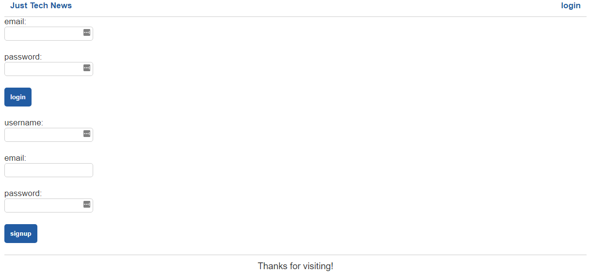
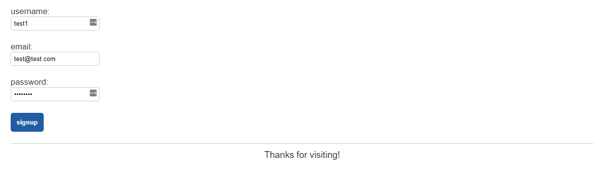
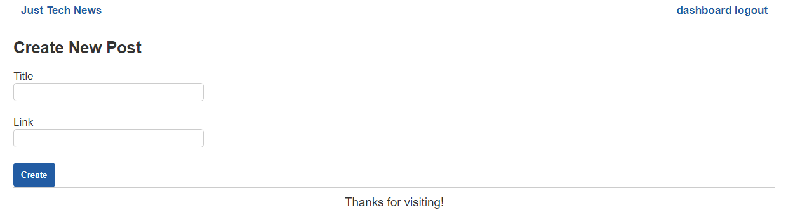
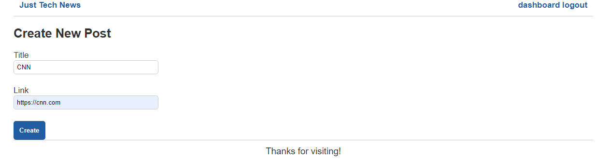
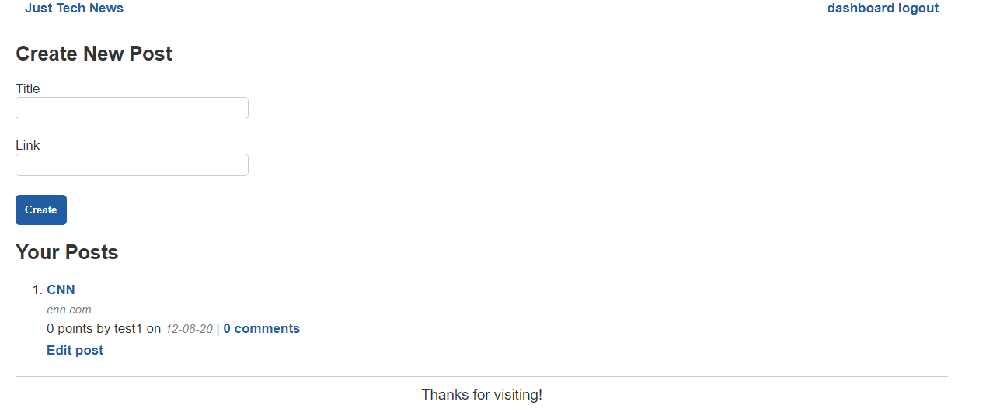

## Introduction

Nice job creating Thymeleaf templates and adding interactivity to your working API! Now you need to manage the front-end template flow in the application&mdash;which pages are displayed, which data is passed and received from those template pages, and which back-end processing will occur to support the transactions that are triggered by the user. 

We'll create two additional controllers that will manage all of that. When we created controllers previously, we used annotations to designate them as `@RestControllers`. This time we'll use the `@Controllers` annotation, because the new controllers will manage flow rather than CRUD operations. 

In this lesson, you'll learn how to do the following:

* Manage front-end flow by using the `@Controller` annotation.

* Track the logged-in status of the user. 

* Manage the back-end processing of the API.

* Implement flow management controller calls to the CRUD service endpoints within the API. 

* Facilitate the direct interaction of the database and the data.

## Preview

The goal for this lesson is to set up the front-end control flow. The code we write here will dictate which templates and fragments are shown to users, and when they're shown to them. This flow can make or break the user experience.

We'll take the following steps to achieve this goal:

1. Create the `HomePageController` and its associated endpoints.

2. Test the `HomePageController`.

3. Create the `TechNewsController` and its associated endpoints.

4. Test the `TechNewsController`.

## Create the HomePageController

While the REST controllers that we've already built function like processors, the `HomePageController` serves as more of a navigator&mdash;essentially, it is the entry and exit point for users. This controller is composed of `@GetMapping` annotation endpoints that help direct the flow of the API. 

With that in mind, you can get started! Inside the `Controller` package, create a new class named `HomePageController`. Once you've created your new class, the code generated should resemble the following example:

```java
package com.technews.controller;

public class HomePageController {

}
```

First we need to add a class-level `@Controller` annotation to the `HomePageController` class, indicating that these controllers will control flow for the front-end user experience. We'll add the `@Controller` annotation above the class definition, so that it resembles the following example:

```java
package com.technews.controller;

import org.springframework.stereotype.Controller;

@Controller
public class HomePageController {

}
```

Next you'll add code to the class body&mdash;starting with `@Autowired`, to set up the relationships for the repositories. Remember, `@Autowired` informs Spring to scan for objects that need to be instantiated for a class or method to run. Copy and paste the following code into your `HomePageController` class body:

```java
@Autowired
UserRepository userRepository;

@Autowired
PostRepository postRepository;

@Autowired
VoteRepository voteRepository;

@Autowired
CommentRepository commentRepository;
```

Now we've included the repositories we created earlier and mapped them to objects that will be instantiated in this class when necessary. In doing so, we've laid the foundation for writing the methods that will control the front-end flow of the application! 

### Create the Login and Logout Endpoints

Let's add the first method into the file. Just beneath the `CommentRepository commentRepository` line, paste the following code:

```java
@GetMapping("/login")
public String login(Model model, HttpServletRequest request) {

  if (request.getSession(false) != null) {
    return "redirect:/";
  }

  model.addAttribute("user", new User());
  return "login";
}
```

You've just added the `login` endpoint, which will allow users to log in by calling the `login.html` template when the `/login` route is hit. 

There are a few things happening here. `Model model`, the first argument passed into the `login()` method, is inherited functionality from Spring&mdash;we've remapped `Model` to the `model` variable. Next, the `addAttribute()` method, built into the `Model` object, sends information to the Thymeleaf templates. In this case, `model.addAttribute()` will send a newly created user to the template as the string `user`, so that it can be displayed within the template. Once logged in, the user will be redirected to the `/` route, bringing us to the homepage. 

Let's add the `logout` route now, as follows:

```java
@GetMapping("/users/logout")
public String logout(HttpServletRequest request) {
  if (request.getSession(false) != null) {
    request.getSession().invalidate();
  }
  return "redirect:/login";
}
```

When the `logout` route is hit, we check whether the session exists. If it does, we'll invalidate the session, subsequently logging out the user. We then redirect the user back to the `login` route. 

### Create the Homepage Endpoint

Now that we've created `login` and `logout`, we'll create the `homepage` endpoint. Let's paste the following code under the `logout` endpoint:

```java
@GetMapping("/")
  public String homepageSetup(Model model, HttpServletRequest request) {
    User sessionUser = new User();

    if (request.getSession(false) != null) {
      sessionUser = (User) request.getSession().getAttribute("SESSION_USER");
      model.addAttribute("loggedIn", sessionUser.isLoggedIn());
    } else {
      model.addAttribute("loggedIn", false);
    }


    List<Post> postList = postRepository.findAll();
    for (Post p : postList) {
      p.setVoteCount(voteRepository.countVotesByPostId(p.getId()));
      User user = userRepository.getById(p.getUserId());
      p.setUserName(user.getUsername());
    }

    model.addAttribute("postList", postList);
    model.addAttribute("loggedIn", sessionUser.isLoggedIn());

    // "point" and "points" attributes refer to upvotes.
    model.addAttribute("point", "point");
    model.addAttribute("points", "points");

    return "homepage";
  }
```

This endpoint will show users the homepage, which will require it to retrieve all of the `Post` data. So inside the `if` conditional, we check that the user is logged in. Once that's confirmed, we create a variable called `postList` with a type `List<Post>`. Then we use a `for` loop to get all of the posts and populate them into the `postList` variable. We use `model.addAttributes()` to add these details to the `User` model. As a result, this route will populate and display the `homepage.html` template. 

### Create the Dashboard, Single Post, and Edit Post Endpoints

Finally, let's add the rest of the `HomePageController` code. Under the `homepage` route, paste the following code for the `dashboard` route:

```java
  @GetMapping("/dashboard")
  public String dashboardPageSetup(Model model, HttpServletRequest request) throws Exception {

    if (request.getSession(false) != null) {
      setupDashboardPage(model, request);
      return "dashboard";
    } else {
      model.addAttribute("user", new User());
      return "login";
    }
  }

  @GetMapping("/dashboardEmptyTitleAndLink")
  public String dashboardEmptyTitleAndLinkHandler(Model model, HttpServletRequest request) throws Exception {
    setupDashboardPage(model, request);
    model.addAttribute("notice", "To create a post the Title and Link must be populated!");
    return "dashboard";
  }


  @GetMapping("/singlePostEmptyComment/{id}")
  public String singlePostEmptyCommentHandler(@PathVariable int id, Model model, HttpServletRequest request) {
    setupSinglePostPage(id, model, request);
    model.addAttribute("notice", "To add a comment you must enter the comment in the comment text area!");
    return "single-post";
  }


  @GetMapping("/post/{id}")
  public String singlePostPageSetup(@PathVariable int id, Model model, HttpServletRequest request) {
    setupSinglePostPage(id, model, request);
    return "single-post";
  }


  @GetMapping("/editPostEmptyComment/{id}")
  public String editPostEmptyCommentHandler(@PathVariable int id, Model model, HttpServletRequest request) {
    if (request.getSession(false) != null) {
      setupEditPostPage(id, model, request);
      model.addAttribute("notice", "To add a comment you must enter the comment in the comment text area!");
      return "edit-post";
    } else {
      model.addAttribute("user", new User());
      return "login";
    }
  }


  @GetMapping("/dashboard/edit/{id}")
  public String editPostPageSetup(@PathVariable int id, Model model, HttpServletRequest request) {
    if (request.getSession(false) != null) {
      setupEditPostPage(id, model, request);
      return "edit-post";
    } else {
      model.addAttribute("user", new User());
      return "login";
    }
  }


  public Model setupDashboardPage(Model model, HttpServletRequest request) throws Exception {
    User sessionUser = (User) request.getSession().getAttribute("SESSION_USER");

    Integer userId = sessionUser.getId();

    List<Post> postList = postRepository.findAllPostsByUserId(userId);
    for (Post p : postList) {
      p.setVoteCount(voteRepository.countVotesByPostId(p.getId()));
      User user = userRepository.getById(p.getUserId());
      p.setUserName(user.getUsername());
    }

    model.addAttribute("user", sessionUser);
    model.addAttribute("postList", postList);
    model.addAttribute("loggedIn", sessionUser.isLoggedIn());
    model.addAttribute("post", new Post());

    return model;
  }


  public Model setupSinglePostPage(int id, Model model, HttpServletRequest request) {
    if (request.getSession(false) != null) {
      User sessionUser = (User) request.getSession().getAttribute("SESSION_USER");
      model.addAttribute("sessionUser", sessionUser);
      model.addAttribute("loggedIn", sessionUser.isLoggedIn());
    }

    Post post = postRepository.getById(id);
    post.setVoteCount(voteRepository.countVotesByPostId(post.getId()));

    User postUser = userRepository.getById(post.getUserId());
    post.setUserName(postUser.getUsername());

    List<Comment> commentList = commentRepository.findAllCommentsByPostId(post.getId());

    model.addAttribute("post", post);

    model.addAttribute("commentList", commentList);
    model.addAttribute("comment", new Comment());

    return model;
  }


  public Model setupEditPostPage(int id, Model model, HttpServletRequest request) {
  if (request.getSession(false) != null) {
    User sessionUser = (User) request.getSession().getAttribute("SESSION_USER");

    Post returnPost = postRepository.getById(id);
    User tempUser = userRepository.getById(returnPost.getUserId());
    returnPost.setUserName(tempUser.getUsername());
    returnPost.setVoteCount(voteRepository.countVotesByPostId(returnPost.getId()));

    List<Comment> commentList = commentRepository.findAllCommentsByPostId(returnPost.getId());

    model.addAttribute("post", returnPost);
    model.addAttribute("loggedIn", sessionUser.isLoggedIn());
    model.addAttribute("commentList", commentList);
    model.addAttribute("comment", new Comment());
    }

    return model;
  }
```

Don't panic at the sight of all that code! If you examine it closely, you'll find that much of it is familiar from your experience up to this point.

Let's break it down. All of the methods associated with the `dashboard` page will be called by the `setupDashboardPage()` method within this route. As the name suggests, this method helps set up the user dashboard. We first assign the value of the current user, via `SESSION_USER`, to a variable called `sessionUser`. Next we get the user's id and store that in `userId`. That comes in handy in `postRepository.findAllPostsByUserId(userId);`, when we use a `for` loop to gather all posts that have been made by the specific `userId`.

Furthermore, the `model.addAttribute()` method allows us to pass information into the Thymeleaf pages when that template is called. So in `model.addAttribute("user", sessionUser);`, we're sending the current user (`sessionUser`) to the Thymeleaf dashboard template as a variable called `user`. The same thought process applies to the rest of the three `addAttribute()` calls on Spring's `model` object. 

So once we know that the user is logged in, we pass the model with all the attributes we added, along with the request data of that user, and redirect the user to their specific dashboard. 

The code for `setupSinglePostPage()` and `setupEditPostPage()` closely resembles the code for setting up the dashboard page&mdash;you can review it on your own to deepen your understanding.

### Create Endpoints for Missing Information

Now what happens if the user tries to make a post but forgets to include a post title or link? We'll hit the `/dashboardEmptyTitleAndLink` endpoint, which will throw the error message "To create a post the Title and Link must be populated!" 

The rest of the endpoints involving `model.addAttribute("notice", "message")` are error-handling routes. You should be able to read through them to ascertain what they do and how they help us validate information.

### Test the HomePageController Code

To check that all this code is working, navigate to IntelliJ and run your server. Once the server is running, open your browser. Navigate to `localhost:8082`, and you should be greeted with a page that resembles the following image:


Awesome! You can navigate to `localhost:8082/dashboard` to see the dashboard screen or `/login` to see the login screen! 

Only one more controller remains for us to create before we finish this project. Let's do it!

## Create the TechNewsController

This next controller serves very much as the API processing manager&mdash;it is more concerned with processing data  than navigating the user. `TechNewsController` will mostly comprise `@PostMapping` endpoints focused on the back-end server-side processing that manages the database and the flow of data to and from the end user. 

Create a new class in your `controller` directory and name it `TechNewsController`. Inside your newly created class, you should see the following code:

```java
package com.technews.controller;

public class TechNewsController {
    
}
```

First we need to add the class-level `@Controller` annotation, plus the `@Autowired` annotations we used inside `HomePageController`. With those additions, the class should look like the following example:

```java
package com.technews.controller;

import com.technews.repository.CommentRepository;
import com.technews.repository.PostRepository;
import com.technews.repository.UserRepository;
import com.technews.repository.VoteRepository;
import org.springframework.beans.factory.annotation.Autowired;
import org.springframework.stereotype.Controller;

@Controller
public class TechNewsController {

  @Autowired
  PostRepository postRepository;

  @Autowired
  VoteRepository voteRepository;

  @Autowired
  UserRepository userRepository;

  @Autowired
  CommentRepository commentRepository;
    
}
```

### Create the POST Endpoints

Now we can bring in the `@PostMapping` annotation methods. Let's start by adding data processing for the `/users/login` route. Copy the following code and paste it under `CommentRepository commentRepository`:

```java
@PostMapping("/users/login")
  public String login(@ModelAttribute User user, Model model, HttpServletRequest request) throws Exception {

  if ((user.getPassword().equals(null) || user.getPassword().isEmpty()) || (user.getEmail().equals(null) || user.getPassword().isEmpty())) {
    model.addAttribute("notice", "Email address and password must be populated in order to login!");
    return "login";
  }

  User sessionUser = userRepository.findUserByEmail(user.getEmail());

  try {
    // If sessionUser is invalid, running .equals() will throw an error
    if (sessionUser.equals(null)) {

    }
    // We will catch an error and notify client that email address is not recognized
  } catch (NullPointerException e) {
    model.addAttribute("notice", "Email address is not recognized!");
    return "login";
  }

  // Validate Password
  String sessionUserPassword = sessionUser.getPassword();
  boolean isPasswordValid = BCrypt.checkpw(user.getPassword(), sessionUserPassword);
  if(isPasswordValid == false) {
    model.addAttribute("notice", "Password is not valid!");
    return "login";
  }

  sessionUser.setLoggedIn(true);
  request.getSession().setAttribute("SESSION_USER", sessionUser);

  return "redirect:/dashboard";
}
```

The preceding code is the POST `login` endpoint. Let's dissect it!

The first big `if` statement checks that all fields were properly filled in. Then we populate the `sessionUser` variable by identifying the email of the user. If the user is found by their email, we'll create a new session variable, set the `loggedIn` variable to `true`, and finally return the `dashboard.html` template, allowing them to see and use that page. But if the user is NOT found by their email, we throw an exception and redirect them to the `login.html` template to try again.

  > **Note** 
  >
  > In Java, we can't compare `String`s with a `==` operator like in JavaScript&mdash;instead, we use the `String` method `.equals()` to determine if they are equivalent.

Great! Now the next method will be the POST `AddUser` endpoint. Copy the following code and paste it under the preceding method:

```java
@PostMapping("/users")
  public String signup(@ModelAttribute User user, Model model, HttpServletRequest request) throws Exception {

  if ((user.getUsername().equals(null) || user.getUsername().isEmpty()) || (user.getPassword().equals(null) || user.getPassword().isEmpty()) || (user.getEmail().equals(null) || user.getPassword().isEmpty())) {
    model.addAttribute("notice", "In order to signup username, email address and password must be populated!");
    return "login";
  }

  try {
    // Encrypt password
    user.setPassword(BCrypt.hashpw(user.getPassword(), BCrypt.gensalt()));
    userRepository.save(user);
  } catch (DataIntegrityViolationException e) {
    model.addAttribute("notice", "Email address is not available! Please choose a different unique email address.");
    return "login";
  }

  User sessionUser = userRepository.findUserByEmail(user.getEmail());

  try {
    if (sessionUser.equals(null)) {

    }
  } catch (NullPointerException e) {
    model.addAttribute("notice", "User is not recognized!");
    return "login";
  }

  sessionUser.setLoggedIn(true);
  request.getSession().setAttribute("SESSION_USER", sessionUser);

  return "redirect:/dashboard";
  }
```

This route allows users to create a new profile on Just Tech News. We complete the same validation as in the POST `login` endpoint, to ensure that all fields are fully populated. Next, we encrpyt the proposed user's password, via `BCrypt`, and save that new user to the database. If successful, the API will redirect users to the `login.html` page, where they can enter their new credentials. If the save fails, we'll throw an exception and redirect them to the login page to try again.

### Create the POST and PUT Endpoints

To create the POST and PUT endpoint for the dashboard, copy the following code and paste it under the previous method:

```java
@PostMapping("/posts")
  public String addPostDashboardPage(@ModelAttribute Post post, Model model, HttpServletRequest request) {

    if ((post.getTitle().equals(null) || post.getTitle().isEmpty()) || (post.getPostUrl().equals(null) || post.getPostUrl().isEmpty())) {
      return "redirect:/dashboardEmptyTitleAndLink";
    }

    if (request.getSession(false) == null) {
      return "redirect:/login";
    } else {
      User sessionUser = (User) request.getSession().getAttribute("SESSION_USER");
      post.setUserId(sessionUser.getId());
      postRepository.save(post);

      return "redirect:/dashboard";
    }
  }
```

This functionality will allow users to add a post from their dashboard. First, if the session isn't valid, we redirect them to the `login.html`. If the session is valid and they submit a post, we'll set the `userId` for that post to be the id of the `sessionUser`. Simple enough!

What if the user wants to see an updated post? We created the template and the controller for that&mdash;now we need to process. Paste the following code beneath the previous method:

```java
@PostMapping("/posts/{id}")
  public String updatePostDashboardPage(@PathVariable int id, @ModelAttribute Post post, Model model, HttpServletRequest request) {

    if (request.getSession(false) == null) {
      model.addAttribute("user", new User());
      return "redirect/dashboard";
    } else {
      Post tempPost = postRepository.getById(id);
      tempPost.setTitle(post.getTitle());
      postRepository.save(tempPost);

      return "redirect:/dashboard";
    }
  }
```

As always, if the session isn't valid, we redirect them to the login page! If the session is valid, we get the specific post by its id, using `getById(id)`. Next, we take the updated title data for the post and save it as the new title, via `setTitle`. Then we save the post and return the dashboard template. 

The next method will allow users to comment on their own or others' posts. Copy the following code and paste it below the previous method:

```java
@PostMapping("/comments")
public String createCommentCommentsPage(@ModelAttribute Comment comment, Model model, HttpServletRequest request) {

  if (comment.getCommentText().isEmpty() || comment.getCommentText().equals(null)) {
    return "redirect:/singlePostEmptyComment/" + comment.getPostId();
  } else {
    if (request.getSession(false) != null) {
      User sessionUser = (User) request.getSession().getAttribute("SESSION_USER");
      comment.setUserId(sessionUser.getId());
      commentRepository.save(comment);
      return "redirect:/post/" + comment.getPostId();
  } else {
      return "login";
    }
  }
}
```

So let's break this down. First, if the comment text area is blank, we throw an exception to let users know that they need to fill in that text, then we return them to the same `edit-post.html` template. If the session is invalid, we return them to the login page. But if the session IS valid, we can set the `comment userId` to be equal to the current `sessionUser` id, because the current session user is the one who made the comment. 

Finally, we save that comment and return the user to the `edit-post.html` background, with a new comment created. 

To address editing comments, copy the following code below the previous method:

```java
@PostMapping("/comments/edit")
public String createCommentEditPage(@ModelAttribute Comment comment, HttpServletRequest request) {

  if (comment.getCommentText().equals("") || comment.getCommentText().equals(null)) {
    return "redirect:/editPostEmptyComment/" + comment.getPostId();
  } else {
    if (request.getSession(false) != null) {
      User sessionUser = (User) request.getSession().getAttribute("SESSION_USER");
      comment.setUserId(sessionUser.getId());
      commentRepository.save(comment);

      return "redirect:/dashboard/edit/" + comment.getPostId();
    } else {
      return "redirect:/login";
    }
  }

}
```

In this route, if the text area is blank, we throw an exception to alert users that they need to fill in that text, and we return them the same `edit-post.html` template. If the session is invalid, we return them to the login page (as usual). But if the session IS valid, we can set the `comment userId` to be equal to the current `sessionUser` id; then we save the newly updated comment and redirect back to the edit page. 

Let's create the final method now, which will allow us to upvote posts! Paste the following code below the previous method:

```java
@PutMapping("/posts/upvote")
public void addVoteCommentsPage(@RequestBody Vote vote, HttpServletRequest request, HttpServletResponse response) {

    if (request.getSession(false) != null) {
        Post returnPost = null;
        User sessionUser = (User) request.getSession().getAttribute("SESSION_USER");
        vote.setUserId(sessionUser.getId());
        voteRepository.save(vote);

        returnPost = postRepository.getById(vote.getPostId());
        returnPost.setVoteCount(voteRepository.countVotesByPostId(vote.getPostId()));
    }
}
```

For upvotes, if the session is valid, then we need to set the `vote userId` to be equal to the `sessionUser Id`. Once that's set, we just save the vote, incrementing `setVoteCount` by 1. 

That was a lot of code that we just created for a single file, so we should test it all!

### Test the TechNewsController Code

Run your Java server and open your browser to `localhost:8082/login`. You should see something like the following image:



Enter some test information and click "signup", as shown in the following image:



Once the form is submitted, you should be brought to the dashboard page, as shown in the following image:



To create a new post, enter a title and a valid URL, then click Create&mdash;as shown in the following image:



Great! That should successfully create a post, and you should see a screen resembling the following image:

 

> **Hint** 
>
> If you see any errors with retrieving Posts from your database, check your error messages in IntelliJ to see if there are any leads to what the issue is. Are there any leftover entries with invalid data from your Insomnia testing that might be throwing these errors? Could clearing those tables help?

At this point, push your changes up to GitHub using the Git workflow, as follows:

```git
git add .
git commit -m "message"
git push origin main 
```

## Reflection

Congratulations on completing the Java Tech News API! You've built a highly functional and useful API with Java, Spring, and Thymeleaf. You've learned how to build an API in a modular fashion from the ground up starting with the foundation and completing in this lesson the functional management and interactivity management with the API users.

In this lesson you've successfully completed the following:

* Created the `HomePageController` that manages the entry and exit of the user into and out of the API.

* Created the `TechNewsController` that manages the internal API processing calls for the many requests that a user can make to the API, as well as the display and retrieval of data to and from the user.

Feel free to keep tinkering with your newly finished Java API! You can revisit parts of the build process that gave you trouble the first time around, and you can consult supplemental resources as you continue to familiarize yourself with Java. But for now, you should be proud of what you've accomplished.

In the next lesson, you'll learn how to deploy to Heroku, making this API available for use by anyone who knows the address!

---

© 2025 edX Boot Camps LLC. Confidential and Proprietary. All Rights Reserved.
