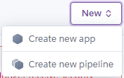
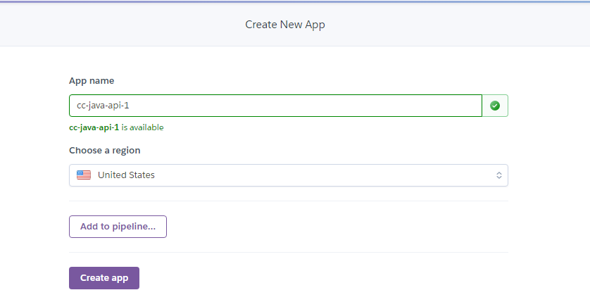
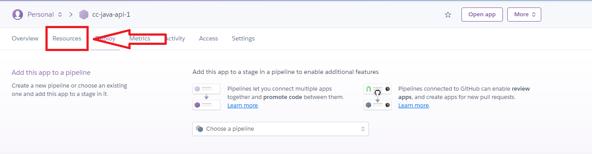
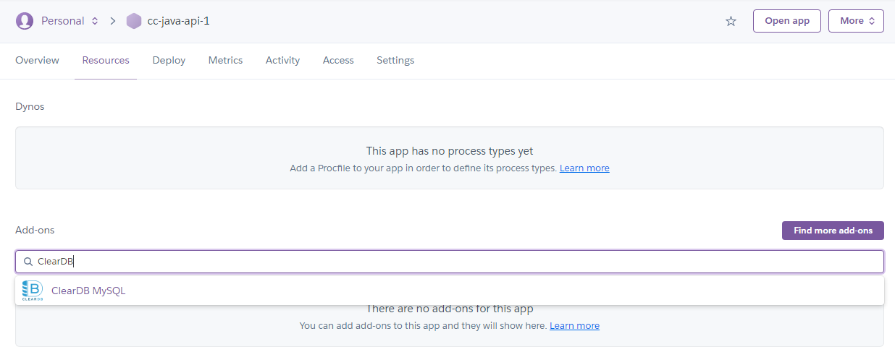
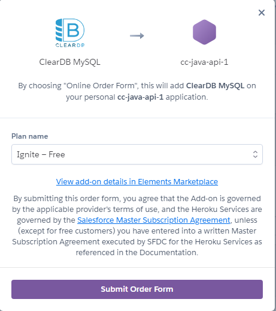
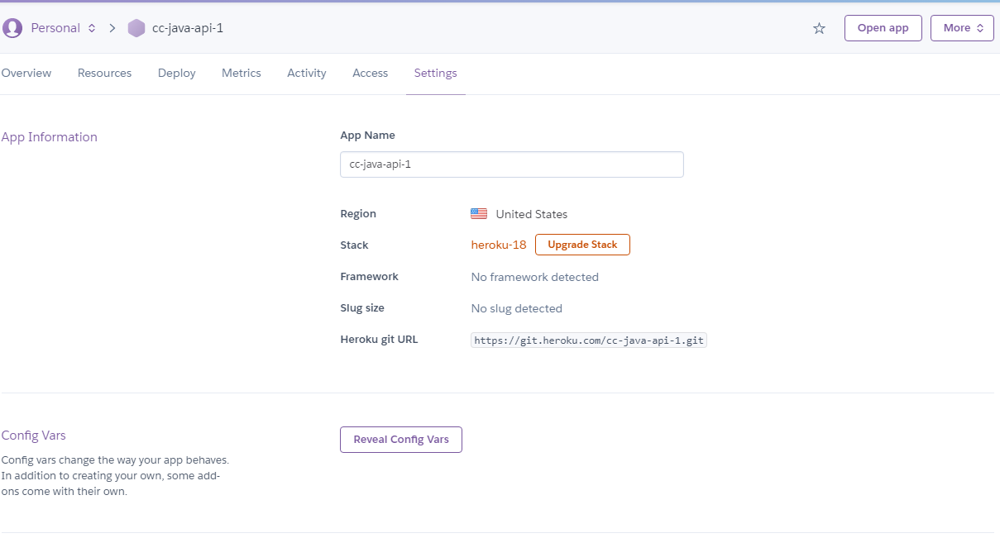
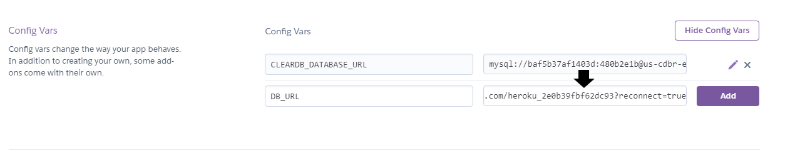

## Introduction

You've already achieved a lot just by building a local version of Just Tech News! However, in its current state, the API can only be accessed by you or someone with a zipped version for download. You should make it available more widely, so that potential employers can see your coding skills on display.

In this lesson, you'll remedy that, by deploying your API to the Heroku cloud platform! You'll learn how to do the following:

* Create a new application dashboard on Heroku.

* Add a free MySQL database to your Heroku account and bind that database to a Java API.

* Connect an API's GitHub repository to the Heroku platform so that you can deploy to the cloud directly from the repository.

* Deploy a Java API to Heroku.

You'll learn some useful skills along the way, but it should be a pretty straightforward process.

## Preview 

The only goal for this lesson is to deploy your new Java API to the web so that anyone can access and interact with it. You'll take the following steps to accomplish that task:

1. Create the application dashboard on Heroku.

2. Add ClearDB MySQL to the application on Heroku.

2. Connect Heroku to the GitHub repository.

3. Deploy the API!

This won't take long, so let's get started!
## Create the Application Dashboard on Heroku 

Open your browser, navigate to the [Heroku website](https://heroku.com), and log in to your account. Once you're logged in, you should see your Heroku dashboard, displaying any deployed applications of yours and their links and statuses. 

From here, we'll create a new project. Towards the top right of the screen, click the "New" button, as shown in the following image:


Select "Create new app" from the dropdown, as shown in the following image:



You'll be brought to the Create New App screen. Enter your app name. You can use any name, but try `cc-java-api` to start. You'll get an error saying that the name is already taken, so add a hyphen and a number (for example, `cc-java-api-1`) until the name is available. Once you find an available name, press the "Create app" button, as shown in the following image:



Now you should see your newly created app's dashboard page! 

## Add ClearDB MySQL to the Application on Heroku

For this next step, navigate to the Resources tab near the top left of the dashboard, as shown in the following image:



In the Resources tab, search for and provision an add-on called ClearDB MySQL, as shown in the following image:



The resulting modal will prompt you to "Submit Order Form". However, you won't being charged in any way. Follow the prompts and click "Submit Order Form", as shown in the following image:



Now navigate to the Settings tab. Just under the App Information frame, you'll see the Config Vars frame. Click the button that says "Reveal Config Vars", as shown in the following image:



Let's create a new Config Var and name it `DB_URL`. Locate the `CLEARDB_DATABASE_URL` variable and copy the value, pasting it into the value portion of the newly created `DB_URL` variable. Click the Add button to save these settings, as shown in the following image:



Okay, those are all the basic settings we need to configure on Heroku! Now we can take the final steps to connect the GitHub repository to the Heroku platform.

## Connect Heroku to the GitHub Repository

First, as always, push all of your latest work to GitHub, using the following Git workflow:

```git
git add .
git commit -m "message"
git push origin main 
```

Open your command prompt and navigate to the root directory of your Java API folder. Once there, type the following command (where `[appName]` is the name of your project, without the `[]`):

```bash
heroku git:remote -a [appName]
```

You're nearly done!

## Deploy the API to Heroku

Finally, you can enter the last command, as follows:

```bash
git push heroku main
```

That's it! Afterward, you can open your browser and navigate to `[appname].herokuapp.com` (just remove the brackets `[]` and replace `appname` with your Heroku application name).

## Reflection

Congratulations on creating not just one but TWO full-stack social news apps&mdash;one backed by a server-side Express.js API, and the other backed by a server-side Java Spring Boot API. Software developers who can create APIs using both of those frameworks are in high demand, so you've positioned yourself as a valuable potential employee. 

Keep up the hard work, and keep learning!

---

© 2025 edX Boot Camps LLC. Confidential and Proprietary. All Rights Reserved.
